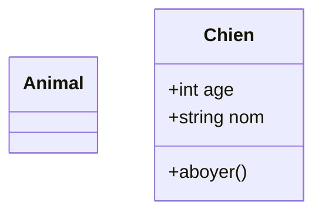
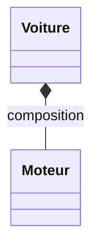
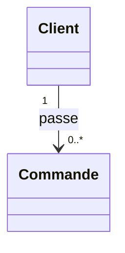

# Syntaxe des Diagrammes de Classes Mermaid (classDiagram)

## 1. Déclaration de base
Tout diagramme de classes doit commencer obligatoirement par le mot-clé `classDiagram`.
**ATTENTION :** Un diagramme de classes ne peut pas être vide. Il doit contenir au moins une définition de classe ou une relation. Le mot-clé seul provoquera une erreur de rendu.

## 2. Définir des classes
Il y a deux façons principales de définir une classe :

## 3. Visibilité
La visibilité s'indique au début de l'attribut ou de la méthode :
- `+` : Public
- `-` : Private
- `#` : Protected
- `~` : Package/Internal

## 4. Relations
Les types de relations entre classes :
- `<|--` : Héritage (Inheritance)
- `*--` : Composition
- `o--` : Agrégation
- `-->` : Association (Directionnelle)
- `--` : Association (Bidirectionnelle)
- `..>` : Dépendance
- `..|>` : Réalisation (Interface)

Exemple complet de relation :

## 5. Cardinalités (Multiplicité)
Les cardinalités sont placées entre guillemets doubles et précèdent ou suivent la relation :

## Règles pédagogiques pour l'agent
- Lors de la génération d'exemples dans les tutoriels, si un apprenant doit comprendre le mot-clé `classDiagram`, l'agent doit l'afficher sous forme de bloc `text` et non `mermaid`.
- Toujours utiliser une nomenclature explicite (classes avec la première lettre en majuscule, attributs typés).
