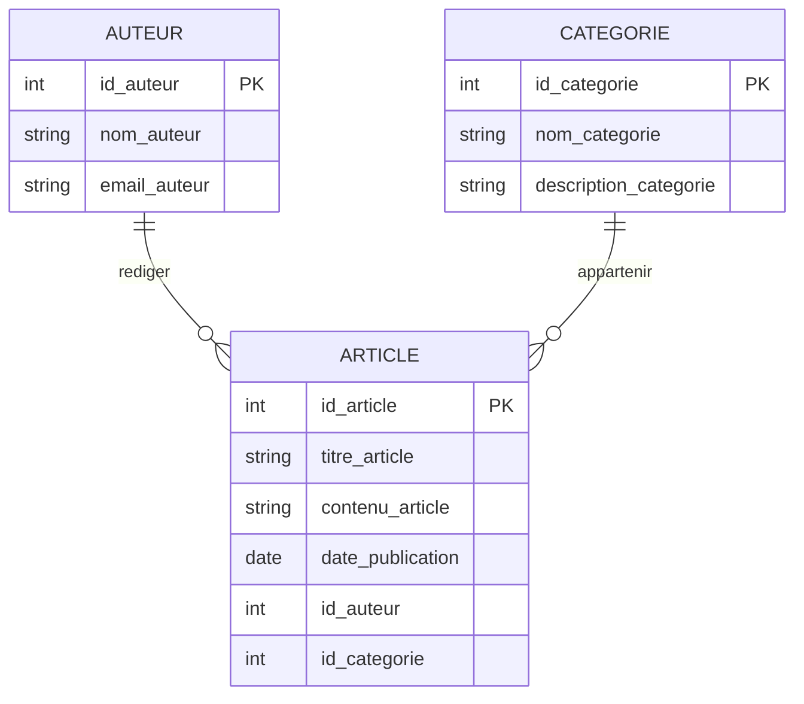

 


## 1. Objectif

À partir des entités et des règles de gestion, identifier les associations et déterminer leurs cardinalités.

Construire ensuite le MCD complet du besoin.

## 2. Prérequis

* Avoir identifié les entités, leurs propriétés et leurs identifiants.
* Comprendre les dépendances fonctionnelles.

# Partie 1 — Théorie

## 1.1. Une règle de gestion

Une **règle de gestion** décrit une règle du fonctionnement du système.

Exemple :

> Un auteur peut rédiger plusieurs articles.

Cette règle montre une relation entre :

```text
AUTEUR
ARTICLE
```

## 1.2. Une association

Une **association** représente une relation entre des entités.

À partir de la règle :

> Un auteur peut rédiger plusieurs articles.

nous obtenons :

```text
AUTEUR ───── RÉDIGER ───── ARTICLE
```

## 1.3. Une cardinalité

Une **cardinalité** indique le nombre minimum et maximum d’occurrences liées.

Elle s’écrit :

```text
(minimum, maximum)
```

Exemples :

```text
(0,N)
(1,1)
```

Pour le Blog :

> Un auteur peut rédiger plusieurs articles.

```text
AUTEUR → (0,N)
```

> Un article est rédigé par un seul auteur.

```text
ARTICLE → (1,1)
```

On obtient :

```text
AUTEUR ─── (0,N) ─── RÉDIGER ─── (1,1) ─── ARTICLE
```

## 1.4. Identifier les associations et les cardinalités du Blog

Les règles sont :

> Un auteur peut rédiger plusieurs articles.

> Un article est rédigé par un seul auteur.

> Un article appartient à une catégorie.

> Une catégorie peut contenir plusieurs articles.

On obtient :

```text
AUTEUR ─── (0,N) ─── RÉDIGER ─── (1,1) ─── ARTICLE

ARTICLE ─── (1,1) ─── APPARTENIR ─── (0,N) ─── CATEGORIE
```

## 1.5. Représenter le MCD avec Mermaid

Le MCD du Blog peut être représenté avec Mermaid :



**À retenir :**

```text
Règle de gestion
      ↓
Association
      ↓
Cardinalités
      ↓
MCD
```

# Partie 2 — Pratique

## 2.1. Identifier les associations

### Étape 1 — Reprendre les entités

Travaillez avec :

```text
CLIENT
COMMANDE
PRODUIT
```

### Étape 2 — Lire les règles

> Un client peut passer plusieurs commandes.

> Une commande est passée par un seul client.

> Une commande contient plusieurs produits.

> Un produit peut être présent dans plusieurs commandes.

Identifiez les entités concernées par chaque règle.

### Étape 3 — Nommer les associations

Donnez un nom à chaque relation entre les entités.

**Résultat attendu :**

Les associations entre `CLIENT`, `COMMANDE` et `PRODUIT`.

## 2.2. Déterminer les cardinalités

### Étape 4 — Déterminer le minimum

Pour chaque côté, cherchez le minimum :

```text
0
```

ou :

```text
1
```

### Étape 5 — Déterminer le maximum

Cherchez ensuite le maximum :

```text
1
```

ou :

```text
N
```

### Étape 6 — Écrire les cardinalités

Écrivez :

```text
(minimum, maximum)
```

Placez les cardinalités sur chaque côté des associations.

**Résultat attendu :**

Toutes les associations possèdent leurs cardinalités.

## 2.3. Construire le MCD

### Étape 7 — Représenter les entités

Ajoutez :

* les entités ;
* les propriétés ;
* les identifiants.

### Étape 8 — Ajouter les associations

Ajoutez les associations trouvées.

### Étape 9 — Ajouter les cardinalités

Ajoutez les cardinalités déterminées à partir des règles de gestion.

### Étape 10 — Placer `quantite_commandee`

Déterminez où placer :

```text
quantite_commandee
```

dans votre modèle.

### Étape 11 — Représenter le MCD avec Mermaid

Construisez votre MCD avec :

```text
erDiagram
    ...
```

Ne copiez pas le MCD du Blog.

**Résultat attendu :**

Un MCD complet de la gestion des commandes avec les entités, propriétés, identifiants, associations et cardinalités.

# 3. Bilan

**Vous avez réalisé :** l’identification des associations et des cardinalités à partir des règles de gestion.

**Vous savez maintenant :** transformer une règle de gestion en association, déterminer ses cardinalités et construire un MCD.

# 4. Glossaire

* **Règle de gestion** : règle qui décrit le fonctionnement du système.
* **Association** : relation entre des entités.
* **Cardinalité** : nombre minimum et maximum d’occurrences liées.
* **Entité** : élément du système représenté dans le modèle de données.
* **Occurrence** : élément d’une entité.
* **Mermaid** : langage qui permet de créer des diagrammes à partir de texte.
