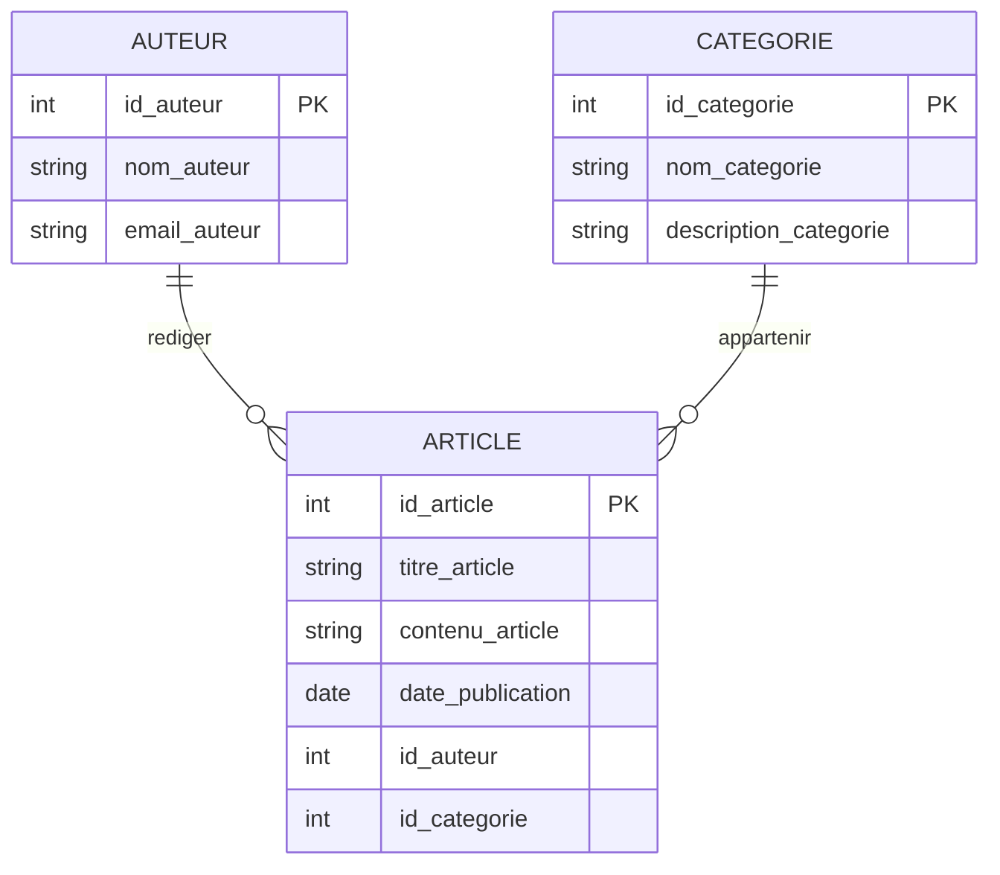

 

## 1. Objectif

À partir des entités et des règles de gestion, identifier les associations et déterminer leurs cardinalités.

Construire ensuite le MCD complet du besoin.

## 2. Prérequis

* Avoir identifié les entités, leurs propriétés et leurs identifiants.
* Comprendre les dépendances fonctionnelles.

# Partie 1 — Théorie

## 1.1. Une règle de gestion

Une **règle de gestion** décrit une règle du fonctionnement du système.

Elle vient du besoin fonctionnel.

Elle permet de préciser comment les éléments du système sont liés.

Une règle de gestion peut indiquer :

* les éléments concernés ;
* la relation entre ces éléments ;
* le nombre de relations possibles ;
* si la relation est obligatoire ou facultative.

**Exemple :**

> Un auteur peut rédiger plusieurs articles.

Cette règle concerne deux entités :

```text
AUTEUR
ARTICLE
```

La règle nous indique donc qu’il existe une relation entre un auteur et ses articles.

La règle de gestion est le point de départ de la construction des associations et des cardinalités.

## 1.2. Une association

Une **association** représente une relation entre des entités.

À partir de la règle :

> Un auteur peut rédiger plusieurs articles.

nous cherchons d’abord les entités concernées :

```text
AUTEUR
ARTICLE
```

Puis nous cherchons un nom pour la relation.

Le nom doit représenter clairement ce qui se passe entre les deux entités.

Nous pouvons utiliser :

```text
RÉDIGER
```

Nous obtenons :

```text
AUTEUR ───── RÉDIGER ───── ARTICLE
```

`RÉDIGER` est donc l’association entre `AUTEUR` et `ARTICLE`.

L’association permet de représenter une relation du domaine dans le MCD.

## 1.3. Identifier les associations du Blog

Dans les tutoriels précédents, nous avons obtenu les entités :

```text
ARTICLE
AUTEUR
CATEGORIE
```

Nous allons maintenant utiliser les règles de gestion.

### Règles concernant l’auteur

> Un auteur peut rédiger plusieurs articles.

> Un article est rédigé par un seul auteur.

Les deux règles concernent :

```text
AUTEUR
ARTICLE
```

Nous identifions l’association :

```text
AUTEUR ───── RÉDIGER ───── ARTICLE
```

### Règles concernant la catégorie

> Un article appartient à une catégorie.

> Une catégorie peut contenir plusieurs articles.

Les deux règles concernent :

```text
ARTICLE
CATEGORIE
```

Nous identifions :

```text
ARTICLE ───── APPARTENIR ───── CATEGORIE
```

Nous avons donc deux associations :

```text
RÉDIGER
APPARTENIR
```

## 1.4. Une cardinalité

Une **cardinalité** indique combien d’occurrences d’une entité peuvent être liées à une occurrence de l’autre entité.

Elle permet donc de préciser la quantité de relations possibles.

Une cardinalité possède deux valeurs :

```text
(minimum, maximum)
```

Le premier nombre représente le minimum.

Le deuxième nombre représente le maximum.

Par exemple :

```text
(0,N)
```

signifie :

> une occurrence peut être liée à zéro ou plusieurs occurrences.

Et :

```text
(1,1)
```

signifie :

> une occurrence doit être liée à une seule occurrence.

## 1.5. Déterminer le minimum

Pour déterminer le minimum, nous revenons à la règle de gestion.

Prenons :

> Un auteur peut rédiger plusieurs articles.

Un auteur peut ne rédiger aucun article.

Le minimum est donc :

```text
0
```

Prenons :

> Un article est rédigé par un seul auteur.

Un article doit avoir un auteur.

Le minimum est donc :

```text
1
```

Le minimum indique donc si la relation est facultative ou obligatoire.

## 1.6. Déterminer le maximum

Nous déterminons ensuite le maximum.

Pour un auteur :

> Un auteur peut rédiger plusieurs articles.

Un auteur peut rédiger plusieurs articles.

Le maximum est :

```text
N
```

Pour un article :

> Un article est rédigé par un seul auteur.

Un article est lié à un seul auteur.

Le maximum est :

```text
1
```

Nous obtenons :

```text
AUTEUR ─── (0,N) ─── RÉDIGER ─── (1,1) ─── ARTICLE
```

## 1.7. Déterminer les cardinalités de l’association RÉDIGER

Reprenons les deux règles :

> Un auteur peut rédiger plusieurs articles.

> Un article est rédigé par un seul auteur.

Pour `AUTEUR` :

```text
(0,N)
```

Pour `ARTICLE` :

```text
(1,1)
```

Nous obtenons :

```text
AUTEUR ─── (0,N) ─── RÉDIGER ─── (1,1) ─── ARTICLE
```

Nous pouvons vérifier le résultat avec des exemples.

Un auteur peut avoir :

```text
0 article
1 article
2 articles
10 articles
...
```

Un article peut avoir :

```text
1 auteur
```

mais pas :

```text
0 auteur
2 auteurs
```

Les cardinalités traduisent donc directement les règles de gestion.

## 1.8. Déterminer les cardinalités de l’association APPARTENIR

Les règles sont :

> Un article appartient à une catégorie.

> Une catégorie peut contenir plusieurs articles.

Pour `ARTICLE` :

```text
(1,1)
```

Un article doit appartenir à une seule catégorie.

Pour `CATEGORIE` :

```text
(0,N)
```

Une catégorie peut ne contenir aucun article ou plusieurs articles.

Nous obtenons :

```text
ARTICLE ─── (1,1) ─── APPARTENIR ─── (0,N) ─── CATEGORIE
```

## 1.9. La méthode complète

Pour chaque groupe de règles de gestion, nous suivons le même raisonnement :

```text
Règle de gestion
       ↓
Entités concernées
       ↓
Association
       ↓
Minimum
       ↓
Maximum
       ↓
Cardinalités
```

Prenons par exemple :

> Un auteur peut rédiger plusieurs articles.

Nous faisons :

```text
AUTEUR + ARTICLE
        ↓
RÉDIGER
        ↓
Auteur : 0 à N articles
Article : 1 auteur
        ↓
(0,N) et (1,1)
```

Il faut donc toujours partir de la règle avant de choisir une cardinalité.

## 1.10. Représenter le MCD avec Mermaid

Mermaid permet de représenter les entités et leurs relations avec un diagramme `erDiagram`.

Pour le Blog :



Dans cette notation :

```text
|| = exactement 1
o{ = 0 à plusieurs
```

Ainsi :

```text
AUTEUR ||--o{ ARTICLE
```

représente :

```text
AUTEUR (0,N) ─── ARTICLE (1,1)
```

Et :

```text
CATEGORIE ||--o{ ARTICLE
```

représente :

```text
CATEGORIE (0,N) ─── ARTICLE (1,1)
```

Mermaid permet donc de vérifier visuellement les relations entre les entités.

## 1.11. Le MCD complet du Blog

Nous avons identifié :

### Entités

```text
AUTEUR
ARTICLE
CATEGORIE
```

### Associations

```text
RÉDIGER
APPARTENIR
```

### Cardinalités

```text
AUTEUR ─── (0,N) ─── RÉDIGER ─── (1,1) ─── ARTICLE

ARTICLE ─── (1,1) ─── APPARTENIR ─── (0,N) ─── CATEGORIE
```

Nous pouvons maintenant représenter le MCD complet :


Le raisonnement complet est maintenant :

```text
Données
   ↓
Dépendances fonctionnelles
   ↓
Décomposition
   ↓
Entités
   ↓
Règles de gestion
   ↓
Associations
   ↓
Cardinalités
   ↓
MCD
```

## 1.12. À retenir

* Une règle de gestion décrit une relation du système.
* Les entités concernées permettent d’identifier l’association.
* L’association représente la relation entre les entités.
* La même règle permet de déterminer les cardinalités.
* Une cardinalité possède un minimum et un maximum.
* Le minimum indique si la relation est facultative ou obligatoire.
* Le maximum indique si une ou plusieurs occurrences sont possibles.
* Le MCD rassemble les entités, les propriétés, les identifiants, les associations et les cardinalités.

# Partie 2 — Pratique

## 2.1. Identifier les associations

### Étape 1 — Reprendre les entités

Pour le système de gestion des commandes, reprenez les entités obtenues dans l’unité précédente :

```text
CLIENT
COMMANDE
PRODUIT
```

Prenez également en compte :

```text
quantite_commandee
```

Cette donnée représente la quantité d’un produit dans une commande.

### Étape 2 — Lire les règles de gestion

Utilisez les règles suivantes :

> Un client peut passer plusieurs commandes.

> Une commande est passée par un seul client.

> Une commande contient plusieurs produits.

> Un produit peut être présent dans plusieurs commandes.

Lisez chaque règle et cherchez les entités concernées.

## 2.2. Identifier les associations

### Étape 3 — Chercher les entités concernées

Pour chaque règle, écrivez les deux entités concernées.

Ne cherchez pas encore les cardinalités.

Commencez uniquement par les relations entre les entités.

### Étape 4 — Nommer les associations

Donnez un nom clair à chaque relation.

Le nom doit expliquer ce qui se passe entre les deux entités.

### Étape 5 — Représenter les associations

Représentez les associations entre :

```text
CLIENT
COMMANDE
PRODUIT
```

**Résultat attendu :**

Les associations entre les entités sont identifiées et nommées.

## 2.3. Déterminer les cardinalités

### Étape 6 — Déterminer le minimum

Pour chaque côté de chaque association, relisez la règle de gestion.

Posez la question :

> Une occurrence peut-elle exister sans être liée à l’autre entité ?

Déterminez :

```text
0
```

ou :

```text
1
```

Justifiez votre choix par la règle.

### Étape 7 — Déterminer le maximum

Posez ensuite :

> Une occurrence peut-elle être liée à plusieurs occurrences de l’autre entité ?

Déterminez :

```text
1
```

ou :

```text
N
```

### Étape 8 — Écrire les cardinalités

Écrivez les cardinalités sous la forme :

```text
(minimum, maximum)
```

Placez-les sur les deux côtés de chaque association.

### Étape 9 — Vérifier les règles

Pour chaque association, relisez les règles de gestion.

Vérifiez :

* les entités concernées ;
* le nom de l’association ;
* le minimum ;
* le maximum.

**Résultat attendu :**

Chaque association possède des cardinalités cohérentes avec les règles de gestion.

## 2.4. Construire le MCD

### Étape 10 — Représenter les entités

Représentez :

* `CLIENT` ;
* `COMMANDE` ;
* `PRODUIT` ;
* leurs propriétés ;
* leurs identifiants.

### Étape 11 — Ajouter les associations

Ajoutez les associations que vous avez identifiées.

### Étape 12 — Ajouter les cardinalités

Ajoutez les cardinalités déterminées à partir des règles de gestion.

### Étape 13 — Placer `quantite_commandee`

Analysez :

```text
quantite_commandee
```

Cette donnée indique la quantité d’un produit dans une commande.

Déterminez où cette donnée doit être placée dans le MCD.

Justifiez votre choix.

### Étape 14 — Représenter le MCD avec Mermaid

Construisez votre propre MCD avec :

```text
erDiagram
    ...
```

Utilisez :

* les entités ;
* les propriétés ;
* les identifiants ;
* les associations ;
* les cardinalités.

Ne copiez pas le MCD du Blog.

**Résultat attendu :**

Un MCD complet de la gestion des commandes contenant les entités, les propriétés, les identifiants, les associations, les cardinalités et `quantite_commandee` au bon endroit.

# 3. Bilan

**Vous avez réalisé :** l’identification des associations et des cardinalités à partir des règles de gestion, puis la construction d’un MCD complet.

**Vous savez maintenant :** lire une règle de gestion, identifier les entités concernées, créer une association, déterminer ses cardinalités et représenter un MCD avec Mermaid.

# 4. Glossaire

* **Règle de gestion** : règle qui décrit le fonctionnement du système.
* **Association** : relation entre des entités.
* **Cardinalité** : nombre minimum et maximum d’occurrences liées.
* **Minimum** : nombre minimum de relations possibles.
* **Maximum** : nombre maximum de relations possibles.
* **Entité** : élément du système représenté dans le modèle de données.
* **Propriété** : donnée qui décrit une entité.
* **Occurrence** : élément d’une entité.
* **Mermaid** : langage qui permet de créer des diagrammes à partir de texte.
