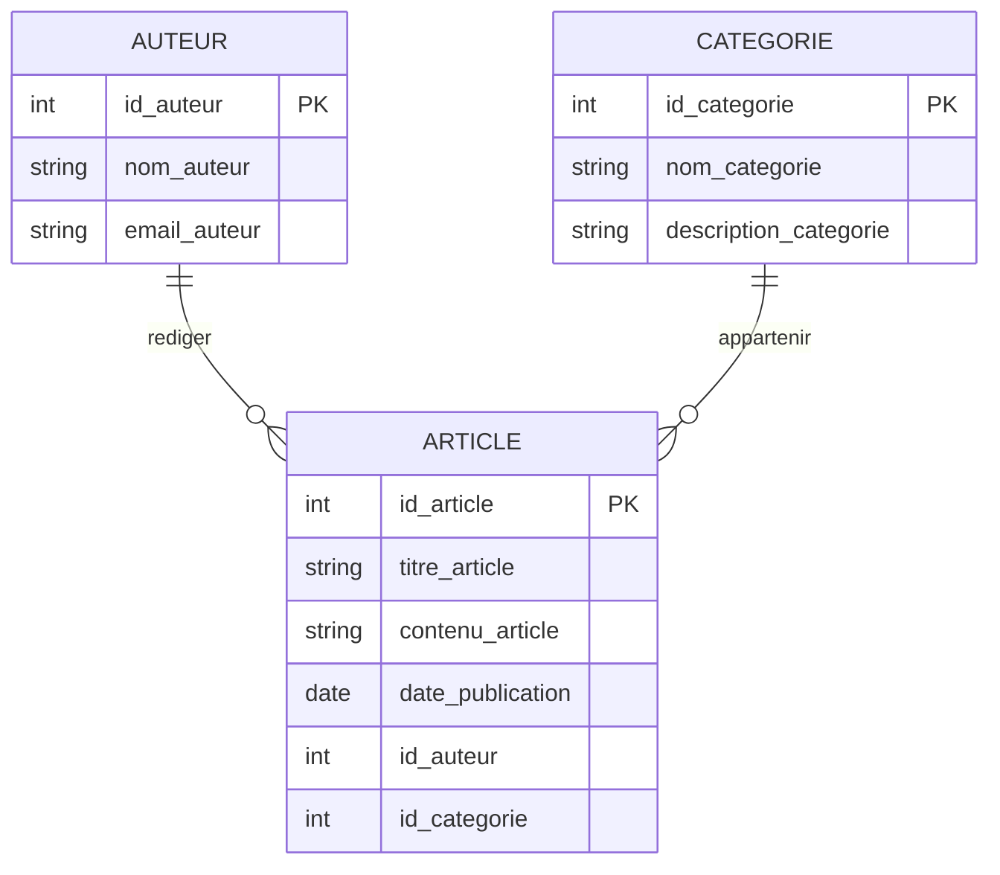

 

## 1. Objectif

À partir des entités identifiées précédemment et des règles de gestion, identifier les associations et déterminer leurs cardinalités.

Construire ensuite le MCD complet du Blog.

## 2. Prérequis

* Avoir identifié les entités, leurs propriétés et leurs identifiants.
* Comprendre les dépendances fonctionnelles.
* Connaître les entités `ARTICLE`, `AUTEUR` et `CATEGORIE`.

# Partie 1 — Théorie

## 1.1. Reprendre les entités

Dans les tutoriels précédents, nous avons organisé les données du Blog et identifié les entités.

Nous avons maintenant :

```text
ARTICLE
AUTEUR
CATEGORIE
```

Chaque entité possède :

* un identifiant ;
* des propriétés.

Nous devons maintenant répondre à une nouvelle question :

> **Comment ces entités sont-elles liées ?**

Pour répondre à cette question, nous utilisons les **règles de gestion**.

## 1.2. Une règle de gestion

Une **règle de gestion** décrit une règle du fonctionnement du système.

Elle permet de préciser comment les éléments du domaine sont liés.

**Exemple :**

> Un auteur peut rédiger plusieurs articles.

Cette règle décrit une relation entre :

```text
AUTEUR
ARTICLE
```

Une règle de gestion est liée au besoin fonctionnel.

Elle permet donc de construire une partie du modèle de données.

## 1.3. Une association

Une **association** représente une relation entre des entités.

À partir de la règle :

> Un auteur peut rédiger plusieurs articles.

nous avons les entités :

```text
AUTEUR
ARTICLE
```

La règle indique qu’un auteur a une relation avec des articles.

Nous pouvons donner un nom à cette relation :

```text
RÉDIGER
```

Nous obtenons :

```text
AUTEUR ───── RÉDIGER ───── ARTICLE
```

`RÉDIGER` est l’association entre `AUTEUR` et `ARTICLE`.

## 1.4. Identifier les associations du Blog

Nous utilisons les règles de gestion du Blog.

### Règles concernant l’auteur

> Un auteur peut rédiger plusieurs articles.

> Un article est rédigé par un seul auteur.

Ces règles montrent une relation entre :

```text
AUTEUR
ARTICLE
```

Nous créons l’association :

```text
AUTEUR ───── RÉDIGER ───── ARTICLE
```

### Règles concernant la catégorie

> Un article appartient à une catégorie.

> Une catégorie peut contenir plusieurs articles.

Ces règles montrent une relation entre :

```text
ARTICLE
CATEGORIE
```

Nous créons l’association :

```text
ARTICLE ───── APPARTENIR ───── CATEGORIE
```

Nous avons donc identifié deux associations :

```text
RÉDIGER
APPARTENIR
```

## 1.5. Une cardinalité

Une **cardinalité** indique combien d’occurrences d’une entité peuvent être liées à une occurrence de l’autre entité.

Une cardinalité possède deux valeurs :

```text
(minimum, maximum)
```

Exemple :

```text
(0,N)
```

signifie :

* minimum : 0 ;
* maximum : plusieurs.

Exemple :

```text
(1,1)
```

signifie :

* minimum : 1 ;
* maximum : 1.

## 1.6. Déterminer le minimum

Pour trouver le minimum, nous lisons la règle de gestion.

Prenons :

> Un auteur peut rédiger plusieurs articles.

Le mot **« peut »** indique qu’un auteur peut ne rédiger aucun article.

Le minimum est donc :

```text
0
```

Prenons :

> Un article est rédigé par un seul auteur.

Un article doit avoir un auteur.

Le minimum est donc :

```text
1
```

## 1.7. Déterminer le maximum

Nous cherchons ensuite le nombre maximum.

Pour un auteur :

> Un auteur peut rédiger plusieurs articles.

Le maximum est :

```text
N
```

Pour un article :

> Un article est rédigé par un seul auteur.

Le maximum est :

```text
1
```

Nous obtenons :

```text
AUTEUR ─── (0,N) ─── RÉDIGER ─── (1,1) ─── ARTICLE
```

## 1.8. Déterminer les cardinalités de l’association RÉDIGER

Les règles sont :

> Un auteur peut rédiger plusieurs articles.

> Un article est rédigé par un seul auteur.

Pour `AUTEUR` :

```text
(0,N)
```

Pour `ARTICLE` :

```text
(1,1)
```

Nous obtenons :

```text
AUTEUR ─── (0,N) ─── RÉDIGER ─── (1,1) ─── ARTICLE
```

## 1.9. Déterminer les cardinalités de l’association APPARTENIR

Les règles sont :

> Un article appartient à une catégorie.

> Une catégorie peut contenir plusieurs articles.

Pour `ARTICLE` :

```text
(1,1)
```

Pour `CATEGORIE` :

```text
(0,N)
```

Nous obtenons :

```text
ARTICLE ─── (1,1) ─── APPARTENIR ─── (0,N) ─── CATEGORIE
```

## 1.10. La méthode à retenir

Pour chaque groupe de règles de gestion, nous suivons cette démarche :

```text
Règle de gestion
       ↓
Entités concernées
       ↓
Association
       ↓
Minimum
       ↓
Maximum
       ↓
Cardinalités
```

Il faut donc :

1. lire la règle de gestion ;
2. identifier les entités concernées ;
3. nommer l’association ;
4. déterminer le minimum ;
5. déterminer le maximum ;
6. placer les cardinalités.

## 1.11. Représenter le MCD avec Mermaid

Mermaid permet de représenter les entités et leurs relations avec un diagramme `erDiagram`.

Pour le Blog :



Dans Mermaid :

```text
||  = exactement 1
o{  = 0 à plusieurs
```

Ainsi :

```text
AUTEUR ||--o{ ARTICLE
```

représente :

```text
AUTEUR (0,N) ─── ARTICLE (1,1)
```

Et :

```text
CATEGORIE ||--o{ ARTICLE
```

représente :

```text
CATEGORIE (0,N) ─── ARTICLE (1,1)
```

## 1.12. Le MCD complet du Blog

Nous avons identifié :

### Entités

```text
ARTICLE
AUTEUR
CATEGORIE
```

### Associations

```text
RÉDIGER
APPARTENIR
```

### Cardinalités

```text
AUTEUR ─── (0,N) ─── RÉDIGER ─── (1,1) ─── ARTICLE

ARTICLE ─── (1,1) ─── APPARTENIR ─── (0,N) ─── CATEGORIE
```

Nous pouvons maintenant représenter le MCD complet :


Nous avons donc suivi toute la démarche :

```text
Données
   ↓
Dépendances fonctionnelles
   ↓
Décomposition
   ↓
Entités
   ↓
Règles de gestion
   ↓
Associations
   ↓
Cardinalités
   ↓
MCD
```

## 1.13. À retenir

* Une règle de gestion décrit le fonctionnement du système.
* Elle permet d’identifier une relation entre des entités.
* Cette relation devient une association.
* La même règle permet de déterminer les cardinalités.
* Une cardinalité indique un minimum et un maximum.
* Les associations et les cardinalités doivent être justifiées par les règles de gestion.
* Le MCD rassemble les entités, les propriétés, les identifiants, les associations et les cardinalités.

# Partie 2 — Pratique

## 2.1. Préparer le travail

### Étape 1 — Reprendre les entités

Pour le système de gestion des commandes, reprenez les entités obtenues dans l’unité précédente :

```text
CLIENT
COMMANDE
PRODUIT
```

Prenez également en compte :

```text
quantite_commandee
```

Cette donnée représente la quantité d’un produit dans une commande.

### Étape 2 — Lire les règles de gestion

Utilisez les règles suivantes :

> Un client peut passer plusieurs commandes.

> Une commande est passée par un seul client.

> Une commande contient plusieurs produits.

> Un produit peut être présent dans plusieurs commandes.

Lisez chaque règle avant de construire le modèle.

## 2.2. Identifier les associations

### Étape 3 — Identifier les entités concernées

Pour chaque règle, indiquez les entités concernées.

### Étape 4 — Nommer les associations

Pour chaque relation identifiée, donnez un nom clair.

Le nom doit représenter la relation entre les entités.

### Étape 5 — Représenter les associations

Représentez les associations entre :

```text
CLIENT
COMMANDE
PRODUIT
```

**Résultat attendu :**

Les associations entre les entités sont identifiées et nommées.

## 2.3. Déterminer les cardinalités

### Étape 6 — Déterminer le minimum

Pour chaque côté d’une association, posez la question :

> Une occurrence peut-elle exister sans être liée à l’autre entité ?

Déterminez :

```text
0
```

ou :

```text
1
```

### Étape 7 — Déterminer le maximum

Posez ensuite :

> Une occurrence peut-elle être liée à plusieurs occurrences de l’autre entité ?

Déterminez :

```text
1
```

ou :

```text
N
```

### Étape 8 — Écrire les cardinalités

Écrivez les cardinalités sous la forme :

```text
(minimum, maximum)
```

Placez-les sur les deux côtés de chaque association.

### Étape 9 — Vérifier les règles de gestion

Relisez chaque règle de gestion.

Vérifiez que les cardinalités correspondent bien à la règle.

**Résultat attendu :**

Chaque association possède des cardinalités justifiées par les règles de gestion.

## 2.4. Construire le MCD

### Étape 10 — Représenter les entités

Représentez :

* les entités ;
* les propriétés ;
* les identifiants.

### Étape 11 — Ajouter les associations

Ajoutez les associations identifiées.

### Étape 12 — Ajouter les cardinalités

Ajoutez les cardinalités déterminées à partir des règles de gestion.

### Étape 13 — Placer `quantite_commandee`

Analysez la donnée :

```text
quantite_commandee
```

Déterminez à quelle relation elle appartient dans votre modèle.

### Étape 14 — Représenter le MCD avec Mermaid

Écrivez votre propre MCD avec :

```text
erDiagram
    ...
```

Ne copiez pas le MCD du Blog.

Construisez votre modèle à partir des règles de gestion de la gestion des commandes.

**Résultat attendu :**

Un MCD complet de la gestion des commandes contenant :

* les entités ;
* les propriétés ;
* les identifiants ;
* les associations ;
* les cardinalités ;
* `quantite_commandee` au bon endroit.

# 3. Bilan

**Vous avez réalisé :** l’identification des associations et des cardinalités à partir des règles de gestion, puis la construction du MCD de la gestion des commandes.

**Vous savez maintenant :** lire une règle de gestion, identifier les entités concernées, créer une association, déterminer ses cardinalités et représenter le MCD avec Mermaid.

# 4. Glossaire

* **Règle de gestion** : règle qui décrit le fonctionnement du système.
* **Association** : relation entre des entités.
* **Cardinalité** : nombre minimum et maximum d’occurrences liées.
* **Minimum** : nombre minimum de relations possibles.
* **Maximum** : nombre maximum de relations possibles.
* **Entité** : élément du système représenté dans le modèle de données.
* **Propriété** : donnée qui décrit une entité.
* **Occurrence** : élément d’une entité.
* **Mermaid** : langage qui permet de créer des diagrammes à partir de texte.
