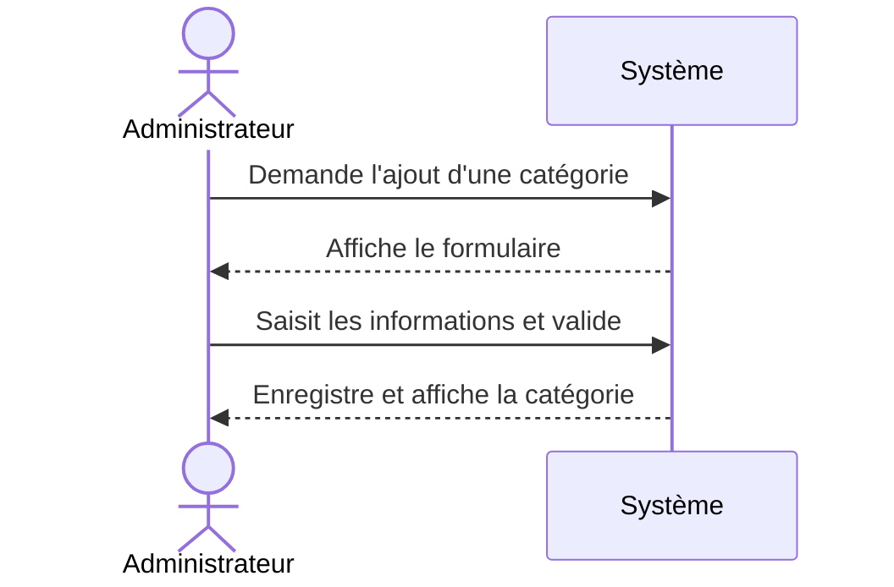

## 1. Objectif

Dans ce tutoriel, vous allez apprendre à décrire le **scénario nominal** d’un cas d’utilisation.
Vous allez préciser :
* la précondition et le déclencheur ;
* les échanges entre l'acteur et le système ;
* le résultat attendu.

## 2. Prérequis

Vous devez avoir identifié le système, ses acteurs, et modélisé le diagramme de cas d’utilisation.

## Cas d'étude

Le système étudié est le **Blog**. Nous allons analyser deux fonctionnalités : la première servira d'exemple théorique, la seconde d'exercice pratique.

### Fonctionnalité 1 (Exemple) : Ajouter une catégorie
* **Acteur principal :** Administrateur
* **Fonctionnement brut attendu :** 
  L'Administrateur accède à la gestion des catégories. Le système affiche les catégories existantes. L'Administrateur clique sur créer. Le système affiche le formulaire. Il saisit les informations et valide. Le système enregistre et affiche la nouvelle catégorie.

### Fonctionnalité 2 (Exercice) : Ajouter un article
* **Acteur principal :** Auteur
* **Fonctionnement brut attendu :** 
  L'Auteur accède à la page d'ajout d'article. Le système affiche le formulaire. L'Auteur saisit le titre, sélectionne la catégorie et le statut, téléverse une image, rédige le contenu, puis clique sur "Enregistrer l'article". Le système sauvegarde l'article et redirige l'Auteur vers la liste des articles.

*Note : Dans ce tutoriel, on ne décrit que le fonctionnement parfait sans aucune erreur (le scénario nominal).*

## Partie 1 — Théorie

### 1.1. L'anatomie d'un scénario nominal

Un **scénario nominal** raconte l'histoire "parfaite" où le cas d'utilisation se déroule du début à la fin sans erreur. 
Il est encadré par trois balises obligatoires :
1. **Précondition** : L'état requis du système *avant* de commencer. 
2. **Déclencheur** : L'action précise qui donne le coup d'envoi.
3. **Résultat attendu** : L'état du système à la toute fin.

### 1.2. Le dialogue Acteur / Système

Le cœur du scénario décrit les étapes sous la forme d'une alternance stricte (comme un match de ping-pong) : `Action de l'Acteur` ➡️ `Réponse du Système`.
Chaque ligne doit contenir un verbe d'action précis.

> ❌ **Mauvais exemple (trop vague) :**
> L'Administrateur ouvre la page, tape son titre et le système sauvegarde.

> ✅ **Bon exemple (séparé en étapes) :**
> 1. L'Administrateur clique sur "Nouvelle catégorie".
> 2. Le système affiche le formulaire de création.
> 3. L'Administrateur saisit le titre et valide.
> 4. Le système enregistre la catégorie.

### 1.3. Exemple complet : Ajouter une catégorie

Voici la formalisation complète de la première fonctionnalité de notre cas d'étude :

- **Cas d'utilisation :** Ajouter une catégorie
- **Acteur principal :** Administrateur
- **Précondition :** L'Administrateur est connecté au blog.
- **Déclencheur :** L'Administrateur souhaite créer une nouvelle catégorie.

**Scénario nominal :**
1. L'Administrateur accède à la gestion des catégories.
2. Le système affiche les catégories existantes.
3. L'Administrateur clique sur le bouton de création.
4. Le système affiche un formulaire vide.
5. L'Administrateur saisit les informations et valide.
6. Le système enregistre la nouvelle catégorie.
7. Le système affiche la nouvelle catégorie dans la liste.

**Résultat attendu :** La catégorie est sauvegardée et visible dans l'interface de gestion.

*Bonus visuel : Ce dialogue peut être modélisé très efficacement avec un Diagramme de Séquence UML :*

## Partie 2 — Pratique

### 2.1. Rédiger le scénario nominal

À partir du fonctionnement brut de la **Fonctionnalité 2** listée dans le Cas d'étude, vous devez rédiger le scénario complet et formel pour l'ajout d'un article.

**Travail à faire :**

Dans votre document de travail, rédigez le livrable final en respectant scrupuleusement l'anatomie vue en théorie (Précondition, Déclencheur, dialogue Acteur/Système, Résultat).

**Cas d'utilisation :** Ajouter un article
**Acteur principal :** Auteur
**Précondition :** ...
**Déclencheur :** ...

**Scénario nominal :**
1. L'Auteur ...
2. Le système ...
3. ...

**Résultat attendu :** ...

<button class="btn btn-primary btn-toggle-resultat">Afficher le résultat</button>
<iframe
    class="auto-wrapper tuto-resultat"
    src="{{ '/code/fonctionnalite/tuto-211-113-fonctionnalite.html' | relative_url }}"
    height="500"
    title="Résultat attendu">
</iframe>

## Bilan

**Vous avez appris :**
* à définir les bornes d'un scénario (Précondition, Déclencheur, Résultat).
* à décrire précisément le dialogue (l'alternance des étapes) entre un acteur et le système.
* à lire un diagramme de séquence UML modélisant cet échange.

**Vous préparerez ensuite :**
> les scénarios alternatifs (erreurs et cas particuliers) pour rendre ce cas d'utilisation parfaitement robuste.

## Glossaire

* **Scénario nominal** : le chemin idéal où le cas d'utilisation se déroule parfaitement, sans aucune erreur.
* **Précondition** : état requis du système avant de pouvoir démarrer le scénario.
* **Déclencheur** : l'événement initial qui provoque le démarrage du scénario.
* **Résultat attendu** : état garanti par le système à la fin du scénario nominal.
* **Diagramme de Séquence** : Modélisation UML permettant de visualiser chronologiquement les échanges entre les acteurs et le système.
