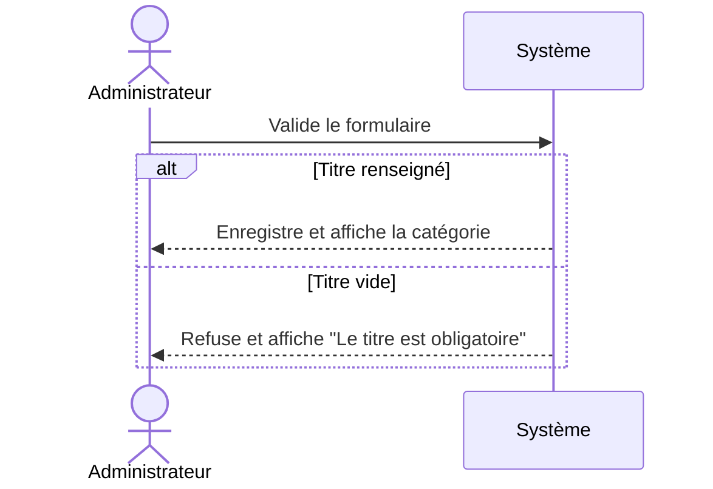

## 1. Objectif

Dans ce tutoriel, vous allez apprendre à :
* gérer les scénarios d'erreur et les chemins alternatifs ;
* valider la cohérence globale de votre **Dossier Fonctionnel** (Acteurs ↔ Diagrammes ↔ Scénarios).

## 2. Prérequis

Vous devez avoir rédigé le scénario nominal de votre fonctionnalité (T.211.113).

## Cas d'étude

Le système étudié est le **Blog**. Nous continuons sur notre lancée :

### Fonctionnalité 1 (Exemple) : Ajouter une catégorie
* **Scénario d'erreur identifié :** L'Administrateur tente d'enregistrer avec le champ "Titre" vide. Le système doit bloquer l'action et afficher une erreur.

### Fonctionnalité 2 (Exercice) : Ajouter un article
* **Scénario d'erreur identifié :** L'Auteur oublie de renseigner le contenu de l'article avant d'enregistrer.
* **Scénario alternatif identifié :** L'Auteur décide de choisir le statut "Brouillon" dans le formulaire plutôt que "Publié". Le système doit sauvegarder l'article sans le rendre visible au public.

## Partie 1 — Théorie

### 1.1. Les chemins alternatifs et d'erreur

Le scénario nominal décrit un monde parfait. Mais dans la réalité, des imprévus arrivent. Pour compléter une fonctionnalité, on ajoute des blocs d'**Exceptions** (ou Scénarios alternatifs) à la suite du scénario nominal.

Un bloc d'exception contient :
1. **La Condition :** Ce qui déclenche l'exception (ex: *Le titre est vide*).
2. **Le Scénario :** Le dialogue Acteur / Système spécifique à cette exception.
3. **La Reprise (ou la Fin) :** Ce qui se passe après (ex: *L'Administrateur corrige et reprend à l'étape X*).

* **Scénario d'erreur :** L'action échoue, le système bloque ou affiche une alerte.
* **Scénario alternatif :** L'action réussit, mais via un chemin différent (ex: Paiement par Paypal au lieu de Carte Bleue).

**Exemple complet (Fonctionnalité 1) :**
> **Condition (Erreur) :** À l'étape 5, le champ "Titre" est vide.
> **Scénario d'erreur :**
> 1. L'Administrateur valide le formulaire.
> 2. Le système refuse l'enregistrement et affiche "Le titre est obligatoire".
> **Reprise :** L'Administrateur corrige et le scénario reprend à l'étape 5.

*Voici comment modéliser cette exception avec un Diagramme de Séquence :*

### 1.2. Le Dossier Fonctionnel (Cohérence Globale)

Le livrable final d'une analyse s'appelle le **Dossier Fonctionnel**. Il regroupe tout ce que vous avez produit :
- Les acteurs identifiés
- Le diagramme de contexte
- Le diagramme de cas d'utilisation
- Les scénarios (nominaux et exceptions)

**La règle d'or est la Cohérence.** 
Tous vos documents doivent raconter *exactement la même histoire*. Si votre diagramme de cas d'utilisation montre l'acteur *Auteur* relié à *Ajouter un article*, votre scénario texte doit concerner l'Auteur et non le Visiteur !

## Partie 2 — Pratique

### 2.1. Compléter avec les exceptions

Reprenez le scénario nominal de la **Fonctionnalité 2** ("Ajouter un article" par l'Auteur) que vous avez rédigé au tutoriel précédent. 

**Travail à faire :**
Ajoutez, à la suite de votre scénario, les deux blocs d'exception fournis dans le **Cas d'étude**.

1. Rédigez le **Scénario d'erreur** (L'Auteur oublie le contenu).
2. Rédigez le **Scénario alternatif** (L'Auteur choisit le statut "Brouillon").

<button class="btn btn-primary btn-toggle-resultat">Afficher le résultat</button>
<iframe
    class="auto-wrapper tuto-resultat"
    src="{{ '/code/fonctionnalite/tuto-211-114-fonctionnalite.html' | relative_url }}"
    height="450"
    title="Résultat attendu">
</iframe>

### 2.2. La Checklist du Dossier Fonctionnel

Avant de livrer un dossier d'analyse à une équipe de développement, vous devez passer en revue cette checklist :

- [ ] Mes diagrammes (Contexte, Cas d'utilisation) n'utilisent que des arcs non orientés (`---`).
- [ ] Mes acteurs ne sont jamais des interfaces graphiques ou des bases de données.
- [ ] J'ai vérifié que chaque trait sur le diagramme correspond bien à une fonctionnalité documentée en texte.
- [ ] Mes scénarios utilisent un vocabulaire précis ("Le système...", "L'Acteur...") et évitent les phrases vagues.
- [ ] J'ai prévu les cas d'erreur principaux (champs vides, doublons, annulations).

Si tout est coché, votre analyse est solide et prête pour le développement !

## Bilan

**Vous avez appris :**
* à gérer l'imprévu en ajoutant des scénarios alternatifs et d'erreur.
* à auto-évaluer votre conception grâce à la checklist de cohérence.

**Vous avez réalisé :**
> Votre premier Dossier Fonctionnel complet et robuste pour une fonctionnalité web !

## Glossaire

* **Scénario alternatif** : Un chemin différent du scénario nominal, qui aboutit tout de même à un succès.
* **Scénario d'erreur** : Un chemin bloquant, où le système empêche le succès à cause d'une condition non respectée.
* **Dossier fonctionnel** : L'ensemble cohérent de tous vos diagrammes et scénarios décrivant le comportement d'une fonctionnalité.
