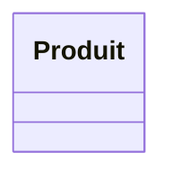
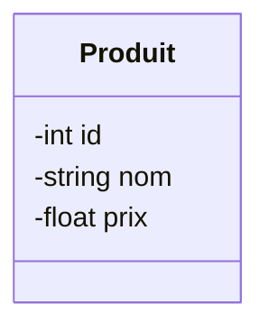

## 1. Objectif

Dans ce tutoriel, vous allez apprendre à utiliser la syntaxe Mermaid pour dessiner un diagramme de classes simple. Vous découvrirez comment déclarer une classe et lui ajouter des attributs.

## 2. Prérequis

* Comprendre ce qu'est une classe de manière conceptuelle (un modèle de données).

## Base de travail

Aucun fichier de départ n'est requis. Vous pouvez tester le code Mermaid directement dans votre éditeur (s'il supporte Mermaid) ou sur l'éditeur en ligne officiel : [Mermaid Live Editor](https://mermaid.live).

## Partie 1 — Théorie

### 1.1. Déclarer un diagramme de classes

Mermaid est un outil qui permet de générer des schémas à partir de texte. Pour indiquer à Mermaid que vous souhaitez dessiner un diagramme de classes, vous devez toujours commencer par le mot-clé `classDiagram`.

**Exemple :**
```text
classDiagram
```

### 1.2. Ajouter une classe

Pour créer une boîte représentant une classe, utilisez le mot-clé `class` suivi du nom de votre classe (toujours avec une majuscule).

**Exemple :**

*Code :*
```text
classDiagram
    class Produit
```

*Rendu visuel :*


### 1.3. Ajouter des attributs

Les attributs (les données de la classe) se placent entre des accolades `{}` sous le nom de la classe. Chaque attribut est défini par son **type** (int, string, bool...) suivi de son **nom**. 
Le symbole `-` devant l'attribut indique qu'il est privé (une bonne pratique en conception objet).

**Exemple :**

*Code :*
```text
classDiagram
    class Produit {
        -int id
        -string nom
        -float prix
    }
```

*Rendu visuel :*


### 1.4. À retenir

- Un diagramme commence par `classDiagram`.
- Une classe se déclare avec `class NomClasse`.
- Les attributs se définissent à l'intérieur d'accolades `{}` avec le format `-type nom`.

## Partie 2 — Pratique

### Mission : Modéliser l'Entité Catégorie de votre Blog

Vous allez initier le dossier de conception de votre projet de Blog (Sprint 2) en y écrivant votre premier diagramme de classes.

**Travail à faire (dans votre dépôt GitHub) :**

1. À la racine de votre projet Blog, créez un dossier `conception`.
2. À l'intérieur, créez un fichier nommé `classes.mmd`.
3. Dans ce fichier, utilisez la syntaxe Mermaid pour déclarer une classe nommée `Categorie`.
4. Ajoutez-lui les attributs privés suivants correspondant aux données de votre Sprint 1 :
   - `id` de type `int`
   - `nom` de type `string`
   - `couleur` de type `string`
   - `icone` de type `string`

<details>
<summary>Voir le résultat attendu dans `classes.mmd`</summary>
<div markdown="1">

```text
classDiagram
    class Categorie {
        -int id
        -string nom
        -string couleur
        -string icone
    }
```

**Livrable :** Le lien GitHub vers votre fichier `conception/classes.mmd`.

</div>
</details>

## Bilan

**Vous avez réalisé :** Un diagramme de classes basique en texte.
**Vous savez maintenant :** Utiliser la syntaxe Mermaid (`classDiagram`, `class`) pour représenter visuellement une classe et ses attributs.

## Glossaire

- **Mermaid** : Outil permettant de générer des diagrammes et des graphiques à partir de texte.
- **Attribut** : Variable qui stocke une donnée à l'intérieur d'une classe.
