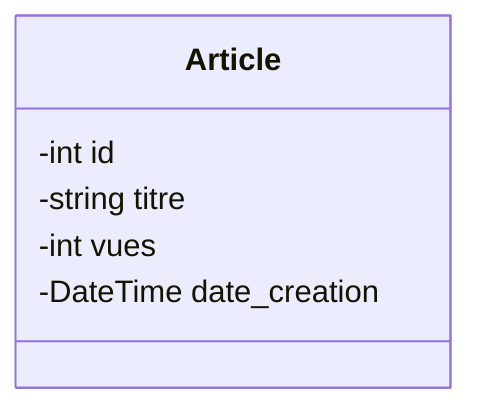

## Objectif

Dans ce tutoriel, vous allez transformer les tables d'un MLD en classes statiques, c'est-à-dire sans comportement ni association.

Vous apprendrez à déduire les classes, leurs attributs, leurs identifiants et leurs types depuis un modèle de base de données.

## Prérequis

* Lire un Modèle Logique de Données (MLD).
* Syntaxe de base d'un diagramme de classes Mermaid.

## Théorie

### 1. De la Table à la Classe

Le passage du modèle relationnel (MLD) au modèle objet se fait selon des règles de traduction directes :

| Modèle Relationnel (MLD) | Modèle Objet (Classe) | Règle de nommage |
|---|---|---|
| **Table** | **Classe** | Nom au singulier, 1ère lettre en majuscule (ex: `ARTICLE` -> `Article`) |
| **Colonne** | **Attribut** | Nom explicite, adapté au contexte de la classe (ex: `id_article` -> `id`) |
| **Clé primaire (PK)** | **Identifiant** | L'attribut devient l'identifiant (ex: `id_article` -> `id`) |
| **Type de donnée** | **Type d'attribut** | Traduction sémantique (ex: `date` -> `DateTime`, `text` -> `string`) |

**Exemple de transformation :**

```text
ARTICLE
- id_article : int (PK)
- titre : string
- vues : int
- date_creation : date
```

Se traduit par la classe suivante :



### 2. Les Clés Étrangères (FK)

Dans un diagramme de classes **statique**, il ne doit y avoir **aucune clé étrangère** dans les attributs. Les liens entre entités seront exprimés plus tard via les **associations UML**.
Dans ce tutoriel, vous allez donc extraire les données propres à chaque classe et ignorer les clés étrangères pour le moment.

## Pratique

### Cas d'étude : Le MLD du Blog

Voici le Modèle Logique de Données d'un blog.

```text
USER
- id_user : int (PK)
- email : string
- mot_de_passe : string
- role : string

AUTEUR
- id_auteur : int (PK)
- id_user : int (FK)
- nom : string
- prenom : string
- biographie : string
- avatar : string

CATEGORIE
- id_categorie : int (PK)
- nom : string
- couleur : string
- icone : string

ARTICLE
- id_article : int (PK)
- id_categorie : int (FK)
- id_auteur : int (FK)
- titre : string
- contenu : text
- image_couverture : string
- statut : string
- date_creation : date
- vues : int
```

### Mission

Votre objectif est de transformer ce MLD en un diagramme de classes.

**Travail à faire :**
1. Créez un fichier `classes_statiques.mmd`.
2. Déclarez un bloc `classDiagram`.
3. Ajoutez les 4 classes : `User`, `Auteur`, `Categorie` et `Article`.
4. Ajoutez les attributs et leurs types pour chaque classe, en ignorant les clés étrangères. N'oubliez pas l'identifiant (`id`).

> [!TIP]
> Pensez à adapter les noms d'attributs au contexte. Par exemple, l'attribut `mot_de_passe` de la table `USER` devient plus naturellement `password` dans la classe `User`.

## Bilan

Vous avez traduit une structure relationnelle (tables, colonnes, types) en une structure objet (classes, attributs, types). Vous possédez désormais le **modèle objet statique** de votre application. L'étape suivante consistera à lier ces classes entre elles.

## Glossaire

* **Classe** : Structure représentant un concept du système.
* **Attribut** : Donnée portée par un objet.
* **Identifiant** : Attribut permettant de distinguer un objet de manière unique.
