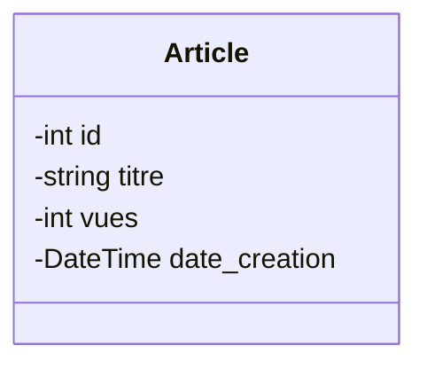

## Objectif

Dans ce tutoriel, vous allez transformer les tables d'un MLD en classes statiques, c'est-à-dire sans comportement ni association.

Vous apprendrez à déduire les classes, leurs attributs, leurs identifiants et leurs types depuis un modèle de base de données.

## Prérequis

* Lire un Modèle Logique de Données (MLD).
* Syntaxe de base d'un diagramme de classes Mermaid.

## Théorie

### 1. De la Table à la Classe

Le passage du modèle relationnel (MLD) au modèle objet se fait selon des règles de traduction directes :

| Modèle Relationnel (MLD) | Modèle Objet (Classe) | Règle de nommage |
|---|---|---|
| **Table** | **Classe** | Nom au singulier, 1ère lettre en majuscule (ex: `ARTICLE` -> `Article`) |
| **Colonne** | **Attribut** | Nom explicite, adapté au contexte de la classe (ex: `id_article` -> `id`) |
| **Clé primaire (PK)** | **Identifiant** | L'attribut devient l'identifiant (ex: `id_article` -> `id`) |
| **Type de donnée** | **Type d'attribut** | Traduction sémantique (ex: `date` -> `DateTime`, `text` -> `string`) |

**Exemple de transformation :**

```text
ARTICLE
- id_article : int (PK)
- titre : string
- vues : int
- date_creation : date
```

Se traduit par la classe suivante :

*Code :*
```text
classDiagram
    class Article {
        -int id
        -string titre
        -int vues
        -DateTime date_creation
    }
```

*Rendu visuel :*


### 2. Les Clés Étrangères (FK)

Dans un diagramme de classes **statique**, il ne doit y avoir **aucune clé étrangère** dans les attributs. Les liens entre entités seront exprimés plus tard via les **associations UML**.
Dans ce tutoriel, vous allez donc extraire les données propres à chaque classe et ignorer les clés étrangères pour le moment.

## Pratique

### Mission : Compléter le diagramme de votre Blog

Dans le tutoriel précédent, vous avez modélisé l'entité `Categorie` dans votre fichier `conception/classes.mmd`. Lors de la phase de conception, un diagramme de classes doit refléter **la totalité** de votre base de données, même si vous n'allez coder qu'une partie de ces classes par la suite.

Voici le MLD complet du projet Blog (Sprint 2) :

```text
USER
- id_user : int (PK)
- email : string
- mot_de_passe : string
- role : string

AUTEUR
- id_auteur : int (PK)
- id_user : int (FK)
- nom : string
- prenom : string
- biographie : string
- avatar : string

ARTICLE
- id_article : int (PK)
- id_categorie : int (FK)
- id_auteur : int (FK)
- titre : string
- contenu : text
- statut : string
- date_creation : date
```

**Travail à faire (dans votre dépôt GitHub) :**

1. Ouvrez votre fichier `conception/classes.mmd`.
2. Ajoutez les classes `User`, `Auteur` et `Article` à la suite de `Categorie`.
3. Traduisez les colonnes de chaque table en attributs de classe (n'oubliez pas de typer correctement, ex: `string`, `DateTime`).
4. **Règle d'or :** Ne traduisez pas les clés étrangères (`id_categorie`, `id_user`, `id_auteur`). Les clés étrangères n'ont pas leur place en tant qu'attributs dans un diagramme de classes.

<details>
<summary>Voir le résultat attendu dans `classes.mmd`</summary>
<div markdown="1">

```text
classDiagram
    class Categorie {
        -int id
        -string nom
        -string couleur
        -string icone
    }
    
    class User {
        -int id
        -string email
        -string password
        -string role
    }
    
    class Auteur {
        -int id
        -string nom
        -string prenom
        -string biographie
        -string avatar
    }
    
    class Article {
        -int id
        -string titre
        -string contenu
        -string statut
        -DateTime date_creation
    }
```

**Livrable :** Le lien GitHub vers votre fichier `conception/classes.mmd` contenant l'intégralité du modèle de données (4 classes).

</div>
</details>

## Bilan

Vous avez traduit une structure relationnelle (tables, colonnes, types) en une structure objet (classes, attributs, types). Vous possédez désormais le **modèle objet statique** de votre application. L'étape suivante consistera à lier ces classes entre elles.

## Glossaire

* **Classe** : Structure représentant un concept du système.
* **Attribut** : Donnée portée par un objet.
* **Identifiant** : Attribut permettant de distinguer un objet de manière unique.
