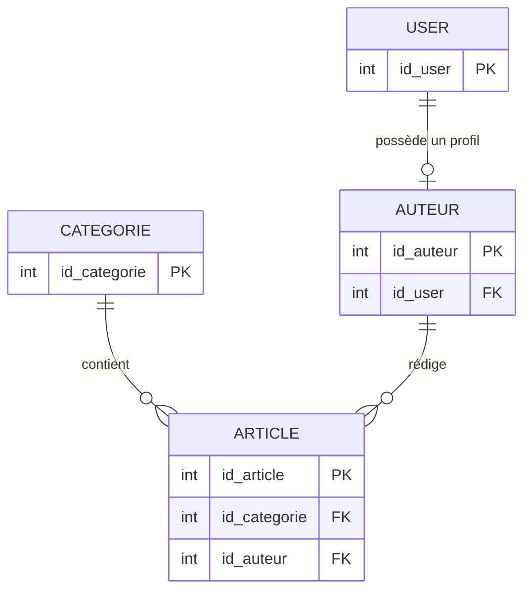
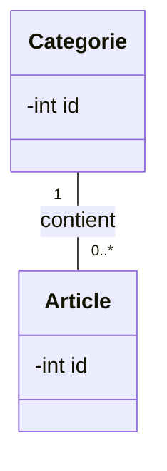

## 1. Objectif

Transformer les relations d'un MLD (Clés étrangères) en associations entre classes (UML), avec leurs multiplicités et leurs rôles.

## 2. Prérequis

* Lire un Modèle Logique de Données (MLD).
* Avoir modélisé les classes simples (Tutoriel T.212.111).

## Données de départ

Le MLD de notre blog se présente ainsi :



**Attention :** Dans le modèle objet UML, les clés étrangères (`id_user`, `id_categorie`...) **disparaissent** des attributs et sont remplacées visuellement par des lignes appelées **Associations**.

## Partie 1 — Théorie

### De la clé étrangère à l'Association UML

Dans une base de données, on relie deux tables avec une **Clé étrangère**. En POO et modélisation UML, on relie deux classes par une **Association**.

**Règles de traduction :**

| Élément MLD | Modèle Objet (UML) |
| --- | --- |
| Clé étrangère (FK) | Association (Ligne entre deux classes) |
| Cardinalité (1,N) | Multiplicité (`1`, `0..1`, `0..*`) |
| Nom de la relation | Rôle de l'association |

### Syntaxe Mermaid (Associations et Multiplicités)

La syntaxe pour lier deux classes dans un diagramme de classes Mermaid est :
`ClasseA "multiplicité A" -- "multiplicité B" ClasseB : rôle`

**Exemple de relation 1..N (Un à plusieurs) :**

*Code :*
```text
classDiagram
    class Categorie {
        -int id
    }
    class Article {
        -int id
    }
    Categorie "1" -- "0..*" Article : contient
```

*Rendu visuel :*


*Explication des multiplicités :*
- `1` : Exactement 1
- `0..1` : Zéro ou un (Optionnel, relation 1-1)
- `0..*` : Zéro ou plusieurs (Relation 1-N)
- `1..*` : Un ou plusieurs

Ici, on lit dans les deux sens : 
1. "Une Categorie contient zéro ou plusieurs (`0..*`) Articles".
2. "Un Article appartient à exactement une (`1`) Categorie".

## Partie 2 — Pratique

### Mission : Traduire les relations en associations

**Travail à faire :**
Reprenez votre fichier `classes_statiques.mmd` du tutoriel précédent, qui contenait vos 4 classes nues (`User`, `Auteur`, `Categorie`, `Article`). Notez bien que les clés étrangères (`id_user`, etc.) ont été supprimées des attributs.

En vous basant sur les relations du MLD (dans la section "Données de départ"), ajoutez les associations entre les classes en utilisant la syntaxe Mermaid vue dans la théorie.
Faites attention à mettre la bonne multiplicité (`1`, `0..1`, ou `0..*`) de chaque côté de l'association.

### Étape de vérification (Audit du Modèle)

Avant de valider définitivement votre modèle, passez-le toujours à la loupe avec cette "Checklist du Concepteur" :

- [ ] **Classes** : Chaque table du MLD a-t-elle sa classe (au singulier) ?
- [ ] **Identifiants** : Chaque classe possède-t-elle son attribut `id` (issu de la clé primaire) ?
- [ ] **Attributs** : Tous les champs (hors clés étrangères) sont-ils présents et correctement typés (`string`, `int`, `DateTime`) ?
- [ ] **Associations** : Les clés étrangères ont-elles bien disparu des attributs pour devenir des lignes d'association ?
- [ ] **Multiplicités** : Le sens de chaque association a-t-il été testé avec une phrase ? *(ex: "Un Auteur rédige 0 ou plusieurs Articles")*.
- [ ] **Pureté** : Le diagramme est-il exempt de méthodes ou de classes d'architecture (Controller, Repository) ?

**Résultat attendu :**

<button class="btn btn-primary btn-toggle-resultat">Afficher le résultat</button>
<iframe
    class="auto-wrapper tuto-resultat"
    src="{{ '/code/objets/T.212.112.html' | relative_url }}"
    height="1200"
    title="Résultat attendu">
</iframe>

## Bilan

**Vous avez appris :**
* qu'une clé étrangère en base de données devient une association en POO.
* à utiliser la syntaxe Mermaid pour lier deux classes.
* à définir et lire des multiplicités (`1`, `0..*`, etc.) et des rôles d'association.

Votre modèle objet statique est désormais complet et cohérent !

## Glossaire

* **Association** : Lien structurel entre deux classes dans un modèle objet.
* **Multiplicité** : Indique combien d'objets peuvent être liés de part et d'autre d'une association.
* **Rôle** : Verbe ou expression qui donne un sens à l'association (ex: "rédige", "contient").
