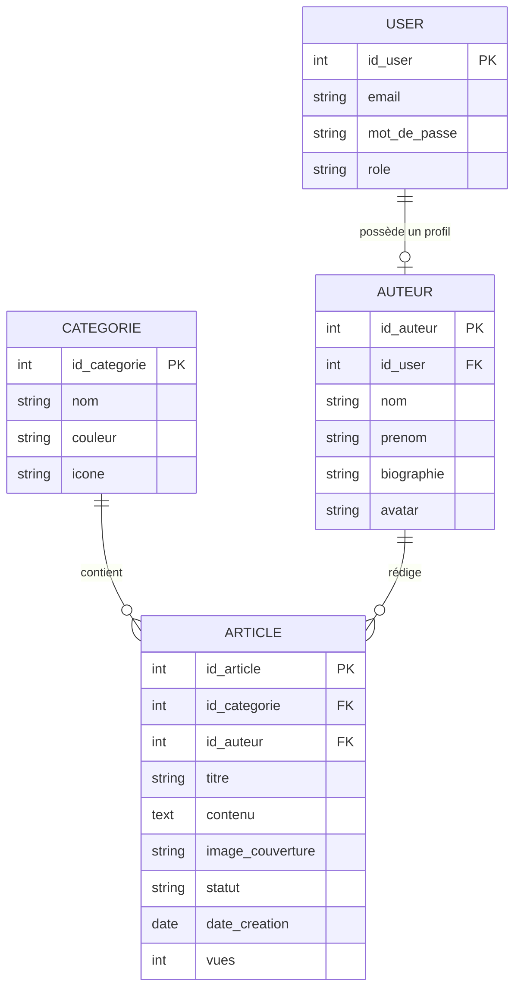

## 1. Objectif

Dans ce tutoriel, vous allez apprendre à vérifier et finaliser un modèle objet à partir du MLD.

Vous allez vérifier :

* les classes ;
* les attributs ;
* les types ;
* les identifiants ;
* les associations ;
* les multiplicités ;
* les rôles des associations ;
* la cohérence avec les fonctionnalités.

À la fin du tutoriel, vous disposerez du **diagramme de classes objet final**.

## 2. Prérequis

Vous devez savoir :

* lire un MLD ;
* transformer une table en classe ;
* transformer une colonne en attribut ;
* transformer une clé primaire en identifiant ;
* transformer une relation en association ;
* utiliser les multiplicités ;
* lire un diagramme de classes.

Vous devez avoir réalisé :

* **T.212.111 — Transformer les tables en classes** ;
* **T.212.112 — Transformer les relations en associations**.

Vous devez disposer du fichier :

```text
classes_statiques.mmd
```

## Données de départ

Le MLD de référence est :



Le modèle objet construit dans les tutoriels précédents contient quatre classes :

```text
User
Auteur
Categorie
Article
```

et leurs associations.

Le modèle objet doit rester **statique**.

Il ne contient pas encore :

* de méthodes ;
* de services ;
* de comportements ;
* d'héritage métier ;
* de Repository ;
* de DAO.

## Partie 1 — Théorie

### 1.1. Pourquoi vérifier le modèle objet ?

La transformation du MLD vers le modèle objet peut produire des erreurs.

Exemples :

* une table oubliée ;
* un attribut oublié ;
* un mauvais type ;
* un identifiant incorrect ;
* une association oubliée ;
* une mauvaise multiplicité ;
* un rôle incorrect.

La vérification permet de comparer les deux modèles.

La question principale est :

> Le modèle objet représente-t-il correctement les informations et les relations du MLD ?

### 1.2. Vérifier les classes

Chaque table du MLD doit avoir une classe correspondante.

Le MLD contient :

```text
USER
AUTEUR
CATEGORIE
ARTICLE
```

Le modèle objet doit donc contenir :

```text
User
Auteur
Categorie
Article
```

Vérifiez :

* le nombre de classes ;
* le nom des classes ;
* le singulier ;
* la correspondance avec les tables.

### 1.3. Vérifier les attributs

Chaque donnée nécessaire du MLD doit être représentée dans la classe correspondante.

Exemple :

```text
ARTICLE
- titre
- contenu
- statut
- date_creation
- vues
```

doit être représenté dans `Article`.

Un attribut ne doit pas apparaître sans justification dans le MLD.

Il faut donc vérifier les deux directions :

> MLD → modèle objet

et :

> modèle objet → MLD

### 1.4. Vérifier les identifiants

Chaque classe de données doit posséder son identifiant.

Exemple :

```text
User
- int id
```

```text
Auteur
- int id
```

```text
Categorie
- int id
```

```text
Article
- int id
```

L'identifiant doit correspondre à la clé primaire de la table source.

### 1.5. Vérifier les types

Les types doivent rester cohérents avec les données du MLD.

Exemple :

```text
int → int
string → string
text → string
date → DateTime
```

Une erreur de type peut modifier le sens de la donnée.

Exemple :

```text
vues : int
```

ne doit pas devenir :

```text
string vues
```

### 1.6. Vérifier les associations

Chaque relation du MLD doit être retrouvée dans le modèle objet.

Le MLD contient trois relations :

```text
USER → AUTEUR
CATEGORIE → ARTICLE
AUTEUR → ARTICLE
```

Le modèle objet doit donc contenir trois associations correspondantes.

Une association supplémentaire ne doit pas être ajoutée sans justification.

### 1.7. Vérifier les multiplicités

Les multiplicités doivent être déduites du MLD.

Pour :

```text
USER ||--o| AUTEUR
```

la lecture est :

> Un `User` possède zéro ou un `Auteur`.

et :

> Un `Auteur` appartient à un seul `User`.

La représentation objet correspondante est :

```text
User "1" -- "0..1" Auteur
```

Pour :

```text
CATEGORIE ||--o{ ARTICLE
```

la représentation est :

```text
Categorie "1" -- "0..*" Article
```

Pour :

```text
AUTEUR ||--o{ ARTICLE
```

la représentation est :

```text
Auteur "1" -- "0..*" Article
```

### 1.8. Vérifier les rôles

Le rôle explique la signification de l'association.

Exemples :

```text
User → possède un profil → Auteur
```

```text
Categorie → contient → Article
```

```text
Auteur → rédige → Article
```

Le rôle doit être cohérent avec la relation du MLD.

### 1.9. Vérifier la correspondance avec les fonctionnalités

Le modèle objet représente les données utilisées par les fonctionnalités.

Les fonctionnalités déjà formalisées utilisent notamment :

* les utilisateurs ;
* les auteurs ;
* les catégories ;
* les articles.

Le modèle objet doit donc permettre de représenter ces données.

Cette vérification ne consiste pas encore à ajouter des méthodes.

La question est :

> Les classes permettent-elles de représenter les données nécessaires aux fonctionnalités ?

### 1.10. Le modèle objet statique final

Le modèle final de cette UA contient :

```text
Classes
    ↓
Attributs
    ↓
Identifiants
    ↓
Associations
    ↓
Multiplicités
```

Il décrit **la structure des données**.

Il ne décrit pas encore :

> comment les classes réalisent les traitements.

Les comportements seront étudiés plus tard.

## Partie 2 — Pratique

### 2.1. Vérifier les classes

Ouvrez :

```text
classes_statiques.mmd
```

Vérifiez les classes suivantes :

```text
User
Auteur
Categorie
Article
```

**Travail à faire :**

Complétez le tableau.

| Table MLD | Classe    | Présente ? | Nom correct ? |
| --------- | --------- | ---------- | ------------- |
| USER      | User      |            |               |
| AUTEUR    | Auteur    |            |               |
| CATEGORIE | Categorie |            |               |
| ARTICLE   | Article   |            |               |

### 2.2. Vérifier les attributs

Pour chaque classe, comparez les attributs avec le MLD.

**Travail à faire :**

Complétez le tableau pour les attributs qui posent un problème.

| Classe | Élément à vérifier | Problème trouvé | Correction |
| ------ | ------------------ | --------------- | ---------- |
|        |                    |                 |            |
|        |                    |                 |            |
|        |                    |                 |            |

Vérifiez notamment :

* les identifiants ;
* les noms ;
* les types ;
* les données oubliées.

### 2.3. Vérifier les associations

Le MLD contient trois relations.

**Travail à faire :**

Complétez le tableau.

| Relation du MLD     | Association objet | Présente ? |
| ------------------- | ----------------- | ---------- |
| USER → AUTEUR       |                   |            |
| CATEGORIE → ARTICLE |                   |            |
| AUTEUR → ARTICLE    |                   |            |

### 2.4. Vérifier les multiplicités

Pour chaque association, relisez les multiplicités dans les deux sens.

**Travail à faire :**

Complétez le tableau.

| Association         | Lecture du premier côté | Lecture du deuxième côté |
| ------------------- | ----------------------- | ------------------------ |
| User / Auteur       |                         |                          |
| Categorie / Article |                         |                          |
| Auteur / Article    |                         |                          |

Utilisez uniquement les multiplicités réellement déduites du MLD.

### 2.5. Corriger une incohérence

Vérifiez particulièrement la relation :

```text
USER ||--o| AUTEUR
```

Ne la transformez pas automatiquement en :

```text
User "1" -- "1" Auteur
```

Le symbole `o|` indique **zéro ou un**.

La multiplicité correcte côté `Auteur` est donc :

```text
0..1
```

Le résultat est :

```text
User "1" -- "0..1" Auteur
```

Cette vérification montre pourquoi les multiplicités doivent être lues à partir du MLD et non choisies approximativement.

### 2.6. Vérifier les rôles

Comparez les rôles avec le MLD.

Les associations doivent exprimer les relations :

```text
possède un profil
contient
rédige
```

**Travail à faire :**

Vérifiez chaque rôle.

| Association         | Rôle | Correct ? |
| ------------------- | ---- | --------- |
| User / Auteur       |      |           |
| Categorie / Article |      |           |
| Auteur / Article    |      |           |

### 2.7. Vérifier les fonctionnalités

Relisez les fonctionnalités formalisées précédemment.

Vérifiez que les données nécessaires peuvent être représentées par les classes.

**Travail à faire :**

Complétez le tableau.

| Fonctionnalité         | Classes concernées |
| ---------------------- | ------------------ |
| Ajouter une catégorie  |                    |
| Consulter les articles |                    |
| Ajouter un article     |                    |
| Modifier un article    |                    |
| Publier un article     |                    |
| Créer un auteur        |                    |

Ne créez pas de nouvelle classe uniquement parce qu'une fonctionnalité possède une action.

Une fonctionnalité n'est pas automatiquement une classe.

### 2.8. Vérifier les limites du modèle

Relisez le diagramme.

Supprimez les éléments qui ne respectent pas le périmètre du modèle objet statique.

Le diagramme ne doit pas contenir :

* méthodes ;
* paramètres ;
* services ;
* contrôleurs ;
* Repository ;
* DAO ;
* logique métier.

Il doit représenter uniquement la structure des données.

### 2.9. Finaliser le diagramme

Après les vérifications, corrigez le fichier :

```text
classes_statiques.mmd
```

Le diagramme final doit contenir :

* `User` ;
* `Auteur` ;
* `Categorie` ;
* `Article` ;
* leurs attributs ;
* leurs identifiants ;
* les trois associations ;
* les bonnes multiplicités ;
* les rôles des associations.

### 2.10. Effectuer une vérification finale

Utilisez cette grille.

| Vérification                                         | Oui / Non |
| ---------------------------------------------------- | --------- |
| Les quatre classes sont présentes                    |           |
| Chaque classe correspond à une table                 |           |
| Chaque classe possède un identifiant                 |           |
| Les attributs correspondent au MLD                   |           |
| Les types sont cohérents                             |           |
| Toutes les relations du MLD sont présentes           |           |
| Les multiplicités sont correctes                     |           |
| Les rôles sont corrects                              |           |
| Aucune association inutile n'est présente            |           |
| Aucune méthode n'est présente                        |           |
| Aucune classe technique n'est présente               |           |
| Les classes couvrent les données des fonctionnalités |           |

### 2.11. Produire le livrable final

**Travail à faire :**

Finalisez le modèle objet statique à partir du MLD.

Corrigez toutes les incohérences trouvées.

**Livrable :**

Produisez le fichier :

```text
classes_statiques.mmd
```

Il doit contenir le diagramme de classes final.

**Critère de réussite :**

Le diagramme de classes respecte le MLD : classes, attributs, identifiants, associations, rôles et multiplicités sont cohérents et aucune notion de comportement ou d'architecture n'est ajoutée.

## Bilan

**Vous avez appris :**

* à comparer un MLD et un modèle objet ;
* à vérifier les classes ;
* à vérifier les attributs et les types ;
* à vérifier les identifiants ;
* à vérifier les associations ;
* à vérifier les multiplicités ;
* à vérifier les rôles ;
* à détecter et corriger une incohérence ;
* à finaliser un modèle objet statique.

**Vous avez produit :**

> le diagramme de classes objet final.

Le fichier final est :

```text
classes_statiques.mmd
```

Le modèle obtenu représente :

```text
User "1" -- "0..1" Auteur
Categorie "1" -- "0..*" Article
Auteur "1" -- "0..*" Article
```

avec les classes et attributs correspondants.

**Vous savez maintenant passer de :**

```text
MLD
  ↓
Classes
  ↓
Attributs
  ↓
Identifiants
  ↓
Associations
  ↓
Multiplicités
  ↓
Vérification
  ↓
Modèle objet statique final
```

## Glossaire

* **Cohérence** : correspondance correcte entre les différents éléments du modèle.
* **Vérification** : contrôle permettant de détecter les erreurs ou les oublis.
* **Multiplicité** : nombre d'objets pouvant participer à une association.
* **Rôle** : nom qui précise la signification d'une association.
* **Modèle objet statique** : représentation des classes, attributs, identifiants et associations sans comportements.
* **Correspondance** : relation entre un élément du MLD et son équivalent dans le modèle objet.
* **Incohérence** : différence incorrecte entre deux éléments qui doivent être compatibles.
