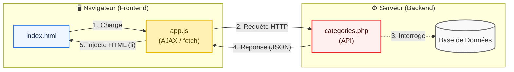

## 1. Objectif

Dans ce tutoriel, vous allez apprendre à :
* comprendre la notion d'AJAX ;
* boucler l'architecture en connectant le Frontend au Backend à l'aide de Javascript (`fetch`).

## 2. Prérequis

Avoir créé le fichier `backend/categories.php` renvoyant du JSON (T.213.112).

## Cas d'étude

Notre Backend est prêt, il distribue la liste des catégories en JSON.
Maintenant, l'utilisateur charge `frontend/index.html`. Comment faire pour que cette page HTML "appelle" le script PHP en arrière-plan et affiche les catégories sans que la page ne se recharge ? C'est le rôle d'AJAX.

## Partie 1 — Théorie

### 1.1. Qu'est-ce que l'AJAX ?

**AJAX** (Asynchronous JavaScript and XML) est une technique qui permet au Frontend (Javascript) d'envoyer une requête HTTP au Backend (l'API) **en arrière-plan**, sans que la page HTML ne clignote ou ne se recharge. 
Grâce à AJAX, les applications web modernes (comme Gmail ou Netflix) sont fluides : seules les données changent, la page reste la même.

### 1.2. La fonction fetch()

En JavaScript moderne, l'outil pour faire de l'AJAX s'appelle `fetch()`.

```javascript
// 1. On appelle une API publique existante
fetch('https://jsonplaceholder.typicode.com/users')
  // 2. On transforme la réponse en objet JSON utilisable
  .then(reponse => reponse.json())
  // 3. On utilise les données
  .then(utilisateurs => {
      console.log("Nom du premier utilisateur :", utilisateurs[0].name);
  })
  .catch(erreur => console.error("Erreur :", erreur));
```

### 1.3. L'architecture Component-Based (N2) complète

Votre architecture est désormais complète :


<div class="fullscreenable" markdown="1">



</div>


1. Le client charge `index.html`.
2. Le fichier `app.js` s'exécute et fait un `fetch()` vers `categories.php`.
3. Le serveur exécute `categories.php` (qui interrogera plus tard la BDD).
4. Le serveur répond en envoyant du texte `JSON`.
5. Le Javascript reçoit le JSON et fabrique des balises HTML (`<li>`) pour les afficher à l'écran.

## Partie 2 — Pratique

### 2.1. Connecter le Frontend au Backend

Nous allons écrire le script côté Frontend qui va consommer notre API.

**Travail à faire :**

Affichez la liste des catégories sur la page d'accueil en utilisant AJAX (`fetch`) pour appeler votre API PHP.

Ouvrez `index.html` dans votre navigateur. Vous devriez voir apparaître la liste des catégories injectées dynamiquement par votre script JavaScript !

<button class="btn btn-primary btn-toggle-resultat">Afficher le résultat</button>
<iframe
    class="auto-wrapper tuto-resultat"
    src="{{ '/code/composants/tuto-213-113-composants.html' | relative_url }}"
    height="450"
    title="Résultat attendu">
</iframe>

## Bilan

**Vous avez appris :**
* à faire une requête HTTP asynchrone avec AJAX (`fetch`).
* à relier un client JavaScript à une API PHP procédurale.

**Félicitations !** Vous venez de mettre en place une véritable architecture découplée :
> Interface (HTML/JS) ⇄ Traitement (API PHP) ⇄ Données (JSON/SQL).

## Glossaire
* **AJAX** : Technique permettant de communiquer avec le serveur sans recharger la page.
* **fetch()** : Fonction JavaScript moderne pour effectuer des requêtes HTTP (AJAX).
