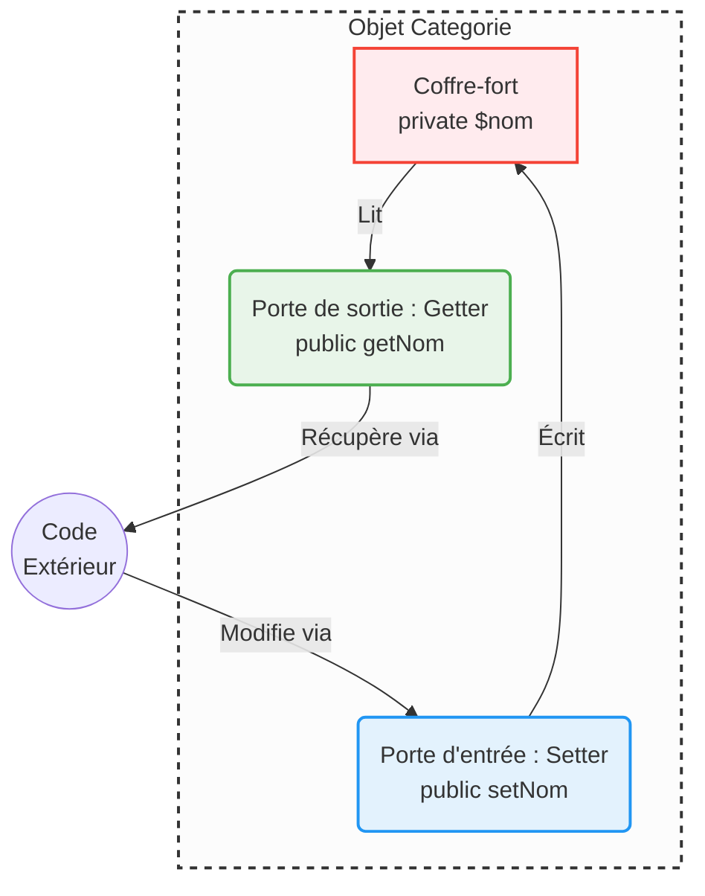

## 1. Objectif

Dans ce tutoriel, vous allez apprendre à :
* protéger les données internes de vos objets (Encapsulation) ;
* utiliser la visibilité `private` et `public` ;
* manipuler les données via des Getters et Setters ;
* typer strictement vos propriétés, paramètres et retours de méthodes.

## 2. Prérequis

* Avoir compris la notion de Classe et d'Objet (Tutoriel T.221.111).

## Cas d'étude

Dans le tutoriel précédent, nos propriétés étaient `public`. N'importe quel code extérieur pouvait faire n'importe quoi, comme `$categorie->id = "Texte Invalide";`.
Pour protéger l'intégrité de notre objet "Catégorie", nous allons verrouiller ses propriétés et forcer des types précis.

---

## Partie 1 — Théorie

### 1.1. L'Encapsulation (Protéger les données)

L'**encapsulation** est le principe fondamental consistant à cacher les données sensibles à l'intérieur de l'objet, et de ne fournir que des portes d'accès strictement contrôlées. 

<div class="fullscreenable" markdown="1">



</div>

* **La visibilité `private`** : La propriété est verrouillée dans la classe. Le code extérieur (ex: `index.php`) ne peut plus la modifier ni la lire directement.
* **Le Getter** : C'est une méthode `public` qui sert de guichet de lecture (`getNom()`).
* **Le Setter** : C'est une méthode `public` qui sert de douanier (`setNom()`). Il permet d'altérer la valeur en s'assurant au passage que la nouvelle donnée est valide.

**Exemple exécutable :**
```php
<?php
class Categorie {
    private string $nom; // Propriété protégée et typée

    public function getNom(): string {
        return $this->nom;
    }

    public function setNom(string $nouveauNom): void {
        if (strlen($nouveauNom) > 2) { // La douane vérifie la donnée !
            $this->nom = $nouveauNom;
        } else {
            echo "Erreur : Nom trop court !<br>";
        }
    }
}

$cat = new Categorie();
$cat->setNom("A"); // Va afficher l'erreur
$cat->setNom("Développement Web"); // Succès
echo "Le nom est désormais : " . $cat->getNom();
?>
```

### 1.2. Le Typage (Sécuriser les données)

Pour aller plus loin dans la protection, PHP (comme la plupart des langages) permet d'exiger qu'une donnée soit d'un type précis (`int`, `string`, `bool`, `array`).
* **Sur une propriété** : `private int $id;`
* **Sur un paramètre entrant** : `public function setId(int $id)`
* **Sur une valeur sortante** : `public function getId(): int` *(le `: int` indique ce que la fonction renvoie)*

---

## Partie 2 — Pratique

### 2.1. Encapsuler et typer la classe

**Travail à faire :**
1. Modifiez votre fichier `backend/Categorie.php`.
2. Passez toutes les propriétés en `private` et typez-les (`int` pour `$id`, `string` pour le reste).
3. Ajoutez les types sur les paramètres de votre constructeur.
4. Créez les "Getters" et "Setters" pour chaque propriété, en n'oubliant pas de typer les paramètres entrants et les retours sortants (`: string`, `: void`, etc.).
5. Modifiez le code de votre `test-categorie.php` pour utiliser les setters à la place de l'accès direct.

<button class="btn btn-primary btn-toggle-resultat">Afficher la solution</button>
<div class="auto-wrapper tuto-resultat" style="display: none; padding: 20px; border: 1px solid #ddd; border-radius: 8px; margin-top: 15px;" markdown="1">

**Fichier `backend/Categorie.php` :**
```php
<?php
class Categorie {
    private int $id;
    private string $nom;
    private string $couleur;
    private string $icone;

    public function __construct(int $id, string $nom, string $couleur, string $icone) {
        $this->id = $id;
        $this->nom = $nom;
        $this->couleur = $couleur;
        $this->icone = $icone;
    }

    // --- GETTERS (Lecture) ---
    public function getId(): int { return $this->id; }
    public function getNom(): string { return $this->nom; }
    public function getCouleur(): string { return $this->couleur; }
    public function getIcone(): string { return $this->icone; }

    // --- SETTERS (Écriture) ---
    public function setNom(string $nom): void { $this->nom = $nom; }
    public function setCouleur(string $couleur): void { $this->couleur = $couleur; }
    public function setIcone(string $icone): void { $this->icone = $icone; }

    public function afficher(): void {
        echo $this->nom . " - " . $this->couleur . " - " . $this->icone . "<br>";
    }
}
?>
```

**Fichier `backend/test-categorie.php` :**
```php
<?php
require_once 'Categorie.php';

$cat1 = new Categorie(1, "Développement Web", "Bleu", "Code");

// Erreur fatale : Cannot access private property
// $cat1->nom = "Nouveau Nom"; 

// Correct : On passe par la porte d'entrée autorisée (le setter)
$cat1->setNom("Développement Backend");

$cat1->afficher();
?>
```
</div>

---

## Bilan

**Vous avez appris :**
* à cacher les données sensibles de votre objet avec la visibilité `private`.
* à créer des portes d'accès sécurisées via des méthodes Getters et Setters.
* à blinder votre code en utilisant le typage strict (`int`, `string`, `: void`).

## Glossaire

* **Encapsulation** : Principe visant à masquer les données internes d'un objet et à en protéger l'accès.
* **private** : Visibilité interdisant l'accès à une propriété/méthode depuis l'extérieur de la classe.
* **Getter (Accesseur)** : Méthode permettant de lire une propriété privée.
* **Setter (Mutateur)** : Méthode permettant de modifier une propriété privée.
* **Typage** : Fait d'imposer un type de donnée précis (ex: `int`, `string`) à une variable ou un retour de fonction.
