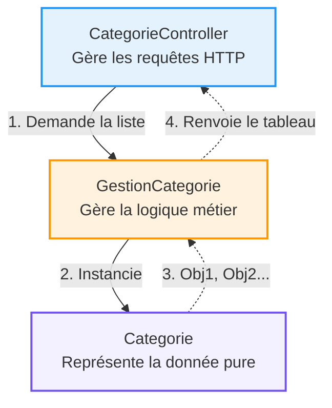

## 1. Objectif

Dans ce tutoriel, vous allez apprendre à :
* faire collaborer plusieurs classes entre elles ;
* passer un objet comme paramètre à une méthode ;
* stocker plusieurs objets dans un tableau ;
* structurer votre code (Contrôleur -> Gestionnaire -> Entité).

## 2. Prérequis

* Maîtriser la création de classes et l'encapsulation (T.221.111 et T.221.112).

## Cas d'étude

Jusqu'à présent, notre application n'avait qu'une seule classe. Or, dans une vraie application, un objet n'a pas à tout faire seul. 
Nous allons séparer les responsabilités :
1. **L'Entité (`Categorie`)** stocke la donnée pure.
2. **Le Gestionnaire (`GestionCategorie`)** manipule la base de données ou la logique métier.
3. **Le Contrôleur (`CategorieController`)** reçoit la requête de l'utilisateur et orchestre le tout.

---

## Partie 1 — Théorie

### 1.1. La collaboration entre objets (Dépendance)

Lorsqu'une classe a besoin d'une autre classe pour fonctionner, on parle de **dépendance**. Le typage permet de s'assurer qu'on passe le bon objet à la bonne classe.

<div class="fullscreenable" markdown="1">



</div>

*Exemple de typage strict d'objet :*
```php
<?php
class Categorie {
    public string $nom = "Catégorie Test";
}

class GestionCategorie {
    // Le gestionnaire exige de recevoir spécifiquement un objet Categorie
    public function sauvegarder(Categorie $categorie) {
        echo "Sauvegarde de la catégorie : " . $categorie->nom . " en cours...";
    }
}

$gestion = new GestionCategorie();
$cat = new Categorie();
$gestion->sauvegarder($cat); // Fonctionne car $cat est bien de type Categorie
?>
```

### 1.2. Tableaux d'objets

Un gestionnaire traite souvent des listes. En PHP, on peut stocker des objets dans un tableau classique (`array`) et les parcourir avec une boucle `foreach`.

**Exemple exécutable :**
```php
<?php
class Categorie {
    public string $nom;
    public function __construct($nom) { $this->nom = $nom; }
}

// Stockage dans un tableau
$listeCategories = [
    new Categorie("Web"),
    new Categorie("Design")
];

// Parcours du tableau d'objets
foreach ($listeCategories as $cat) {
    echo "- " . $cat->nom . "<br>";
}
?>
```

---

## Partie 2 — Pratique

### 2.1. L'architecture 3-Tiers en pratique

**Travail à faire :**
1. Conservez votre classe `Categorie` (avec ses propriétés privées et ses getters).
2. Créez un fichier `backend/classes/GestionCategorie.php`. À l'intérieur, créez une méthode `getAll(): array` qui instancie manuellement deux objets `Categorie`, les insère dans un tableau, puis retourne ce tableau.
3. Créez un fichier `api/controllers/CategorieController.php`. Ce contrôleur doit instancier le gestionnaire, appeler sa méthode `getAll()`, puis faire une boucle sur les résultats pour afficher le nom de chaque catégorie.

<button class="btn btn-primary btn-toggle-resultat">Afficher la solution</button>
<div class="auto-wrapper tuto-resultat" style="display: none; padding: 20px; border: 1px solid #ddd; border-radius: 8px; margin-top: 15px;" markdown="1">

**1. Gestionnaire `backend/classes/GestionCategorie.php` :**
```php
<?php
require_once 'Categorie.php';

class GestionCategorie {
    // Cette méthode retourne un tableau d'objets
    public function getAll(): array {
        $liste = [];
        
        // Le Gestionnaire crée les Entités
        $liste[] = new Categorie(1, "Développement Web", "Bleu", "Code");
        $liste[] = new Categorie(2, "Design UI/UX", "Rose", "Pinceau");
        
        return $liste;
    }
}
?>
```

**2. Contrôleur `api/controllers/CategorieController.php` :**
```php
<?php
require_once '../../backend/classes/GestionCategorie.php';

class CategorieController {
    public function listerCategories(): void {
        // Le Contrôleur utilise le Gestionnaire
        $gestion = new GestionCategorie();
        $categories = $gestion->getAll();
        
        // Affichage final du résultat
        foreach ($categories as $cat) {
            echo $cat->getNom() . " (Couleur: " . $cat->getCouleur() . ")<br>";
        }
    }
}

// Test rapide pour simuler un appel de l'utilisateur
$controller = new CategorieController();
$controller->listerCategories();
?>
```
</div>

---

## Bilan

**Vous avez appris :**
* à faire collaborer plusieurs classes pour découper la complexité d'un programme.
* à exiger des objets en paramètres via le typage strict (`Categorie $cat`).
* à retourner et parcourir des tableaux d'objets.

**Vous venez de mettre en place une véritable architecture MVC (Modèle - Vue - Contrôleur) simplifiée !**

## Glossaire

* **Dépendance** : Lorsqu'une classe utilise une autre classe pour réaliser son travail.
* **Typage d'objet** : Fait d'exiger qu'une variable contienne une instance précise d'une classe (ex: `function save(Categorie $cat)`).
