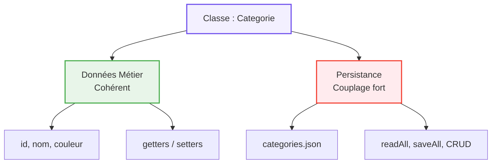

## 1. Objectif

Savoir analyser une classe pour identifier ses multiples responsabilités, mesurer sa cohésion et repérer ses dépendances avant de la refactoriser.

## 2. Prérequis

* Créer des classes, propriétés et méthodes (D.221.1).
* Connaître les opérations CRUD et la manipulation de fichiers JSON.

## Cas d'étude

Nous analyserons une classe `Categorie` "fourre-tout" issue d'un projet existant. Elle gère à la fois ses propres données (nom, couleur) et sa sauvegarde technique dans un fichier `categories.json`.

*Extrait de la classe `Categorie` :*
```php
class Categorie {
    private $id, $nom, $couleur, $icone;
    private static $dataFile = __DIR__ . '/data/categories.json';

    public function __construct($nom, $couleur, $icone, $id) { ... }
    public function getNom() { ... }
    public function setNom($nom) { ... }
    
    // Opérations CRUD et Fichier JSON
    public static function readAll() { /* lit categories.json */ }
    public function create() { /* ajoute au JSON */ }
    public function update() { /* modifie le JSON */ }
    public function delete() { /* supprime du JSON */ }
    private static function saveAll($categories) { /* écrit le JSON */ }
}
```

---

## Partie 1 — Théorie

### 1.1. Rôle et Responsabilités

Le **rôle** est la mission principale d'une classe. Une **responsabilité** est une tâche spécifique qu'elle accomplit (ex: "Fournir le nom", "Sauvegarder dans un fichier"). 
Une classe bien conçue ne devrait avoir qu'une seule grande responsabilité (un seul rôle). 

### 1.2. Cohésion et Couplage

Lorsqu'une classe fait trop de choses différentes, on dit qu'elle manque de **cohésion**. Elle devient "fourre-tout" (ex: représenter une donnée ET gérer un fichier technique).

De plus, si elle interagit directement avec un fichier externe (ici `categories.json`), on parle de **couplage** fort (ou dépendance). Si le support de sauvegarde change, la classe devra être entièrement réécrite.

<div class="fullscreenable" markdown="1">



</div>

*Règle d'or : Avant de séparer du code, dressez toujours la carte de ses responsabilités pour repérer ce qui n'a rien à y faire.*

---

## Partie 2 — Pratique

### Mission : Analyser le code du Sprint 1 de votre Blog

Avant de coder la nouvelle architecture du Sprint 2, vous devez comprendre ce qui posait problème dans le code du Sprint 1.

**Travail à faire (dans votre dépôt GitHub) :**

1. **Ouvrez le code de gestion des catégories de votre Sprint 1** (votre ancien fichier PHP qui gérait la logique d'ajout/lecture).
2. **Identifiez le mélange des responsabilités** : Repérez les lignes de code qui définissent simplement la structure d'une catégorie (id, nom, couleur), et celles qui ouvrent/lisent/écrivent techniquement dans le fichier `categories.json`.
3. **Documentez sur GitHub** : Ouvrez l'Issue "Refactoriser la gestion des catégories en POO" que vous avez créée précédemment.
4. **Ajoutez un commentaire d'analyse** expliquant le problème actuel. Exemple : *"Actuellement, le code est fortement couplé : il mélange la structure de la donnée (Entité) et l'accès au fichier JSON (Gestionnaire). L'objectif est de les séparer."*

<details>
<summary>Voir le résultat attendu sur GitHub</summary>
<div markdown="1">

L'Issue de refactorisation doit maintenant contenir un commentaire avec votre analyse des problèmes de cohésion et de couplage du Sprint 1.

**Livrable :** Le lien vers l'Issue contenant votre commentaire d'analyse.

</div>
</details>

---

## Bilan

**Vous avez appris :**
* à lister les méthodes d'une classe pour révéler ses multiples responsabilités.
* qu'une classe "fourre-tout" manque de **cohésion** en regroupant des tâches très différentes.
* qu'un **couplage** fort avec un fichier technique rend la classe difficile à maintenir.

## Glossaire

* **Responsabilité** : Tâche qu'une méthode ou classe est censée accomplir.
* **Cohésion** : Mesure indiquant si les éléments d'une classe sont tous liés vers un but unique.
* **Couplage / Dépendance** : Fait qu'une classe ait obligatoirement besoin d'un élément externe (ex: un fichier, une autre classe) pour fonctionner.
