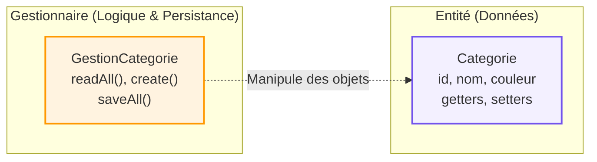

## 1. Objectif

Savoir extraire les responsabilités d'une classe "fourre-tout" pour les répartir dans de nouvelles classes spécialisées (séparer la donnée pure de la logique de persistance).

## 2. Prérequis

* Avoir identifié les responsabilités mélangées de la classe `Categorie` (T.222.111).
* Créer des classes et instancier des objets (D.221.1).

## Cas d'étude

Nous reprenons la classe `Categorie` du tutoriel précédent, qui gérait à la fois ses données (id, nom, couleur) et la lecture/écriture dans le fichier `categories.json`. 
Pour respecter les bonnes pratiques (Cohésion forte), nous allons créer une architecture où :
1. `Categorie` ne gérera **que** les données.
2. `GestionCategorie` s'occupera **uniquement** du CRUD et du JSON.

---

## Partie 1 — Théorie

### 1.1. Pourquoi séparer les responsabilités ?

Avoir une classe par responsabilité rend le code :
* **Plus lisible** : On sait exactement où chercher une information ou un comportement.
* **Plus facile à maintenir** : Si on change de base de données, on ne touche qu'à `GestionCategorie`, sans risquer de casser la structure de `Categorie`.
* **Réutilisable** : L'entité `Categorie` peut être passée à d'autres systèmes sans emporter avec elle tout le lourd code du fichier JSON.

### 1.2. Architecture Cible : Entité vs Gestionnaire

<div class="fullscreenable" markdown="1">



</div>

* **L'Entité (`Categorie`)** : Une classe très simple, souvent appelée *Model* ou *Entity*. Elle ne connaît pas la base de données et ne stocke que ses attributs en mémoire.
* **Le Gestionnaire (`GestionCategorie`)** : Contient la logique métier complexe. Il va interagir avec la base de données (ou le JSON), créer/sauvegarder les données, et souvent retourner des objets `Categorie` au reste de l'application.

---

## Partie 2 — Pratique

### Mission : Refactoriser la gestion des Catégories

Votre objectif est de séparer le code de la classe "fourre-tout" initiale en deux classes distinctes.

**Travail à faire :**
1. **Créer l'Entité** : Modifiez `Categorie.php` pour qu'il ne conserve **que** les propriétés (`$id`, `$nom`, etc.), le constructeur, les getters et les setters. Supprimez tout le reste.
2. **Créer le Gestionnaire** : Créez un nouveau fichier `GestionCategorie.php`. Copiez-y toutes les méthodes CRUD (`readAll`, `create`, `update`, `delete`, `saveAll`) ainsi que la propriété de stockage `$dataFile`.
3. **Lier les classes** : N'oubliez pas d'ajouter un `require_once 'Categorie.php';` en haut de votre gestionnaire, puisque celui-ci devra manipuler des objets `Categorie`.

<details>
<summary>Voir la solution de refactoring</summary>
<div markdown="1">

**1. `Categorie.php` (L'Entité pure)**
```php
<?php
class Categorie {
    private $id;
    private $nom;
    private $couleur;
    private $icone;

    public function __construct($nom = null, $couleur = null, $icone = null, $id = null) {
        $this->nom = $nom;
        $this->couleur = $couleur;
        $this->icone = $icone;
        $this->id = $id;
    }

    // Uniquement les getters et setters
    public function getId() { return $this->id; }
    public function getNom() { return $this->nom; }
    public function getCouleur() { return $this->couleur; }
    public function getIcone() { return $this->icone; }

    public function setId($id) { $this->id = $id; }
    public function setNom($nom) { $this->nom = $nom; }
    public function setCouleur($couleur) { $this->couleur = $couleur; }
    public function setIcone($icone) { $this->icone = $icone; }
}
?>
```

**2. `GestionCategorie.php` (Le Gestionnaire)**
```php
<?php
require_once 'Categorie.php';

class GestionCategorie {
    private static $dataFile = __DIR__ . '/data/categories.json';

    public static function readAll() {
        if (!file_exists(self::$dataFile)) return [];
        $json = file_get_contents(self::$dataFile);
        return json_decode($json, true);
    }

    public function create($categorieData) {
        $data = self::readAll();
        // logique de création...
        $data[] = $categorieData;
        self::saveAll($data);
    }
    
    // ... autres méthodes update(), delete()
    
    private static function saveAll($categories) {
        file_put_contents(self::$dataFile, json_encode($categories, JSON_PRETTY_PRINT));
    }
}
?>
```

</div>
</details>

---

## Bilan

**Vous avez appris :**
* à diviser une classe complexe en entités métier et en gestionnaires (Manager).
* que la séparation des responsabilités augmente considérablement la cohésion de vos classes.
* à organiser votre code de façon professionnelle pour anticiper les évolutions futures et réduire la duplication.

## Glossaire

* **Refactoring** : L'action de modifier la structure interne du code (pour le nettoyer ou l'améliorer) sans changer son comportement visible pour l'utilisateur.
* **Entité / Model** : Classe dont le seul rôle est de représenter et stocker les données métier en mémoire.
* **Gestionnaire / Manager** : Classe responsable des manipulations complexes (CRUD, appels à la base de données, algorithmes) concernant une Entité.
