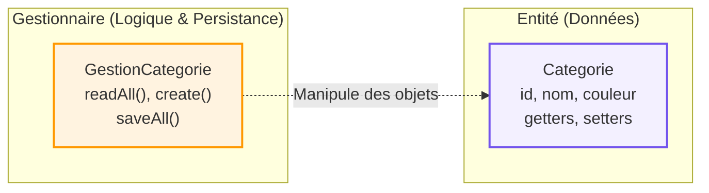

## 1. Objectif

Savoir extraire les responsabilités d'une classe "fourre-tout" pour les répartir dans de nouvelles classes spécialisées (séparer la donnée pure de la logique de persistance).

## 2. Prérequis

* Avoir identifié les responsabilités mélangées de la classe `Categorie` (T.222.111).
* Créer des classes et instancier des objets (D.221.1).

## Cas d'étude

Nous reprenons la classe `Categorie` du tutoriel précédent, qui gérait à la fois ses données (id, nom, couleur) et la lecture/écriture dans le fichier `categories.json`. 
Pour respecter les bonnes pratiques (Cohésion forte), nous allons créer une architecture où :
1. `Categorie` ne gérera **que** les données.
2. `GestionCategorie` s'occupera **uniquement** du CRUD et du JSON.

---

## Partie 1 — Théorie

### 1.1. Pourquoi séparer les responsabilités ?

Avoir une classe par responsabilité rend le code :
* **Plus lisible** : On sait exactement où chercher une information ou un comportement.
* **Plus facile à maintenir** : Si on change de base de données, on ne touche qu'à `GestionCategorie`, sans risquer de casser la structure de `Categorie`.
* **Réutilisable** : L'entité `Categorie` peut être passée à d'autres systèmes sans emporter avec elle tout le lourd code du fichier JSON.

### 1.2. Architecture Cible : Entité vs Gestionnaire

<div class="fullscreenable" markdown="1">



</div>

* **L'Entité (`Categorie`)** : Une classe très simple, souvent appelée *Model* ou *Entity*. Elle ne connaît pas la base de données et ne stocke que ses attributs en mémoire.
* **Le Gestionnaire (`GestionCategorie`)** : Contient la logique métier complexe. Il va interagir avec la base de données (ou le JSON), créer/sauvegarder les données, et souvent retourner des objets `Categorie` au reste de l'application.

---

## Partie 2 — Pratique

### Mission : Connecter le Gestionnaire au fichier JSON

Dans le tutoriel `T.221.121`, votre `GestionCategorie.php` retournait de fausses données en dur. Il est temps de rapatrier la logique de lecture et d'écriture de votre Sprint 1 pour qu'elle s'intègre proprement dans la nouvelle architecture MVC, réalisant ainsi la vraie séparation des responsabilités.

**Travail à faire (dans votre dépôt GitHub) :**

1. Ouvrez `backend/classes/GestionCategorie.php`.
2. Ajoutez une propriété privée statique `$dataFile` qui pointe vers votre fichier `categories.json` du Sprint 1 (généralement dans le dossier `data/`).
3. Modifiez votre méthode `getAll(): array` :
   - Elle doit maintenant utiliser `file_get_contents()` pour lire le fichier JSON.
   - Décoder le JSON avec `json_decode`.
   - Parcourir les données du JSON et instancier de VRAIS objets `Categorie` pour chaque enregistrement.
   - Retourner le tableau contenant tous ces objets `Categorie`.
4. Ajoutez les autres méthodes CRUD (`create`, `delete`, etc.) en déplaçant et en adaptant le code procédural que vous aviez écrit lors du Sprint 1.

<details>
<summary>Voir un exemple de `getAll` connecté au JSON</summary>
<div markdown="1">

**backend/classes/GestionCategorie.php**
```php
<?php
require_once 'Categorie.php';

class GestionCategorie {
    // Chemin relatif vers le fichier de données (à adapter selon votre structure)
    private static $dataFile = __DIR__ . '/../../data/categories.json';

    public function getAll(): array {
        if (!file_exists(self::$dataFile)) return [];
        
        $json = file_get_contents(self::$dataFile);
        $data = json_decode($json, true);
        
        $categories = [];
        foreach ($data as $row) {
            // Le Gestionnaire crée de vraies Entités avec les données du fichier
            $categories[] = new Categorie(
                $row['id'], 
                $row['nom'], 
                $row['couleur'], 
                $row['icone']
            );
        }
        
        return $categories;
    }
    
    // TODO: Ajoutez ensuite create(), update(), delete()
}
?>
```

**Livrable :** Le lien vers le commit GitHub contenant la mise à jour de `GestionCategorie.php` avec la logique JSON de votre Sprint 1.

</div>
</details>

---

## Bilan

**Vous avez appris :**
* à diviser une classe complexe en entités métier et en gestionnaires (Manager).
* que la séparation des responsabilités augmente considérablement la cohésion de vos classes.
* à organiser votre code de façon professionnelle pour anticiper les évolutions futures et réduire la duplication.

## Glossaire

* **Refactoring** : L'action de modifier la structure interne du code (pour le nettoyer ou l'améliorer) sans changer son comportement visible pour l'utilisateur.
* **Entité / Model** : Classe dont le seul rôle est de représenter et stocker les données métier en mémoire.
* **Gestionnaire / Manager** : Classe responsable des manipulations complexes (CRUD, appels à la base de données, algorithmes) concernant une Entité.
