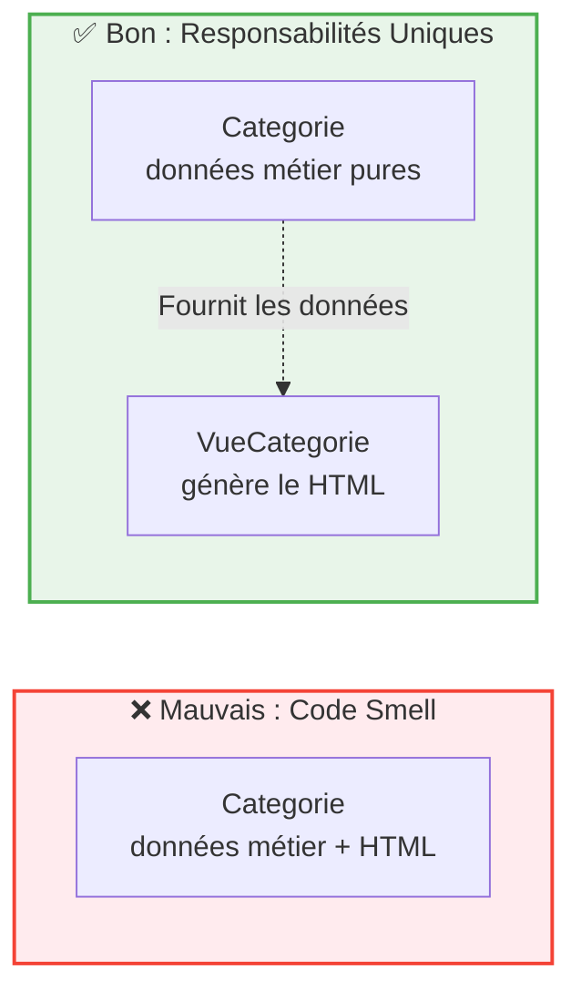

## 1. Objectif

Vérifier que nos classes respectent le Principe de Responsabilité Unique (SRP) et corriger les "code smells" (mauvaises pratiques) en déplaçant les comportements mal placés.

## 2. Prérequis

* Avoir séparé une classe en Entité et Gestionnaire (T.222.112).
* Connaître les concepts de Cohésion et de Couplage (T.222.111).

## Cas d'étude

Suite au tutoriel précédent, nous avons séparé `Categorie` et `GestionCategorie`.
Cependant, imaginons qu'un développeur ait ajouté une méthode `exporterEnHTML()` directement dans la classe `Categorie` pour générer du code d'affichage. 

*Extrait du code actuel :*
```php
class Categorie {
    private $nom;
    // ... getters, setters ...

    // Oups ! Un comportement d'affichage s'est glissé dans l'entité
    public function exporterEnHTML() {
        return "<span class='badge'>" . $this->nom . "</span>";
    }
}
```

---

## Partie 1 — Théorie

### 1.1. Le Principe de Responsabilité Unique (SRP)

Le **SRP** (Single Responsibility Principle) stipule qu'une classe ne doit avoir qu'**une seule raison de changer**.
* Si la base de données change, `GestionCategorie` change.
* Si on ajoute une propriété "Description", `Categorie` change.
* Si le design (HTML) change, qui doit changer ? Sûrement pas `Categorie` !

### 1.2. Identifier un "Code Smell" (Mauvaise odeur)

Un **code smell** est un symptôme dans le code qui indique un problème de conception plus profond. 
Mélanger de l'affichage (HTML) dans une classe de données pures est un code smell classique. Cela **diminue la cohésion** (le HTML n'a rien à faire à côté des données) et **augmente le couplage** (l'entité devient dépendante du formatage visuel).

<div class="fullscreenable" markdown="1">



</div>

*Solution : Extraire le comportement hors de l'Entité pour retrouver un code propre.*

---

## Partie 2 — Pratique

### Mission : Chasser le Code Smell

Votre objectif est de refactoriser le code pour extraire la logique d'affichage hors de la classe de données.

**Travail à faire :**
1. **Nettoyer l'Entité** : Supprimez la méthode `exporterEnHTML()` de la classe `Categorie`. L'entité doit redevenir 100% pure (uniquement des propriétés, getters, setters).
2. **Créer une classe d'Affichage** : Créez un fichier `VueCategorie.php`. À l'intérieur, créez une classe contenant une méthode `afficher(Categorie $cat)` qui renverra le code HTML.
3. **Tester** : Dans votre script principal, instanciez un objet `Categorie`, passez-le à `VueCategorie->afficher()`, et vérifiez que le résultat à l'écran reste identique.

<details>
<summary>Voir la solution de refactoring</summary>
<div markdown="1">

**1. `VueCategorie.php` (La nouvelle classe spécialisée)**
```php
<?php
require_once 'Categorie.php';

class VueCategorie {
    // Cette classe a pour unique responsabilité l'affichage HTML
    public function afficher(Categorie $categorie) {
        return "<span class='badge'>" . $categorie->getNom() . "</span>";
    }
}
?>
```

**2. `test.php` (L'utilisation)**
```php
<?php
require_once 'Categorie.php';
require_once 'VueCategorie.php';

$cat = new Categorie("Design", "Rose", "Pinceau", 1);
$vue = new VueCategorie();

// Le comportement visuel est préservé, mais l'architecture est saine !
echo $vue->afficher($cat);
?>
```

</div>
</details>

---

## Bilan

**Vous avez appris :**
* à appliquer le Principe de Responsabilité Unique (SRP).
* à repérer un "code smell" (comme du HTML mélangé à des données).
* à refactoriser votre code pour isoler les problèmes de présentation dans des classes "Vue".

## Glossaire

* **SRP (Single Responsibility Principle)** : Principe de conception exigeant qu'une classe n'ait qu'une seule et unique raison d'évoluer.
* **Code Smell** : Indice dans le code source signalant un problème potentiel de structure ou de qualité.
* **Vue (View)** : Classe dont la seule responsabilité est de transformer des données métier en une interface visuelle (HTML, JSON pour API, etc.).
