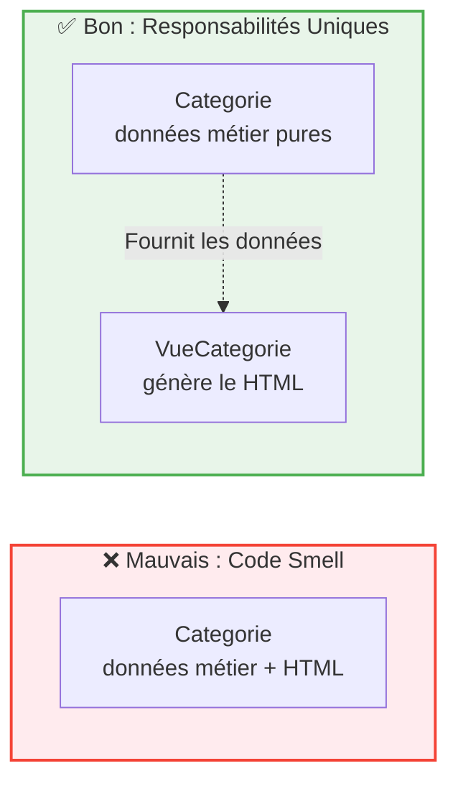

## 1. Objectif

Vérifier que nos classes respectent le Principe de Responsabilité Unique (SRP) et corriger les "code smells" (mauvaises pratiques) en déplaçant les comportements mal placés.

## 2. Prérequis

* Avoir séparé une classe en Entité et Gestionnaire (T.222.112).
* Connaître les concepts de Cohésion et de Couplage (T.222.111).

## Cas d'étude

Suite au tutoriel précédent, nous avons séparé `Categorie` et `GestionCategorie`.
Cependant, imaginons qu'un développeur ait ajouté une méthode `exporterEnHTML()` directement dans la classe `Categorie` pour générer du code d'affichage. 

*Extrait du code actuel :*
```php
class Categorie {
    private $nom;
    // ... getters, setters ...

    // Oups ! Un comportement d'affichage s'est glissé dans l'entité
    public function exporterEnHTML() {
        return "<span class='badge'>" . $this->nom . "</span>";
    }
}
```

---

## Partie 1 — Théorie

### 1.1. Le Principe de Responsabilité Unique (SRP)

Le **SRP** (Single Responsibility Principle) stipule qu'une classe ne doit avoir qu'**une seule raison de changer**.
* Si la base de données change, `GestionCategorie` change.
* Si on ajoute une propriété "Description", `Categorie` change.
* Si le design (HTML) change, qui doit changer ? Sûrement pas `Categorie` !

### 1.2. Identifier un "Code Smell" (Mauvaise odeur)

Un **code smell** est un symptôme dans le code qui indique un problème de conception plus profond. 
Mélanger de l'affichage (HTML) dans une classe de données pures est un code smell classique. Cela **diminue la cohésion** (le HTML n'a rien à faire à côté des données) et **augmente le couplage** (l'entité devient dépendante du formatage visuel).

<div class="fullscreenable" markdown="1">



</div>

*Solution : Extraire le comportement hors de l'Entité pour retrouver un code propre.*

---

## Partie 2 — Pratique

### Mission : Transformer votre Contrôleur en véritable API

Dans le cadre de l'architecture du Sprint 2 (Frontend SPA séparé), votre backend ne doit générer **aucun** affichage (HTML/texte formaté). Son rôle est uniquement de fournir de la donnée brute. Actuellement, votre `CategorieController` fait des `echo` avec des balises `<br>`. C'est un **Code Smell** !

**Travail à faire (dans votre dépôt GitHub) :**

1. Ouvrez `api/controllers/CategorieController.php`.
2. Repérez la boucle `foreach` qui fait un `echo` (le comportement visuel illégitime).
3. **Refactorisation** :
   - Transformez les objets `$categories` en tableaux associatifs simples pour faciliter l'export.
   - Ajoutez l'entête HTTP nécessaire pour déclarer que le backend renvoie de la donnée pure : `header('Content-Type: application/json');`.
   - Utilisez `echo json_encode()` pour renvoyer le tableau.
4. Testez votre fichier dans le navigateur : vous devriez voir un format JSON brut. Le backend est maintenant une vraie API, avec une responsabilité parfaitement définie !

<details>
<summary>Voir la solution de refactoring</summary>
<div markdown="1">

**api/controllers/CategorieController.php**
```php
<?php
require_once '../../backend/classes/GestionCategorie.php';

class CategorieController {
    public function listerCategories(): void {
        $gestion = new GestionCategorie();
        $categories = $gestion->getAll();
        
        // 1. Préparation de la donnée pure (sans HTML)
        $data = [];
        foreach ($categories as $cat) {
            $data[] = [
                'id' => $cat->getId(),
                'nom' => $cat->getNom(),
                'couleur' => $cat->getCouleur(),
                'icone' => $cat->getIcone()
            ];
        }
        
        // 2. Déclaration de la responsabilité de la réponse
        header('Content-Type: application/json');
        header('Access-Control-Allow-Origin: *'); // Pratique pour le dev local
        
        // 3. Renvoi des données brutes
        echo json_encode($data);
    }
}

$controller = new CategorieController();
$controller->listerCategories();
?>
```

**Livrable :** Le lien vers le commit GitHub contenant la refactorisation de votre contrôleur en API JSON.

</div>
</details>

---

## Bilan

**Vous avez appris :**
* à appliquer le Principe de Responsabilité Unique (SRP).
* à repérer un "code smell" (comme du HTML mélangé à des données).
* à refactoriser votre code pour isoler les problèmes de présentation dans des classes "Vue".

## Glossaire

* **SRP (Single Responsibility Principle)** : Principe de conception exigeant qu'une classe n'ait qu'une seule et unique raison d'évoluer.
* **Code Smell** : Indice dans le code source signalant un problème potentiel de structure ou de qualité.
* **Vue (View)** : Classe dont la seule responsabilité est de transformer des données métier en une interface visuelle (HTML, JSON pour API, etc.).
