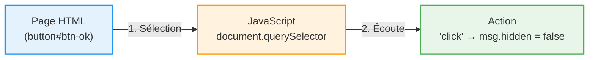

<script>
window.pageData = {
    html: {{ page.data_html | default: "" | jsonify }},
    css: {{ page.data_css | default: "" | jsonify }},
    js: {{ page.data_js | default: "" | jsonify }},
    php: {{ page.data_php | default: "" | jsonify }}
};
</script>

## 1. Objectif

Dans ce tutoriel, vous allez apprendre à :
* sélectionner des éléments HTML avec JavaScript ;
* écouter des événements (clic, soumission de formulaire) ;
* lire les données saisies par l'utilisateur ;
* modifier dynamiquement le contenu de la page sans la recharger.

## 2. Prérequis

* Connaître les bases du HTML (tableaux, formulaires).
* Connaître les bases de JavaScript (variables `const`/`let`, fonctions fléchées `() => {}`).

## Cas d'étude

Nous avons une page web contenant un tableau de catégories et un bouton "Nouvelle catégorie".
Notre but est de rendre ce bouton fonctionnel pour faire apparaître un formulaire, puis capturer sa soumission pour injecter une nouvelle ligne dans le tableau — le tout sans aucun rechargement de page.

---

## Partie 1 — Théorie

### 1.1. Sélectionner et Écouter (Le DOM)

Le **DOM** (Document Object Model) est la représentation de votre page HTML en mémoire. JavaScript peut lire ou modifier cet arbre.
On sélectionne un élément avec `querySelector`, puis on lui attache un "écouteur d'événement" avec `addEventListener`.

<div class="fullscreenable" markdown="1">



</div>

**Exemple exécutable :**
```html
<button id="btn-magique">Clique-moi !</button>
<p id="message" hidden>Le secret est révélé !</p>

<script>
document.addEventListener('DOMContentLoaded', () => {
    const btn = document.querySelector('#btn-magique');
    const msg = document.querySelector('#message');

    btn.addEventListener('click', () => {
        msg.hidden = false;
    });
});
</script>
```

### 1.2. Lire un formulaire et injecter du HTML

Quand un utilisateur soumet un formulaire, la page se recharge par défaut. Pour une SPA, on bloque ce comportement avec `event.preventDefault()`. Ensuite, on lit `.value` des champs et on injecte du HTML avec `.insertAdjacentHTML()`.

**Exemple exécutable :**
```html
<form id="mon-form">
    <input type="text" id="prenom" placeholder="Votre prénom">
    <button type="submit">Dire Bonjour</button>
</form>
<ul id="liste"></ul>

<script>
document.addEventListener('DOMContentLoaded', () => {
    const form = document.querySelector('#mon-form');
    const input = document.querySelector('#prenom');
    const liste = document.querySelector('#liste');

    form.addEventListener('submit', (event) => {
        event.preventDefault(); // Bloque le rechargement !
        
        liste.insertAdjacentHTML('beforeend', `<li>Bonjour ${input.value} !</li>`);
        form.reset(); // Vide le champ
    });
});
</script>
```

---

## Partie 2 — Pratique

### 2.1. Rendre le bouton "Nouvelle catégorie" fonctionnel

**Travail à faire :**
1. Sélectionnez `#btn-show-form` et `#section-form`.
2. Sur le clic du bouton : masquez le bouton (`hidden = true`) et affichez la section (`hidden = false`).
3. Faites l'inverse sur le clic du bouton "Annuler" (`#btn-cancel-form`), et réinitialisez le formulaire avec `.reset()`.

### 2.2. Ajouter une catégorie dans le tableau

**Travail à faire :**
1. Sélectionnez `#form-categorie`, `#cat-nom`, `#cat-couleur` et `#table-categories-body`.
2. Écoutez le `submit` du formulaire. Utilisez `event.preventDefault()`.
3. Lisez `.value` des inputs, créez une chaîne `<tr>...</tr>` avec les données.
4. Injectez cette ligne avec `insertAdjacentHTML('beforeend', ...)`.
5. Réinitialisez le formulaire et masquez-le.

<button class="btn btn-primary btn-toggle-resultat">Afficher la solution</button>
<div class="auto-wrapper tuto-resultat" style="display: none; padding: 20px; border: 1px solid #ddd; border-radius: 8px; margin-top: 15px;" markdown="1">

```javascript
document.addEventListener('DOMContentLoaded', () => {
    const btnShowForm = document.querySelector('#btn-show-form');
    const sectionForm = document.querySelector('#section-form');
    const btnCancelForm = document.querySelector('#btn-cancel-form');
    const form = document.querySelector('#form-categorie');
    const inputNom = document.querySelector('#cat-nom');
    const selectCouleur = document.querySelector('#cat-couleur');
    const tableBody = document.querySelector('#table-categories-body');
    let ligneEnEdition = null;

    // Affichage du formulaire
    btnShowForm.addEventListener('click', () => {
        sectionForm.hidden = false;
        btnShowForm.hidden = true;
    });

    // Annulation
    btnCancelForm.addEventListener('click', () => {
        sectionForm.hidden = true;
        btnShowForm.hidden = false;
        ligneEnEdition = null;
        form.reset();
    });

    // Soumission du formulaire
    form.addEventListener('submit', (event) => {
        event.preventDefault();

        const nom = inputNom.value;
        const couleur = selectCouleur.value;

        if (ligneEnEdition) {
            // Mode modification
            ligneEnEdition.children[0].textContent = nom;
            ligneEnEdition.children[1].textContent = couleur;
            ligneEnEdition = null;
        } else {
            // Mode ajout
            const html = `
                <tr>
                    <td>${nom}</td>
                    <td>${couleur}</td>
                    <td>
                        <button class="btn-edit">Éditer</button>
                        <button class="btn-delete">Supprimer</button>
                    </td>
                </tr>`;
            tableBody.insertAdjacentHTML('beforeend', html);

            // Récupération de la nouvelle ligne pour lui attacher les events
            const tr = tableBody.lastElementChild;

            tr.querySelector('.btn-delete').addEventListener('click', () => tr.remove());

            tr.querySelector('.btn-edit').addEventListener('click', () => {
                ligneEnEdition = tr;
                inputNom.value = tr.children[0].textContent;
                selectCouleur.value = tr.children[1].textContent;
                sectionForm.hidden = false;
                btnShowForm.hidden = true;
            });
        }

        sectionForm.hidden = true;
        btnShowForm.hidden = false;
        form.reset();
    });
});
```
</div>

---

## Bilan

**Vous avez appris :**
* à faire le pont entre HTML et JavaScript via le DOM (`querySelector`).
* à bloquer le rechargement natif du navigateur (`event.preventDefault()`).
* à modifier la page en temps réel avec `insertAdjacentHTML()`.
* à créer une véritable interface CRUD sans aucune ligne PHP ni rechargement de page.

## Glossaire

* **DOM** : Arborescence en mémoire représentant votre page HTML, manipulable par JavaScript.
* **SPA** : Site dont le contenu se met à jour sans jamais recharger la page.
* **`querySelector()`** : Sélectionne le premier élément correspondant à un sélecteur CSS.
* **`addEventListener()`** : Attache une fonction à un événement (`click`, `submit`...).
* **`event.preventDefault()`** : Bloque le comportement natif du navigateur.
* **`insertAdjacentHTML()`** : Injecte du HTML brut dans la page à une position donnée.
* **`hidden`** : Propriété booléenne pour afficher/masquer un élément HTML.
