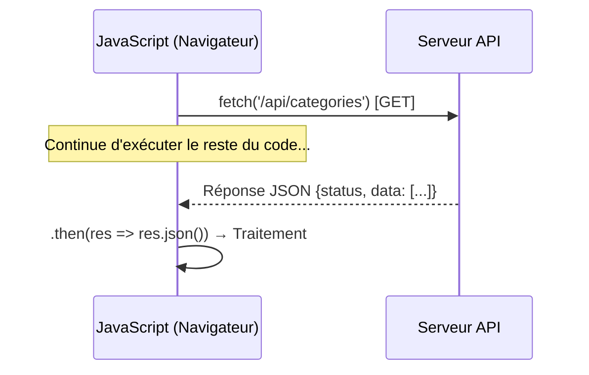

<script>
window.pageData = {
    html: {{ page.data_html | default: "" | jsonify }},
    css: {{ page.data_css | default: "" | jsonify }},
    js: {{ page.data_js | default: "" | jsonify }},
    php: {{ page.data_php | default: "" | jsonify }}
};
</script>

## 1. Objectif

Dans ce tutoriel, vous allez apprendre à :
* utiliser `fetch()` pour communiquer avec une API REST ;
* lire des données (`GET`) et les afficher dans le DOM ;
* envoyer des données (`POST`, `PUT`, `DELETE`) depuis un formulaire.

## 2. Prérequis

* Avoir réalisé T.224.111 (DOM et événements).

## Cas d'étude

L'interface construite dans le tutoriel précédent fonctionnait **localement** (les catégories disparaissaient au rechargement). Nous allons maintenant la connecter à une vraie API REST pour que les données soient persistantes.

---

## Partie 1 — Théorie

### 1.1. L'Asynchronisme et `fetch()` (La Promesse)

Lorsque JavaScript demande des données à un serveur, il n'attend pas passivement. Il envoie la requête et **continue d'exécuter le reste du code**. Quand la réponse arrive, il reprend le travail. C'est ce qu'on appelle l'**asynchronisme**, et une **Promesse** (`Promise`) est l'objet qui représente ce "résultat futur".

<div class="fullscreenable" markdown="1">



</div>

La syntaxe avec `.then()` est la chaîne de traitement d'une Promesse. Si quelque chose échoue (serveur injoignable), `.catch()` attrape l'erreur.

**Exemple exécutable (simule une API locale) :**
```javascript
// fetch() retourne une Promesse
// On utilise une API publique de test pour avoir une vraie réponse
fetch('https://jsonplaceholder.typicode.com/users/1')
    .then(response => response.json()) // Étape 1 : transformer la réponse en objet JS
    .then(data => {                    // Étape 2 : utiliser les données
        console.log('Nom reçu :', data.name);
    })
    .catch(error => {                  // Étape 3 : gérer les erreurs réseau
        console.error('Erreur :', error);
    });
```

### 1.2. Les Verbes HTTP (GET, POST, PUT, DELETE)

Toutes les opérations CRUD (Créer, Lire, Modifier, Supprimer) se font avec `fetch()`, mais en changeant la **configuration** passée en second paramètre. Le principe reste le même : on change uniquement `method` et `body`.

| Action | Verbe | `body` ? |
|---|---|---|
| Lire la liste | `GET` | ❌ Non |
| Créer | `POST` | ✅ Oui (objet JSON) |
| Modifier | `PUT` | ✅ Oui (objet avec ID) |
| Supprimer | `DELETE` | ✅ Oui (`{id: ...}`) |

**Exemple exécutable (POST simulé) :**
```javascript
// Créer une nouvelle catégorie sur l'API
const nouvelleCategorie = {
    nom: "Design UX",
    couleur: "Rose"
};

fetch('https://jsonplaceholder.typicode.com/posts', {
    method: 'POST',
    headers: { 'Content-Type': 'application/json' },
    body: JSON.stringify(nouvelleCategorie) // ← objet JS → texte JSON
})
.then(res => res.json())
.then(data => console.log('Créée avec ID :', data.id));
```

---

## Partie 2 — Pratique

### 2.1. Charger et afficher les catégories au démarrage (GET)

**Travail à faire :**
1. Définissez une constante `API_URL` pointant vers votre API (ex: `'backend/api.php'`).
2. Créez une fonction `chargerCategories()` qui :
   - fait un `fetch(API_URL)`,
   - parse la réponse avec `.json()`,
   - vide le tableau (`tableBody.innerHTML = ''`),
   - parcourt `result.data` avec un `forEach` et injecte une `<tr>` pour chaque catégorie.
3. Appelez `chargerCategories()` au chargement de la page (dans `DOMContentLoaded`).

### 2.2. Connecter le formulaire à l'API (POST / PUT)

**Travail à faire :**
1. Dans l'événement `submit` du formulaire, récupérez les valeurs et construisez un objet `{ nom, couleur, icone }`.
2. Si une variable `ligneEnEdition` est définie, ajoutez l'`id` à l'objet et utilisez `method: 'PUT'`. Sinon, utilisez `method: 'POST'`.
3. Dans le `.then()` de la promesse : fermez le formulaire, réinitialisez-le, et rappeler `chargerCategories()` pour rafraîchir le tableau.

### 2.3. Connecter le bouton Supprimer (DELETE)

**Travail à faire :**
Dans la fonction `chargerCategories()`, pour chaque ligne créée, attachez un écouteur `click` sur le bouton "Supprimer" qui fait un `fetch(API_URL, { method: 'DELETE', body: JSON.stringify({ id }) })` et rappelle `chargerCategories()` dans le `.then()`.

<button class="btn btn-primary btn-toggle-resultat">Afficher la solution</button>
<div class="auto-wrapper tuto-resultat" style="display: none; padding: 20px; border: 1px solid #ddd; border-radius: 8px; margin-top: 15px;" markdown="1">

**`assets/js/app.js` — Version connectée à l'API :**
```javascript
document.addEventListener('DOMContentLoaded', () => {
    const API_URL = 'backend/api.php';

    const btnShowForm = document.querySelector('#btn-show-form');
    const sectionForm = document.querySelector('#section-form');
    const btnCancelForm = document.querySelector('#btn-cancel-form');
    const form = document.querySelector('#form-categorie');
    const inputId = document.querySelector('#cat-id');
    const inputNom = document.querySelector('#cat-nom');
    const selectCouleur = document.querySelector('#cat-couleur');
    const selectIcone = document.querySelector('#cat-icone');
    const tableBody = document.querySelector('#table-categories-body');
    let ligneEnEdition = null;

    // --- Chargement des catégories ---
    function chargerCategories() {
        fetch(API_URL)
            .then(res => res.json())
            .then(result => {
                if (result.status !== 'success') return;
                tableBody.innerHTML = '';
                result.data.forEach(cat => {
                    const html = `
                        <tr data-id="${cat.id}">
                            <td>${cat.id}</td>
                            <td>${cat.nom}</td>
                            <td>${cat.couleur}</td>
                            <td>
                                <button class="btn-edit">Éditer</button>
                                <button class="btn-delete">Supprimer</button>
                            </td>
                        </tr>`;
                    tableBody.insertAdjacentHTML('beforeend', html);
                    const tr = tableBody.lastElementChild;

                    tr.querySelector('.btn-delete').addEventListener('click', () => {
                        fetch(API_URL, {
                            method: 'DELETE',
                            headers: { 'Content-Type': 'application/json' },
                            body: JSON.stringify({ id: cat.id })
                        }).then(() => chargerCategories());
                    });

                    tr.querySelector('.btn-edit').addEventListener('click', () => {
                        ligneEnEdition = cat.id;
                        inputId.value = cat.id;
                        inputNom.value = cat.nom;
                        selectCouleur.value = cat.couleur;
                        if (selectIcone) selectIcone.value = cat.icone || '';
                        sectionForm.hidden = false;
                    });
                });
            });
    }

    // --- Gestion du formulaire ---
    btnShowForm.addEventListener('click', () => sectionForm.hidden = false);

    btnCancelForm.addEventListener('click', () => {
        sectionForm.hidden = true;
        form.reset();
        inputId.value = '';
        ligneEnEdition = null;
    });

    form.addEventListener('submit', event => {
        event.preventDefault();

        const data = {
            nom: inputNom.value,
            couleur: selectCouleur.value,
            icone: selectIcone ? selectIcone.value : ''
        };

        const method = ligneEnEdition ? 'PUT' : 'POST';
        if (ligneEnEdition) data.id = inputId.value;

        fetch(API_URL, {
            method,
            headers: { 'Content-Type': 'application/json' },
            body: JSON.stringify(data)
        })
        .then(() => {
            sectionForm.hidden = true;
            form.reset();
            inputId.value = '';
            ligneEnEdition = null;
            chargerCategories();
        });
    });

    // Chargement initial
    chargerCategories();
});
```
</div>

---

## Bilan

**Vous avez appris :**
* à utiliser `fetch()` pour communiquer avec un serveur.
* le principe de l'asynchronisme et des Promesses (`.then()`, `.catch()`).
* à utiliser les 4 verbes HTTP (GET, POST, PUT, DELETE) pour les opérations CRUD.
* à `JSON.stringify()` pour sérialiser les données à envoyer.

## Glossaire

* **API REST** : Interface serveur exposant des ressources via des URLs et des verbes HTTP standard.
* **`fetch(url, options)`** : Fonction native JS envoyant une requête HTTP asynchrone.
* **Promesse (`Promise`)** : Objet représentant une valeur future (le résultat d'une requête).
* **`.then()`** : Méthode appelée quand la Promesse est résolue (succès).
* **`.catch()`** : Méthode appelée quand la Promesse est rejetée (erreur réseau).
* **`JSON.stringify()`** : Convertit un objet JavaScript en chaîne de texte JSON.
* **`response.json()`** : Convertit la réponse HTTP brute en objet JavaScript.
