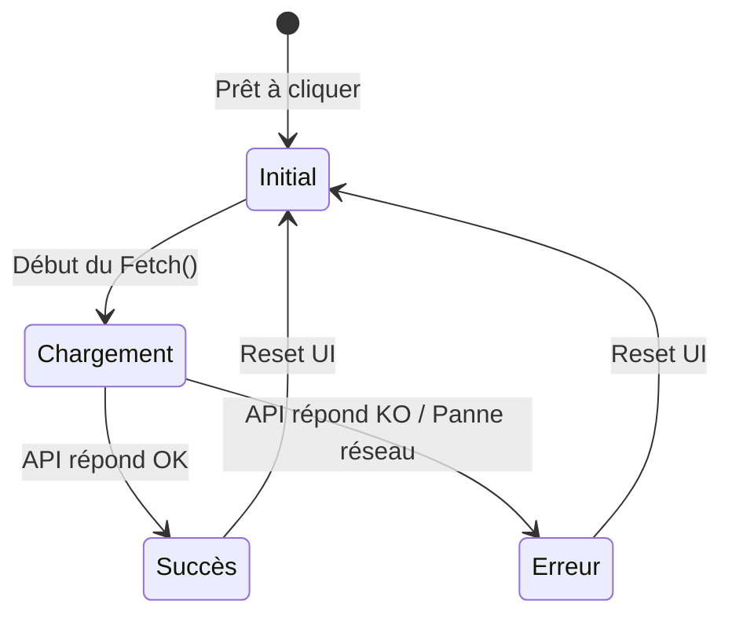

<script>
window.pageData = {
    html: {{ page.data_html | default: "" | jsonify }},
    css: {{ page.data_css | default: "" | jsonify }},
    js: {{ page.data_js | default: "" | jsonify }},
    php: {{ page.data_php | default: "" | jsonify }}
};
</script>

## 1. Objectif

Apprendre à concevoir une interface réactive (UX) qui informe l'utilisateur de l'état d'une requête réseau : Chargement, Succès, ou Erreur.

## 2. Prérequis

* Manipuler le DOM (T.224.111).
* Faire des appels API avec `fetch()` (T.224.112).

## Données de départ

Ce tutoriel s'appuie sur le code HTML et JavaScript déjà fourni dans l'éditeur interactif ci-dessous. Il contient la structure d'un formulaire et de son tableau, ainsi que les sélecteurs DOM de base.

---

## Partie 1 — Théorie

### 1.1. Le cycle de vie d'une requête asynchrone

Une opération réseau (`fetch()`) prend du temps. L'interface (UI) doit refléter ce délai pour ne pas laisser l'utilisateur dans le flou.

<div class="fullscreenable" markdown="1">



</div>

### 1.2. Gérer l'état de Chargement

Pendant la requête, on bloque l'interface pour empêcher le "double-clic" et on affiche un message :
```javascript
// Début du chargement
btnSubmitForm.disabled = true;
btnSubmitForm.textContent = 'Enregistrement...';
```

### 1.3. Distinguer les types d'Erreurs

Dans une SPA, deux types de problèmes peuvent survenir :
1. **L'erreur API (métier)** : Le serveur répond, mais avec une erreur logique (ex: "Nom déjà pris"). On la lit dans le `.then()`.
2. **L'erreur Réseau** : Le serveur est injoignable ou le réseau est coupé. On la capture avec le `.catch()`.

### 1.4. L'importance de `.finally()`

Peu importe que la requête réussisse ou échoue, l'interface doit **toujours** revenir à la normale à la fin. `.finally()` est fait pour ça :
```javascript
fetch(API_URL)
    .then(...)
    .catch(...)
    .finally(() => {
        // Se lance TOUJOURS à la fin
        btnSubmitForm.disabled = false;
        btnSubmitForm.textContent = 'Enregistrer';
    });
```

---

## Partie 2 — Pratique

### Mission : Gérer l'état de chargement du Blog

Dans votre projet de Blog (Sprint 2), vous devez intercepter la soumission du formulaire d'ajout de catégorie pour appeler votre API tout en bloquant l'interface pour éviter les doubles clics.

**Travail à faire (dans votre dépôt GitHub) :**

1. Ouvrez (ou créez) le fichier `assets/js/app.js` de votre blog.
2. **Créer la fonction de chargement** : Ajoutez une fonction `setLoadingState(isLoading)` qui cible le bouton d'enregistrement du formulaire.
   - Si `isLoading` est vrai : désactiver le bouton (`disabled = true`) et changer son texte en "Enregistrement...".
   - Si `isLoading` est faux : réactiver le bouton et remettre le texte "Enregistrer".
3. **Intercepter le formulaire** : Ajoutez un écouteur `submit` sur votre formulaire de catégorie (assurez-vous d'avoir les bons `id` dans votre HTML).
   - Utilisez `e.preventDefault()`.
   - Appelez `setLoadingState(true)` avant de lancer le `fetch()` vers votre `CategorieController.php`.
   - Utilisez le bloc `.finally()` de votre `fetch()` pour appeler systématiquement `setLoadingState(false)`.

<details>
<summary>Voir le code attendu dans `app.js`</summary>
<div markdown="1">

**assets/js/app.js**
```javascript
const formCategorie = document.getElementById('form-categorie');
const btnSubmit = document.getElementById('btn-submit-form');

function setLoadingState(isLoading) {
    btnSubmit.disabled = isLoading;
    if (isLoading) {
        btnSubmit.textContent = 'Enregistrement...';
    } else {
        btnSubmit.textContent = 'Enregistrer';
    }
}

formCategorie.addEventListener('submit', (e) => {
    e.preventDefault();

    // 1. Bloquer l'interface
    setLoadingState(true);

    // 2. Appel API vers votre propre backend
    fetch('api/controllers/CategorieController.php', {
        method: 'POST',
        body: new FormData(formCategorie)
    })
    .then(response => response.json())
    .then(data => {
        console.log("Succès :", data);
        formCategorie.reset();
    })
    .catch(error => {
        console.error("Erreur réseau :", error);
    })
    .finally(() => {
        // 3. Débloquer l'interface quoi qu'il arrive
        setLoadingState(false);
    });
});
```

**Livrable :** Le lien vers le commit GitHub contenant ces modifications dans votre `app.js`.

</div>
</details>

---

## Bilan

**Vous avez appris :**
* à améliorer l'UX en indiquant visuellement à l'utilisateur qu'une opération est en cours.
* à prévenir les bugs (ex: clics multiples) en désactivant les contrôles pertinents.
* à distinguer les erreurs logiques de l'API et les pannes réseau (`catch()`).
* à garantir le déblocage de l'interface grâce au bloc `.finally()`.

## Glossaire

* **Asynchrone** : Processus qui s'exécute en arrière-plan sans bloquer le reste de l'application.
* **État (State)** : Condition dans laquelle se trouve l'application à un instant T (ex: chargement, erreur, succès).
* **`finally()`** : Méthode exécutée à la fin d'une Promesse (Promise), qu'elle soit tenue (`then`) ou rejetée (`catch`).
