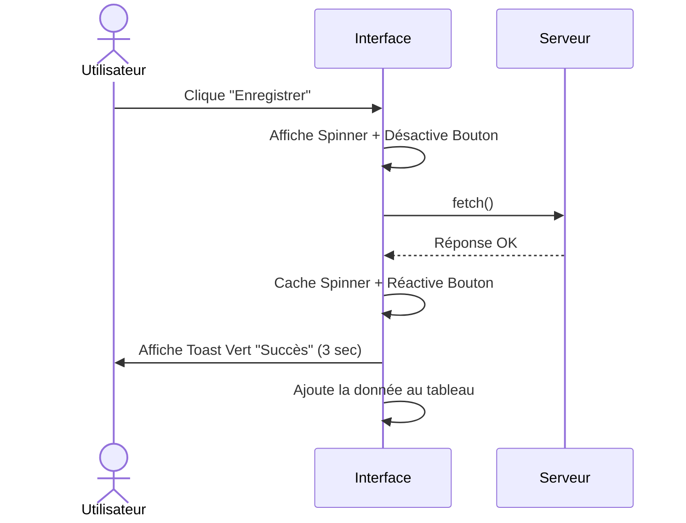

<script>
window.pageData = {
    html: {{ page.data_html | default: "" | jsonify }},
    css: {{ page.data_css | default: "" | jsonify }},
    js: {{ page.data_js | default: "" | jsonify }},
    php: {{ page.data_php | default: "" | jsonify }}
};
</script>

## 1. Objectif

Apprendre à donner un retour (feedback) visuel à l'utilisateur lors de ses actions : indicateur de chargement ("spinner"), notifications temporaires ("Toasts") et mise à jour de l'interface.

## 2. Prérequis

* Gérer les états de chargement (T.224.121).
* Manipuler le DOM pour ajouter des éléments dynamiques (T.224.111).

## Données de départ

Ce tutoriel s'appuie sur le code fourni dans l'éditeur interactif ci-dessous, qui contient déjà :
* Un `toast-container` en bas à droite pour y placer nos notifications.
* Le CSS de base pour afficher des Toasts verts ou rouges.
* Un bouton avec un `span` caché dédié au "Spinner" (indicateur de chargement).

---

## Partie 1 — Théorie

### 1.1. L'importance du Feedback Visuel

Dans une application Single Page (SPA), il n'y a pas de rechargement de page. Si l'application ne réagit pas visuellement pendant un appel API, l'utilisateur risque de cliquer plusieurs fois ou de penser que l'application a planté.

Le feedback repose sur 3 piliers :
1. **Pendant l'action** : Désactiver les boutons et afficher un Spinner.
2. **Après l'action** : Afficher un message clair (Succès / Erreur) sans bloquer l'écran.
3. **Mise à jour** : Rafraîchir les données (ex: ajouter la nouvelle ligne au tableau) instantanément.

### 1.2. Le concept des "Toasts"

Un **Toast** est une petite notification temporaire qui apparaît (souvent en bas de l'écran) puis disparaît toute seule au bout de quelques secondes.

<div class="fullscreenable" markdown="1">



</div>

---

## Partie 2 — Pratique

### Mission : Afficher des Toasts de succès et d'erreur

Vous allez remplacer vos `console.log()` du tutoriel précédent par de vrais messages visuels (Toasts) qui informeront l'utilisateur du résultat de l'enregistrement de sa catégorie.

**Travail à faire (dans votre dépôt GitHub) :**

1. Ouvrez `assets/js/app.js` de votre projet Blog.
2. **Créer le conteneur** : Assurez-vous d'avoir une balise `<div id="toast-container"></div>` quelque part dans votre HTML (idéalement en bas de `<body>`).
3. **Créer la fonction de notification** : Ajoutez une fonction `showToast(message, type = 'success')` dans votre JS :
   - Elle doit créer un élément `div`, lui ajouter des classes CSS (`toast`, et `toast-success` ou `toast-error` selon le paramètre `type`).
   - Elle injecte le texte du `message`.
   - Elle ajoute ce Toast dans le `toast-container`.
   - Elle utilise `setTimeout` pour supprimer la `div` après 3 secondes.
4. **Appeler la fonction dans le `fetch()`** :
   - Dans le `.then()` de l'écouteur de votre formulaire, appelez `showToast("Catégorie ajoutée avec succès", "success")`.
   - Dans le `.catch()`, appelez `showToast("Erreur lors de l'enregistrement", "error")`.

<details>
<summary>Voir le code attendu dans `app.js`</summary>
<div markdown="1">

**assets/js/app.js**
```javascript
// 1. Fonction de création de Toasts dynamiques
function showToast(message, type = 'success') {
    const container = document.getElementById('toast-container');
    const toast = document.createElement('div');
    
    // NB: Vous modifierez ces classes plus tard avec Tailwind !
    toast.className = `toast toast-${type}`;
    toast.textContent = message;
    
    container.appendChild(toast);

    // Disparition automatique après 3 secondes
    setTimeout(() => {
        toast.remove();
    }, 3000);
}

// 2. Intégration dans le fetch() existant
formCategorie.addEventListener('submit', (e) => {
    e.preventDefault();
    setLoadingState(true);

    fetch('api/controllers/CategorieController.php', {
        method: 'POST',
        body: new FormData(formCategorie)
    })
    .then(response => response.json())
    .then(data => {
        // Remplacement du console.log() par un retour visuel UX !
        showToast("Catégorie enregistrée avec succès !", "success");
        formCategorie.reset();
    })
    .catch(error => {
        showToast("Erreur réseau : Impossible de contacter le serveur.", "error");
        console.error(error);
    })
    .finally(() => {
        setLoadingState(false);
    });
});
```

**Livrable :** Le lien vers le commit GitHub contenant l'ajout de la fonction `showToast()` dans votre application.

</div>
</details>

---

## Bilan

**Vous avez appris :**
* qu'un bon feedback est essentiel pour l'expérience utilisateur (UX) d'une SPA.
* à créer un système de notifications temporaires (Toasts) en générant du DOM à la volée.
* à utiliser les délais (`setTimeout`) pour faire disparaître des éléments automatiquement.

## Glossaire

* **Feedback visuel** : Réponse graphique de l'interface suite à une action de l'utilisateur.
* **Spinner** : Icône animée (ou texte) indiquant qu'un chargement est en cours.
* **Toast** : Notification temporaire non bloquante qui "pop" sur l'écran avant de disparaître.
