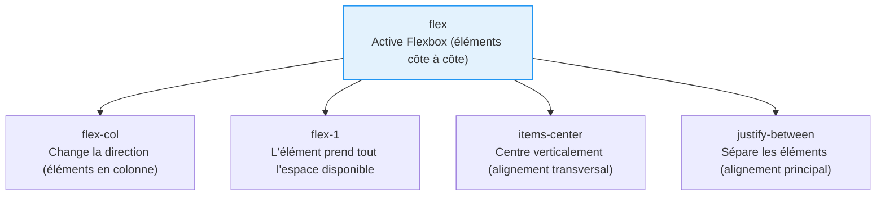

<script>
window.pageData = {
    html: {{ page.data_html | default: "" | jsonify }},
    css: {{ page.data_css | default: "" | jsonify }},
    js: {{ page.data_js | default: "" | jsonify }},
    php: {{ page.data_php | default: "" | jsonify }}
};
</script>

## 1. Objectif

Dans ce tutoriel, vous allez apprendre à :
* utiliser les classes utilitaires Tailwind pour contrôler la mise en page ;
* créer une interface avec une Sidebar + un contenu principal via `flex` ;
* organiser verticalement un Header et un Main via `flex-col` ;
* maîtriser les classes d'espacement et de dimensionnement essentielles.

## 2. Prérequis

* Connaître les bases du HTML (balises sémantiques `aside`, `header`, `main`).
* Connaître les bases du CSS (notion de Flexbox).

## Cas d'étude

Nous allons construire la **squelette structurel** d'une interface d'administration. Pas de couleurs ni de style pour l'instant, uniquement la mise en page.

---

## Partie 1 — Théorie

### 1.1. Le principe de Tailwind : l'Utilitaire

Tailwind CSS n'utilise pas de classes sémantiques comme `.sidebar` ou `.card`. Il fournit des centaines de **classes utilitaires**, chacune faisant une seule chose précise. On compose ces classes directement dans le HTML.

**Exemple exécutable :**
```html
<!DOCTYPE html>
<html>
<head>
    <script src="https://cdn.tailwindcss.com"></script>
</head>
<body>
    <!-- Avec Tailwind, on compose les classes directement dans le HTML -->
    <div class="flex gap-4 p-6 bg-gray-100">
        <div class="w-48 bg-blue-600 text-white p-4 rounded">
            Sidebar (w-48 = largeur fixe)
        </div>
        <div class="flex-1 bg-white p-4 rounded shadow">
            Contenu (flex-1 = prend tout l'espace restant)
        </div>
    </div>
</body>
</html>
```

### 1.2. Les classes de mise en page essentielles

<div class="fullscreenable" markdown="1">



</div>

| Classe | Effet |
|---|---|
| `flex` | Active Flexbox (éléments côte à côte par défaut) |
| `flex-col` | Éléments en colonne (verticalement) |
| `flex-1` | Prend tout l'espace disponible |
| `items-center` | Centre sur l'axe transversal |
| `justify-between` | Espace maximal entre les éléments |
| `w-64` | Largeur fixe (64 = 256px) |
| `p-6` | Padding (espace intérieur) sur tous les côtés |
| `gap-4` | Espace entre les éléments d'un flex |
| `min-h-screen` | Hauteur minimale = hauteur de l'écran |
| `max-w-5xl mx-auto` | Largeur max + centrage horizontal |

---

## Partie 2 — Pratique

### 2.1. Créer le layout Sidebar + Contenu

**Travail à faire :**
En partant du fichier HTML de départ (disponible dans l'éditeur), ajoutez les classes Tailwind nécessaires pour obtenir ce résultat visuel :
- Le conteneur principal utilise `flex` et `min-h-screen`.
- La `<aside>` a une largeur fixe de `w-64`.
- Le `<div>` contenant le header et le main utilise `flex-1 flex flex-col`.
- Le `<header>` utilise `flex items-center justify-between`.
- Le `<main>` utilise `flex-1 p-6`.
- À l'intérieur du main, le conteneur utilise `max-w-5xl mx-auto`.

<button class="btn btn-primary btn-toggle-resultat">Afficher la solution</button>
<div class="auto-wrapper tuto-resultat" style="display: none; padding: 20px; border: 1px solid #ddd; border-radius: 8px; margin-top: 15px;" markdown="1">

```html
<!DOCTYPE html>
<html lang="fr">
<head>
    <meta charset="UTF-8">
    <script src="https://cdn.tailwindcss.com"></script>
</head>
<body class="bg-gray-100 min-h-screen">

<div class="flex min-h-screen">

    <aside class="w-64">
        <h2>Admin Blog</h2>
        <nav class="flex flex-col gap-2">
            <a href="#">Tableau de bord</a>
            <a href="#">Articles</a>
            <a href="#">Catégories</a>
        </nav>
    </aside>

    <div class="flex-1 flex flex-col">
        <header class="flex items-center justify-between p-4">
            <span>Gestion des catégories</span>
            <span>Admin</span>
        </header>

        <main class="flex-1 p-6">
            <div class="max-w-5xl mx-auto">
                <h1>Catégories</h1>
                <p>Organisez les rubriques de votre blog.</p>
            </div>
        </main>
    </div>

</div>
</body>
</html>
```
</div>

---

## Bilan

**Vous avez appris :**
* le principe de Tailwind CSS (une classe = une règle CSS).
* à créer un layout Sidebar + Main via `flex`.
* à empiler des éléments verticalement via `flex-col`.
* à gérer l'espace avec `flex-1`, `gap-*`, `p-*` et `max-w-*`.

## Glossaire

* **Classe utilitaire** : Classe CSS qui n'applique qu'une seule règle précise.
* **`flex`** : Active le mode Flexbox (éléments sur une ligne).
* **`flex-col`** : Passe les éléments flex en colonne.
* **`flex-1`** : Fait occuper à l'élément tout l'espace libre restant.
* **`items-center`** : Aligne les éléments au centre de l'axe transversal.
* **`justify-between`** : Espace maximal entre les éléments sur l'axe principal.
