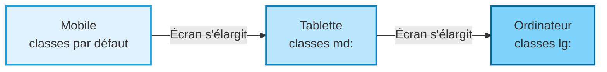

<script>
window.pageData = {
    html: {{ page.data_html | default: "" | jsonify }},
    css: {{ page.data_css | default: "" | jsonify }},
    js: {{ page.data_js | default: "" | jsonify }},
    php: {{ page.data_php | default: "" | jsonify }}
};
</script>

## 1. Objectif

Savoir adapter une interface Tailwind aux différentes tailles d'écran (téléphone, tablette, ordinateur) en appliquant l'approche **Mobile-first**.

## 2. Prérequis

* Structurer une interface Tailwind (T.225.111).
* Mettre en forme des composants Tailwind (T.225.112).

## Cas d'étude : Le Panneau d'Administration

L'éditeur interactif ci-dessous contient une interface d'administration (Sidebar + Header + Contenu + Formulaire). Actuellement, elle est pensée pour un écran large : sur mobile, la grille est trop serrée et la sidebar prend toute la place. Vous allez corriger ça.

---

## Partie 1 — Théorie

### 1.1. L'approche Mobile First

En Tailwind, l'approche **mobile first** (le mobile en premier) signifie que les classes sans préfixe s'appliquent *par défaut* (donc pour les petits écrans). Les préfixes (`sm:`, `md:`, `lg:`, `xl:`) permettent de modifier ce comportement uniquement quand l'écran devient plus large.

*Exemple :*
```html
<!-- Sur mobile : 1 colonne (par défaut). 
     Sur tablette/PC (md et +) : 2 colonnes. -->
<div class="grid grid-cols-1 md:grid-cols-2">
```

### 1.2. Les Breakpoints (Points de rupture)

Tailwind utilise 4 breakpoints principaux :
* (rien) : Mobile (< 640px)
* `sm:` : Petites tablettes (≥ 640px)
* `md:` : Tablettes / Petits ordinateurs (≥ 768px)
* `lg:` : Ordinateurs (≥ 1024px)
* `xl:` : Grands écrans (≥ 1280px)

<div class="fullscreenable" markdown="1">



</div>

### 1.3. Cacher et Afficher

Pour cacher un élément sur mobile et l'afficher sur ordinateur, on utilise :
```html
<div class="hidden md:block">
```
Ici : `hidden` cache l'élément par défaut (mobile). Dès que l'écran atteint `md`, la classe `md:block` prend le relais et l'affiche.

---

## Partie 2 — Pratique

### Mission : Structurer l'interface responsive de votre Blog

Dans le cadre de votre projet de Blog (Sprint 2), vous devez intégrer TailwindCSS et créer l'interface d'administration qui accueillera votre formulaire et votre tableau. Cette interface doit appliquer l'approche "Mobile First".

**Travail à faire (dans votre dépôt GitHub) :**

1. Dans votre fichier principal HTML (`index.html` ou `app.html`), intégrez le CDN Tailwind dans le `<head>` : `<script src="https://cdn.tailwindcss.com"></script>`.
2. **La mise en page globale** :
   - Créez un conteneur principal autour de votre `<body>` (ou à l'intérieur) avec `flex flex-col md:flex-row min-h-screen`.
3. **La Sidebar (`<aside>`)** :
   - Par défaut (sur mobile), cachez la sidebar avec `hidden`.
   - Affichez-la sous forme de bloc uniquement à partir de `md:block` avec une largeur fixe (`w-64`).
4. **La zone principale (`<main>`)** :
   - Ajoutez-lui la classe `flex-1 p-6` pour qu'elle prenne le reste de l'espace.
5. **Le Formulaire et le Tableau** :
   - Intégrez votre formulaire de catégorie et votre tableau (ceux manipulés en JS) dans cette zone `<main>`.
   - Ajoutez `grid grid-cols-1 md:grid-cols-2 gap-4` à votre formulaire pour qu'il s'adapte à l'écran.
   - Entourez votre tableau avec une `div` `overflow-x-auto` pour éviter qu'il ne déborde sur les téléphones.

<details>
<summary>Voir le code de structure attendu dans votre HTML</summary>
<div markdown="1">

**index.html**
```html
<!DOCTYPE html>
<html lang="fr">
<head>
    <meta charset="UTF-8">
    <title>Blog - Administration</title>
    <!-- Intégration de Tailwind -->
    <script src="https://cdn.tailwindcss.com"></script>
</head>
<body class="bg-gray-100 text-gray-800">

    <!-- Conteneur flex (colonne sur mobile, ligne sur PC) -->
    <div class="flex flex-col md:flex-row min-h-screen">

        <!-- Sidebar (cachée sur mobile, visible sur md) -->
        <aside class="hidden md:block w-64 bg-slate-900 text-white p-6">
            <h2 class="text-2xl font-bold mb-6">Mon Blog</h2>
            <nav>
                <a href="#" class="block py-2 px-4 bg-slate-800 rounded">Catégories</a>
            </nav>
        </aside>

        <!-- Contenu principal -->
        <main class="flex-1 p-4 md:p-8">
            <h1 class="text-3xl font-bold mb-6">Gestion des Catégories</h1>

            <!-- Formulaire (1 col mobile, 2 cols PC) -->
            <form id="form-categorie" class="bg-white p-6 rounded shadow mb-8 grid grid-cols-1 md:grid-cols-2 gap-4">
                <!-- Vos inputs ici... -->
                <div class="md:col-span-2 mt-4">
                    <button type="submit" id="btn-submit-form" class="bg-blue-600 text-white px-4 py-2 rounded flex items-center gap-2 hover:bg-blue-700">
                        <span id="spinner-submit" hidden>⏳</span>
                        <span id="text-submit">Enregistrer</span>
                    </button>
                </div>
            </form>

            <!-- Tableau responsive -->
            <div class="overflow-x-auto bg-white p-6 rounded shadow">
                <table class="w-full text-left border-collapse min-w-[600px]">
                    <!-- En-têtes et tbody id="table-categories-body" -->
                </table>
            </div>
            
            <div id="toast-container" class="fixed bottom-4 right-4 flex flex-col gap-2"></div>
        </main>

    </div>

    <!-- JS de l'application -->
    <script src="assets/js/app.js"></script>
</body>
</html>
```

**Livrable :** Le lien vers le commit GitHub contenant l'intégration de Tailwind et la structure de votre page.

</div>
</details>

---

## Bilan

**Vous avez appris :**
* la philosophie **mobile first** de Tailwind : on code pour le téléphone, puis on utilise `md:` ou `lg:` pour les grands écrans.
* à basculer une grille de 1 à plusieurs colonnes dynamiquement (`grid-cols-1 md:grid-cols-2`).
* à cacher/afficher des éléments (comme un menu) selon l'écran (`hidden md:block`).
* à gérer le dépassement d'un grand tableau sur mobile avec `overflow-x-auto`.

## Glossaire

* **Responsive Design** : Conception d'un site web pour qu'il s'adapte automatiquement à la taille de l'écran (mobile, tablette, PC).
* **Mobile First** : Stratégie de développement consistant à styliser d'abord la version mobile, puis à ajouter du code pour les grands écrans.
* **Breakpoint** : Point de rupture (ex: 768 pixels pour `md:`) à partir duquel de nouvelles règles CSS entrent en action.
