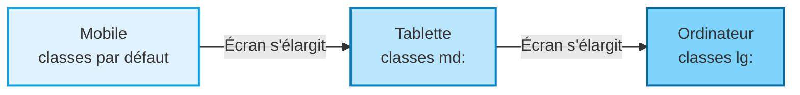

<script>
window.pageData = {
    html: {{ page.data_html | default: "" | jsonify }},
    css: {{ page.data_css | default: "" | jsonify }},
    js: {{ page.data_js | default: "" | jsonify }},
    php: {{ page.data_php | default: "" | jsonify }}
};
</script>

## 1. Objectif

Savoir adapter une interface Tailwind aux différentes tailles d'écran (téléphone, tablette, ordinateur) en appliquant l'approche **Mobile-first**.

## 2. Prérequis

* Structurer une interface Tailwind (T.225.111).
* Mettre en forme des composants Tailwind (T.225.112).

## Cas d'étude : Le Panneau d'Administration

L'éditeur interactif ci-dessous contient une interface d'administration (Sidebar + Header + Contenu + Formulaire). Actuellement, elle est pensée pour un écran large : sur mobile, la grille est trop serrée et la sidebar prend toute la place. Vous allez corriger ça.

---

## Partie 1 — Théorie

### 1.1. L'approche Mobile First

En Tailwind, l'approche **mobile first** (le mobile en premier) signifie que les classes sans préfixe s'appliquent *par défaut* (donc pour les petits écrans). Les préfixes (`sm:`, `md:`, `lg:`, `xl:`) permettent de modifier ce comportement uniquement quand l'écran devient plus large.

*Exemple :*
```html
<!-- Sur mobile : 1 colonne (par défaut). 
     Sur tablette/PC (md et +) : 2 colonnes. -->
<div class="grid grid-cols-1 md:grid-cols-2">
```

### 1.2. Les Breakpoints (Points de rupture)

Tailwind utilise 4 breakpoints principaux :
* (rien) : Mobile (< 640px)
* `sm:` : Petites tablettes (≥ 640px)
* `md:` : Tablettes / Petits ordinateurs (≥ 768px)
* `lg:` : Ordinateurs (≥ 1024px)
* `xl:` : Grands écrans (≥ 1280px)

<div class="fullscreenable" markdown="1">



</div>

### 1.3. Cacher et Afficher

Pour cacher un élément sur mobile et l'afficher sur ordinateur, on utilise :
```html
<div class="hidden md:block">
```
Ici : `hidden` cache l'élément par défaut (mobile). Dès que l'écran atteint `md`, la classe `md:block` prend le relais et l'affiche.

---

## Partie 2 — Pratique

### Mission : Rendre le panneau d'administration Responsive

L'interface actuelle est "cassée" sur mobile. Vous allez utiliser les modificateurs `md:` pour adapter la mise en page.

**Travail à faire (dans l'éditeur HTML) :**

1. **La Sidebar (`<aside>`)** :
   * Par défaut (sur mobile), cachez la sidebar avec `hidden`.
   * Affichez-la sous forme de bloc uniquement à partir de `md:`.
   * *Indice : `<aside class="hidden md:block w-64 ...">`*
2. **Le conteneur principal (`<div class="flex min-h-screen">`)** :
   * Modifiez cette ligne pour que sur mobile, il soit en `flex-col` (le contenu s'empile).
   * Sur ordinateur (`md:`), il doit revenir en ligne (`md:flex-row`).
3. **Le Formulaire** :
   * Le formulaire a actuellement : `<div class="grid grid-cols-2 gap-4">`.
   * Modifiez ceci pour avoir une seule colonne sur mobile (`grid-cols-1`), et 2 colonnes sur tablette/ordinateur (`md:grid-cols-2`).
4. **Le Tableau** :
   * Les tableaux larges cassent les interfaces mobiles. Ajoutez un `div` parent avec `overflow-x-auto` autour de `<table ...>`. Cela permettra au tableau de scroller horizontalement sur mobile sans casser toute la page.
   * Ajoutez aussi une largeur minimum au tableau (`min-w-[600px]`) pour éviter qu'il ne s'écrase.

<details>
<summary>Voir une solution possible</summary>
<div markdown="1">

Voici les éléments HTML modifiés avec les classes responsives :

**1. Conteneur principal (mobile flex-col, PC flex-row)**
```html
<div class="flex flex-col md:flex-row min-h-screen">
```

**2. Sidebar (cachée sur mobile)**
```html
<aside class="hidden md:block w-64 bg-gray-900 text-white p-6">
```

**3. Grille du Formulaire (1 colonne puis 2)**
```html
<div class="grid grid-cols-1 md:grid-cols-2 gap-4">
```

**4. Tableau scollable**
```html
<div class="overflow-x-auto w-full">
    <table class="w-full text-left border-collapse min-w-[600px]">
        <!-- contenu du tableau -->
    </table>
</div>
```

</div>
</details>

---

## Bilan

**Vous avez appris :**
* la philosophie **mobile first** de Tailwind : on code pour le téléphone, puis on utilise `md:` ou `lg:` pour les grands écrans.
* à basculer une grille de 1 à plusieurs colonnes dynamiquement (`grid-cols-1 md:grid-cols-2`).
* à cacher/afficher des éléments (comme un menu) selon l'écran (`hidden md:block`).
* à gérer le dépassement d'un grand tableau sur mobile avec `overflow-x-auto`.

## Glossaire

* **Responsive Design** : Conception d'un site web pour qu'il s'adapte automatiquement à la taille de l'écran (mobile, tablette, PC).
* **Mobile First** : Stratégie de développement consistant à styliser d'abord la version mobile, puis à ajouter du code pour les grands écrans.
* **Breakpoint** : Point de rupture (ex: 768 pixels pour `md:`) à partir duquel de nouvelles règles CSS entrent en action.
