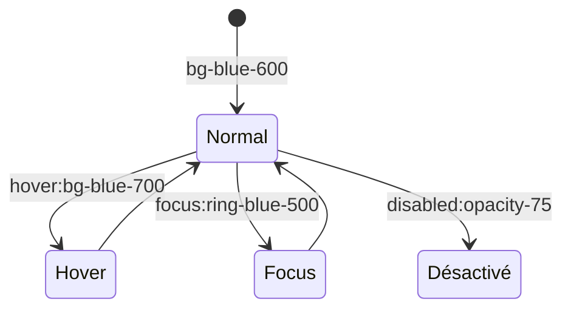

<script>
window.pageData = {
    html: {{ page.data_html | default: "" | jsonify }},
    css: {{ page.data_css | default: "" | jsonify }},
    js: {{ page.data_js | default: "" | jsonify }},
    php: {{ page.data_php | default: "" | jsonify }}
};
</script>

## 1. Objectif

Apprendre à styliser les différents états interactifs d'une interface (survol, focus, chargement, désactivé, succès/erreur) en utilisant les modificateurs d'états de Tailwind CSS.

## 2. Prérequis

* Gérer le Responsive avec Tailwind (T.225.121).

## Données de départ

L'éditeur interactif ci-dessous reprend l'interface d'administration responsive développée précédemment. Elle intègre déjà des boutons inactifs, un tableau statique et des alertes. Votre objectif est de la rendre interactive visuellement (Hover, Focus, Transitions) sans toucher au JavaScript.

---

## Partie 1 — Théorie

### 1.1. Modificateurs d'états dans Tailwind

Un élément d'interface (comme un bouton) possède plusieurs "états" de vie. Tailwind permet de styliser ces états grâce à des préfixes spécifiques :

| État | Préfixe Tailwind | Exemple | Cas d'usage |
|---|---|---|---|
| Survol | `hover:` | `hover:bg-blue-700` | Quand la souris passe sur le bouton. |
| Sélection | `focus:` | `focus:ring-2` | Quand l'utilisateur clique ou navigue au clavier sur un champ (`<input>`). |
| Désactivé | `disabled:` | `disabled:opacity-50` | Quand le contrôle est bloqué (`disabled="true"`). |

<div class="fullscreenable" markdown="1">



</div>

### 1.2. Transitions et Animations

Pour éviter des changements visuels brutaux (ex: un bouton qui devient rouge instantanément), Tailwind propose des classes de transition :
* `transition` : Active l'animation des propriétés (couleurs, opacité, etc.).
* `duration-*` : Durée de l'animation (ex: `duration-200` = 200ms).
* `ease-in-out` : Rendu progressif (doux au début et à la fin).

*Exemple de bouton complet :*
```html
<button class="bg-blue-600 hover:bg-blue-700 transition duration-200 ease-in-out">
```

### 1.3. L'état de Chargement (Spinner)

Tailwind intègre des animations prêtes à l'emploi. L'utilitaire `animate-spin` est parfait pour créer une roue de chargement sur une balise SVG :
```html
<svg class="w-4 h-4 animate-spin" ...></svg>
```

---

## Partie 2 — Pratique

### Mission : Donner vie à l'interface

Le panneau d'administration actuel est très "statique". Vous allez ajouter les états interactifs avec Tailwind.

**Travail à faire (dans l'éditeur HTML) :**

1. **Les Boutons (Hover & Transitions)** :
   - Ajoutez `hover:bg-blue-700` au bouton principal "+ Nouvelle Catégorie".
   - Ajoutez-lui des transitions douces avec `transition duration-200 ease-in-out`.
   - Appliquez le même principe aux boutons "Annuler" et "Enregistrer".
   - Dans le tableau, ajoutez un survol sur les textes "Éditer" (`hover:text-blue-800`) et "Supprimer" (`hover:text-red-800`).
2. **Le Formulaire (Focus)** :
   - Sur les champs (`<input>` et `<select>`), ajoutez des classes pour mettre en évidence le focus : `focus:outline-none focus:ring-2 focus:ring-blue-500 focus:border-blue-500`.
3. **Le Tableau (Hover sur ligne)** :
   - Ajoutez un changement de fond subtil au passage de la souris sur les lignes du tableau : `<tr class="hover:bg-gray-50 transition duration-200">`.
4. **Le Bouton Désactivé (Chargement)** :
   - Repérez le bouton "Enregistrement..." en bas de l'HTML.
   - Il possède déjà l'attribut HTML `disabled`.
   - Utilisez Tailwind pour l'atténuer visuellement et montrer qu'il n'est pas cliquable : `disabled:opacity-75 disabled:cursor-not-allowed`.

<details>
<summary>Voir une solution possible</summary>
<div markdown="1">

Voici un résumé des classes Tailwind ajoutées :

**1. Un bouton classique avec Hover et Transition**
```html
<button class="... bg-blue-600 text-white hover:bg-blue-700 transition duration-200 ease-in-out">
```

**2. Un champ de texte avec Focus**
```html
<input class="... border border-gray-300 focus:outline-none focus:ring-2 focus:ring-blue-500">
```

**3. Une ligne de tableau interactive**
```html
<tr class="hover:bg-gray-50 transition duration-200">
```

**4. Un bouton de chargement désactivé**
```html
<button disabled class="... disabled:opacity-75 disabled:cursor-not-allowed flex items-center gap-2">
    <!-- SVG avec animate-spin à l'intérieur -->
</button>
```

</div>
</details>

---

## Bilan

**Vous avez appris :**
* à gérer l'interactivité souris (`hover:`) et clavier (`focus:`).
* à adapter l'apparence des éléments bloqués (`disabled:`, `opacity-75`, `cursor-not-allowed`).
* à adoucir les changements d'états avec `transition` et `duration-*`.
* à utiliser `animate-spin` pour les roues de chargement.

Dans un projet complet, ces états Tailwind sont essentiels pour préparer le terrain avant l'intégration JavaScript (qui se contentera par exemple d'ajouter ou retirer l'attribut `disabled`).

## Glossaire

* **Hover** : Le survol d'un élément avec la souris.
* **Focus** : L'état d'un élément d'interface (comme un champ de texte) lorsqu'il est actif et prêt à recevoir une saisie clavier.
* **Transition** : L'animation fluide qui accompagne le changement d'une propriété CSS (ex: passage du bleu clair au bleu foncé).
