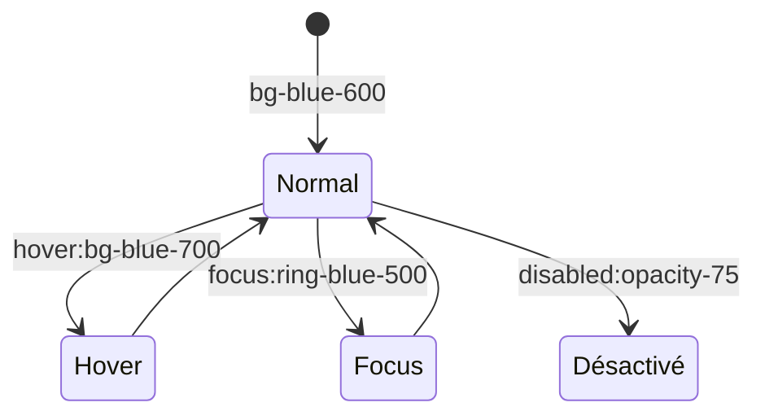

<script>
window.pageData = {
    html: {{ page.data_html | default: "" | jsonify }},
    css: {{ page.data_css | default: "" | jsonify }},
    js: {{ page.data_js | default: "" | jsonify }},
    php: {{ page.data_php | default: "" | jsonify }}
};
</script>

## 1. Objectif

Apprendre à styliser les différents états interactifs d'une interface (survol, focus, chargement, désactivé, succès/erreur) en utilisant les modificateurs d'états de Tailwind CSS.

## 2. Prérequis

* Gérer le Responsive avec Tailwind (T.225.121).

## Données de départ

L'éditeur interactif ci-dessous reprend l'interface d'administration responsive développée précédemment. Elle intègre déjà des boutons inactifs, un tableau statique et des alertes. Votre objectif est de la rendre interactive visuellement (Hover, Focus, Transitions) sans toucher au JavaScript.

---

## Partie 1 — Théorie

### 1.1. Modificateurs d'états dans Tailwind

Un élément d'interface (comme un bouton) possède plusieurs "états" de vie. Tailwind permet de styliser ces états grâce à des préfixes spécifiques :

| État | Préfixe Tailwind | Exemple | Cas d'usage |
|---|---|---|---|
| Survol | `hover:` | `hover:bg-blue-700` | Quand la souris passe sur le bouton. |
| Sélection | `focus:` | `focus:ring-2` | Quand l'utilisateur clique ou navigue au clavier sur un champ (`<input>`). |
| Désactivé | `disabled:` | `disabled:opacity-50` | Quand le contrôle est bloqué (`disabled="true"`). |

<div class="fullscreenable" markdown="1">



</div>

### 1.2. Transitions et Animations

Pour éviter des changements visuels brutaux (ex: un bouton qui devient rouge instantanément), Tailwind propose des classes de transition :
* `transition` : Active l'animation des propriétés (couleurs, opacité, etc.).
* `duration-*` : Durée de l'animation (ex: `duration-200` = 200ms).
* `ease-in-out` : Rendu progressif (doux au début et à la fin).

*Exemple de bouton complet :*
```html
<button class="bg-blue-600 hover:bg-blue-700 transition duration-200 ease-in-out">
```

### 1.3. L'état de Chargement (Spinner)

Tailwind intègre des animations prêtes à l'emploi. L'utilitaire `animate-spin` est parfait pour créer une roue de chargement sur une balise SVG :
```html
<svg class="w-4 h-4 animate-spin" ...></svg>
```

---

### Mission : Styliser l'interactivité de votre Blog

Maintenant que votre page d'administration est structurée, vous allez la rendre interactive visuellement avec Tailwind, en stylisant notamment vos formulaires, vos boutons de chargement, et vos Toasts dynamiques générés en JavaScript.

**Travail à faire (dans votre dépôt GitHub) :**

1. Ouvrez `index.html` et `assets/js/app.js`.
2. **Les Boutons (Hover & Transitions)** :
   - Ajoutez `hover:bg-blue-700 transition duration-200` au bouton principal d'enregistrement.
3. **Le Formulaire (Focus)** :
   - Sur les champs (`<input>` et `<select>`), ajoutez des classes pour mettre en évidence le curseur : `focus:outline-none focus:ring-2 focus:ring-blue-500 border border-gray-300 rounded p-2`.
4. **L'état de Chargement (Bouton désactivé)** :
   - Sur votre bouton d'enregistrement HTML, ajoutez les classes `disabled:opacity-75 disabled:cursor-not-allowed`. (Ainsi, lorsque votre JS fera `btn.disabled = true`, le design changera automatiquement).
5. **Le Spinner** :
   - Au lieu d'un emoji sablier, insérez un SVG de Spinner Tailwind à l'intérieur de votre bouton d'enregistrement (avec la classe `animate-spin` et `hidden` par défaut). Votre JS se chargera de retirer la classe `hidden`.
6. **Les Toasts dynamiques** :
   - Dans `app.js` (fonction `showToast()`), modifiez les classes affectées dynamiquement pour utiliser Tailwind :
     - Base : `text-white px-4 py-2 rounded shadow-lg transition-opacity duration-300`
     - Succès : ajouter `bg-green-500`
     - Erreur : ajouter `bg-red-500`

<details>
<summary>Voir une suggestion de JS pour les Toasts Tailwind</summary>
<div markdown="1">

**assets/js/app.js**
```javascript
// La fonction de Toast avec de vraies classes Tailwind
function showToast(message, type = 'success') {
    const container = document.getElementById('toast-container');
    const toast = document.createElement('div');
    
    // Classes de base pour tous les toasts
    let classes = 'text-white px-4 py-2 rounded shadow-lg mb-2 transition-opacity duration-500';
    
    // Couleur conditionnelle
    if (type === 'success') {
        classes += ' bg-green-500';
    } else {
        classes += ' bg-red-500';
    }
    
    toast.className = classes;
    toast.textContent = message;
    
    container.appendChild(toast);

    // Disparition avec animation
    setTimeout(() => {
        toast.style.opacity = '0'; // Déclenche la transition CSS Tailwind
        setTimeout(() => toast.remove(), 500); // Supprime du DOM après la fin de l'animation
    }, 3000);
}
```

**Livrable :** Le lien vers le commit GitHub contenant ces finitions visuelles (HTML + JS).

</div>
</details>

---

## Bilan

**Vous avez appris :**
* à gérer l'interactivité souris (`hover:`) et clavier (`focus:`).
* à adapter l'apparence des éléments bloqués (`disabled:`, `opacity-75`, `cursor-not-allowed`).
* à adoucir les changements d'états avec `transition` et `duration-*`.
* à utiliser `animate-spin` pour les roues de chargement.

Dans un projet complet, ces états Tailwind sont essentiels pour préparer le terrain avant l'intégration JavaScript (qui se contentera par exemple d'ajouter ou retirer l'attribut `disabled`).

## Glossaire

* **Hover** : Le survol d'un élément avec la souris.
* **Focus** : L'état d'un élément d'interface (comme un champ de texte) lorsqu'il est actif et prêt à recevoir une saisie clavier.
* **Transition** : L'animation fluide qui accompagne le changement d'une propriété CSS (ex: passage du bleu clair au bleu foncé).
