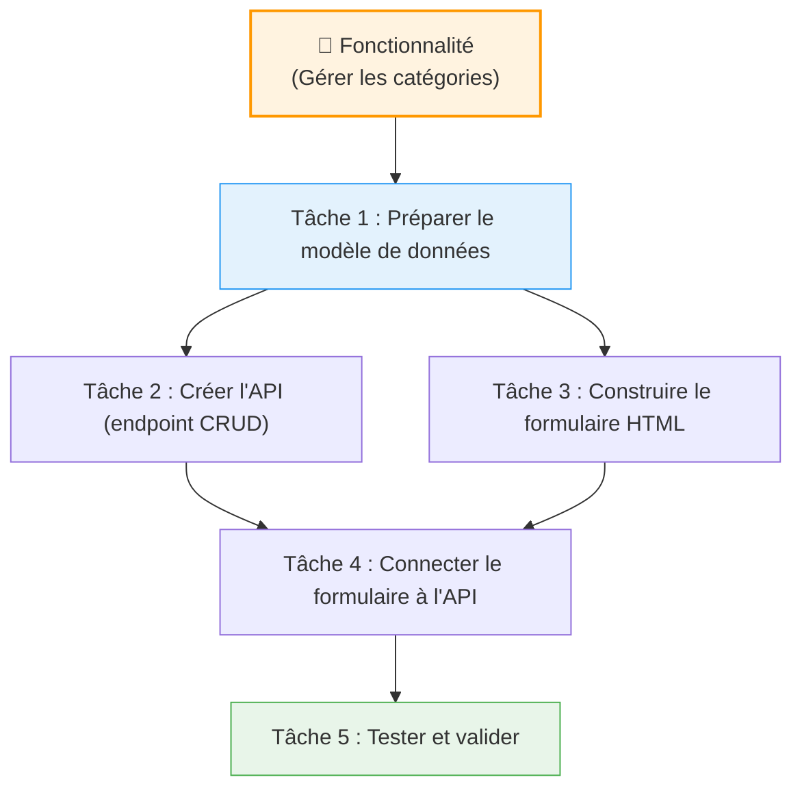

## 1. Objectif

Dans ce tutoriel, vous allez apprendre à transformer une fonctionnalité trop vague en un ensemble de tâches claires, ordonnées et réalisables.

## 2. Prérequis

* Connaître les grandes étapes d'un développement logiciel (analyse, développement, test).

## Cas d'étude

Votre équipe doit développer la fonctionnalité suivante pour le Blog :
> **Gérer les catégories** — L'administrateur doit pouvoir consulter, ajouter, modifier et supprimer des catégories.

Cette description est un objectif, pas un plan de travail. Nous allons la décomposer.

---

## Partie 1 — Théorie

### 1.1. Fonctionnalité → Tâches → Ordre

Une **fonctionnalité** est un service rendu à l'utilisateur (trop vaste pour être fait "d'un coup"). On la décompose en **tâches** : chaque tâche est une action concrète, assignable et vérifiable. Les tâches ont des **dépendances** : certaines ne peuvent commencer qu'une fois d'autres terminées.

**Les règles d'une bonne tâche :**
- ✅ Elle décrit **une seule action concrète** (pas un objectif flou).
- ✅ On sait **clairement** quand elle est terminée.
- ✅ Elle a des **critères de validation** (ex: "La liste s'affiche correctement").
- ❌ `"Travailler sur les catégories"` → Trop vague.
- ✅ `"Créer la table SQL `categories` avec les colonnes id, nom, couleur, icone"` → Parfait.

Une **sous-tâche** ne sert qu'à clarifier une tâche complexe. Évitez d'en créer pour chaque petite action.

---

## Partie 2 — Pratique

### 2.1. Décomposer la fonctionnalité "Gérer les catégories"

**Travail à faire :**
Décomposez la fonctionnalité en au moins **5 tâches** selon le modèle du schéma ci-dessus. Pour chaque tâche, précisez :
1. Son **libellé** (action concrète).
2. Sa **dépendance** (quelle autre tâche doit être faite avant ?).

<button class="btn btn-primary btn-toggle-resultat">Afficher la solution</button>

| # | Tâche | Dépend de |
|---|---|---|
| 1 | Définir le modèle de données (table `categories`) | — |
| 2 | Créer les endpoints API (GET, POST, PUT, DELETE) | Tâche 1 |
| 3 | Créer la structure HTML de la page (formulaire + tableau) | — |
| 4 | Connecter le formulaire à l'API avec `fetch()` | Tâches 2 et 3 |
| 5 | Tester les 4 opérations CRUD manuellement | Tâche 4 |
| 6 | Corriger les anomalies et valider | Tâche 5 |

**Tâche bloquante :** La Tâche 1 (modèle de données) est une tâche bloquante. Tant qu'elle n'est pas terminée, ni l'API ni le formulaire ne peuvent être finalisés.

---

## Bilan

**Vous avez appris :**
* à distinguer une fonctionnalité (un objectif) d'une tâche (une action concrète).
* à identifier les dépendances entre tâches pour les ordonner logiquement.
* à repérer une **tâche bloquante** (celle dont tout le reste dépend).

## Glossaire

* **Fonctionnalité** : Service rendu à l'utilisateur, décrivant un objectif métier.
* **Tâche** : Action concrète, réalisable et vérifiable.
* **Dépendance** : Relation entre deux tâches où l'une doit être terminée avant que l'autre puisse commencer.
* **Tâche bloquante** : Tâche dont d'autres dépendent directement et qui empêche l'avancement si elle n'est pas réalisée.
