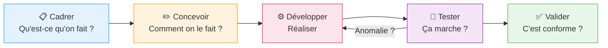

## 1. Objectif

Dans ce tutoriel, vous allez apprendre à ordonner vos tâches dans un processus de développement structuré, en affectant chaque tâche à la bonne étape.

## 2. Prérequis

* Avoir réalisé T.251.111 (Décomposer une fonctionnalité en tâches).

## Cas d'étude

Nous avons les tâches identifiées dans T.251.111 pour la fonctionnalité "Gérer les catégories". Nous devons maintenant les **classer et les ordonner** selon un processus logique.

---

## Partie 1 — Théorie

### 1.1. Le processus en 5 étapes

Un processus de développement ordonne le travail dans un déroulement logique. Chaque étape a un **objectif précis** et produit un **livrable intermédiaire**.

| Étape | Objectif | Livrable intermédiaire |
|---|---|---|
| **Cadrer** | Comprendre ce qu'on doit faire | Objectif et livrable définis |
| **Concevoir** | Préparer la solution (données, UI) | Modèle de données, maquettes |
| **Développer** | Construire la fonctionnalité | Code fonctionnel |
| **Tester** | Vérifier que ça fonctionne | Liste d'anomalies (ou 0 anomalie) |
| **Valider** | Confirmer que le livrable est conforme | Fonctionnalité acceptée |

> **Différence Test vs Validation :**
> Le **test** vérifie le comportement technique (`"Le bouton Supprimer retire bien la ligne"`).
> La **validation** vérifie la conformité au besoin (`"La gestion des catégories est complète et utilisable"`).

---

## Partie 2 — Pratique

### 2.1. Classer les tâches par étape

**Travail à faire :**
Reprenez les tâches de T.251.111 et affectez chacune à la bonne étape du processus (Cadrer / Concevoir / Développer / Tester / Valider).

<button class="btn btn-primary btn-toggle-resultat">Afficher la solution</button>

| Étape | Tâches correspondantes |
|---|---|
| **Cadrer** | Définir le périmètre (consulter, ajouter, modifier, supprimer). Identifier le livrable. |
| **Concevoir** | Définir la structure de la table `categories` (id, nom, couleur, icone). Identifier les endpoints API nécessaires. Esquisser l'interface (formulaire + tableau). |
| **Développer** | Créer la table SQL. Créer les endpoints API (GET, POST, PUT, DELETE). Créer la page HTML avec le formulaire et le tableau. Connecter le JS à l'API avec `fetch()`. |
| **Tester** | Vérifier l'affichage de la liste. Tester l'ajout, la modification, la suppression. Vérifier les messages d'erreur en cas de saisie invalide. |
| **Valider** | Vérifier que toutes les tâches sont terminées. Valider que la fonctionnalité répond aux attentes initiales. |

**Ordre de réalisation complet :**
1. Cadrage complet
2. Modèle de données → Endpoints API
3. Interface HTML → Connexion JS/API (en parallèle possible)
4. Tests des 4 opérations
5. Corrections des anomalies → Retest
6. Validation finale

---

## Bilan

**Vous avez appris :**
* à structurer le travail selon 5 étapes logiques (Cadrer → Concevoir → Développer → Tester → Valider).
* à affecter chaque tâche à la bonne étape.
* à distinguer test (comportement technique) et validation (conformité au besoin).
* à identifier les livrables intermédiaires pour suivre l'avancement.

## Pour aller plus loin : les limites de ce modèle

Le processus que vous venez d'apprendre s'appelle le **modèle en cascade** (*Waterfall*). C'est un excellent point de départ pour structurer sa pensée.

Cependant, il a une **limite principale** : si on découvre un problème lors des tests (ex: le client voulait quelque chose de différent), **revenir en arrière est très coûteux** — il faut repasser par toutes les étapes précédentes.

> [!TIP]
> **Dans la réalité des équipes modernes**, on utilise des méthodes **Agiles** (comme Scrum ou Kanban). L'idée est de ne pas tout planifier d'un coup, mais de livrer la fonctionnalité par petits **incréments** (appelés *sprints*). Chaque sprint produit une version utilisable, testée et validée. Cela permet d'adapter le travail rapidement selon les retours.
> 
> Vous découvrirez cette approche dans le domaine **D.252.1** (Gérer les tâches avec GitHub Issues).

## Glossaire

* **Cadrage** : Étape qui définit clairement ce qui doit être réalisé et le livrable attendu.
* **Conception** : Étape qui prépare la solution (modèle de données, maquettes, architecture).
* **Développement** : Étape de réalisation du code.
* **Test** : Vérification technique du bon fonctionnement.
* **Validation** : Vérification que le livrable final correspond au besoin initial.
* **Livrable intermédiaire** : Résultat produit à la fin d'une étape, qui sert de point de départ à l'étape suivante.
