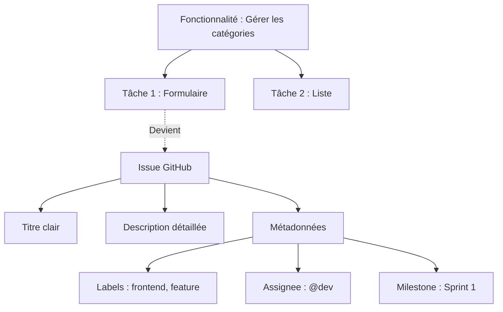

## 1. Objectif

Savoir transformer une tâche identifiée (lors de la décomposition d'une fonctionnalité) en une **Issue GitHub** bien structurée et organisée (titre, description, labels, assignation, milestone).

## 2. Prérequis

* Décomposer une fonctionnalité en tâches (T.251.111).
* Comprendre le processus de développement Agile (T.251.112).

---

## Partie 1 — Théorie

### 1.1. Qu'est-ce qu'une Issue GitHub ?

Une **Issue** est l'outil principal de GitHub pour suivre un travail à faire, un bug ou une idée. Elle matérialise une tâche de votre projet.

Au lieu de garder les tâches sur un post-it, on crée une Issue. Cela permet de discuter, suivre l'avancement et lier le code directement à la tâche.

### 1.2. Anatomie d'une bonne Issue

Une Issue efficace doit contenir :

1. **Un Titre clair** : Il doit être actionnable et précis. (Ex: *Créer le formulaire de catégorie*, et non *Formulaire* ou *Bug*).
2. **Une Description complète** : Elle donne le contexte. (Objectif, règles de gestion, comportement attendu).
3. **Une Checklist (optionnelle)** : Permet de découper la tâche en sous-tâches visuelles.
   ```markdown
   - [ ] Ajouter le champ Nom
   - [ ] Ajouter le bouton Enregistrer
   ```
4. **Des Labels (Étiquettes)** : Pour catégoriser visuellement (ex: `bug`, `enhancement`, `frontend`).
5. **Assignee (Responsable)** : La ou les personnes chargées de réaliser la tâche.
6. **Milestone (Jalon)** : Permet de rattacher l'Issue à un objectif temporel (ex: Sprint 1).

<div class="fullscreenable" markdown="1">



</div>

---

## Partie 2 — Pratique

### Mission : Transformer les tâches en Issues GitHub

Vous allez créer les Issues pour la fonctionnalité **"Gérer les catégories"** sur votre propre dépôt GitHub.

**Travail à faire (dans votre dépôt GitHub) :**

1. **Créer un Milestone** : Nommez-le "Sprint 2".
2. **Créer l'Issue principale** : 
   - **Titre** : "Construire le formulaire de catégorie"
   - **Description** : Expliquez brièvement que le formulaire doit contenir le nom, la couleur et l'icône.
   - **Checklist** : Ajoutez les 3 champs et le bouton sous forme de cases à cocher Markdown (`- [ ]`).
3. **Configurer l'Issue** :
   - Ajoutez le label `enhancement` (ou créez un label `feature`).
   - Assignez-vous vous-même à l'Issue (Assignee).
   - Renseignez le Milestone "Sprint 2".
4. **Créer les autres Issues (Optionnel)** :
   - "Définir les données des catégories"
   - "Construire la liste des catégories"

<details>
<summary>Voir un exemple de création d'Issue</summary>
<div markdown="1">

Voici à quoi doit ressembler le contenu de votre Issue avant de valider :

**Titre :** Construire le formulaire de catégorie

**Description :**
```markdown
L'objectif est de créer un formulaire pour l'ajout et la modification des catégories du blog.

### Sous-tâches :
- [ ] Créer le champ Nom (texte)
- [ ] Créer le champ Couleur (sélecteur)
- [ ] Créer le champ Icône (sélecteur)
- [ ] Ajouter les boutons Annuler et Enregistrer
```

**Panneau latéral droit :**
- **Assignees :** @votre_pseudo
- **Labels :** `enhancement`
- **Milestone :** `Sprint 2`

</div>
</details>

---

## Bilan

**Vous avez appris :**
* à transformer une tâche abstraite en une **Issue GitHub** concrète.
* à rédiger des titres clairs et des descriptions avec des **Checklists** (`- [ ]`).
* à utiliser les **métadonnées** de GitHub (Labels, Assignees, Milestones) pour organiser le travail d'équipe.

## Glossaire

* **Issue** : Ticket de suivi dans GitHub pour une tâche, un bug ou une idée.
* **Assignee** : Personne responsable de traiter l'Issue.
* **Label** : Étiquette visuelle permettant de catégoriser les Issues.
* **Milestone** : Jalon permettant de grouper des Issues autour d'un objectif ou d'une date (ex: Sprint).
* **Checklist** : Liste de tâches à cocher intégrée dans la description (Markdown).
