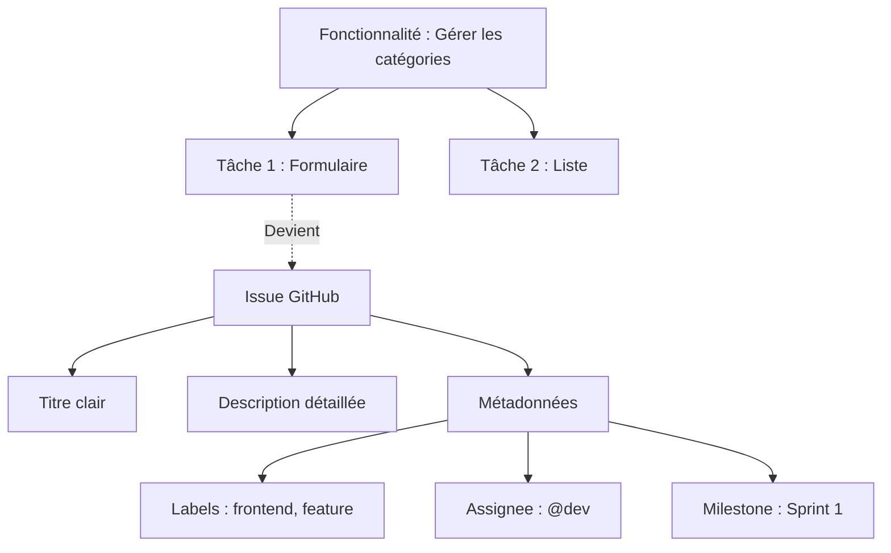

## 1. Objectif

Savoir transformer une tâche identifiée (lors de la décomposition d'une fonctionnalité) en une **Issue GitHub** bien structurée et organisée (titre, description, labels, assignation, milestone).

## 2. Prérequis

* Décomposer une fonctionnalité en tâches (T.251.111).
* Comprendre le processus de développement Agile (T.251.112).

---

## Partie 1 — Théorie

### 1.1. Qu'est-ce qu'une Issue GitHub ?

Une **Issue** est l'outil principal de GitHub pour suivre un travail à faire, un bug ou une idée. Elle matérialise une tâche de votre projet.

Au lieu de garder les tâches sur un post-it, on crée une Issue. Cela permet de discuter, suivre l'avancement et lier le code directement à la tâche.

### 1.2. Anatomie d'une bonne Issue

Une Issue efficace doit contenir :

1. **Un Titre clair** : Il doit être actionnable et précis. (Ex: *Créer le formulaire de catégorie*, et non *Formulaire* ou *Bug*).
2. **Une Description complète** : Elle donne le contexte. (Objectif, règles de gestion, comportement attendu).
3. **Une Checklist (optionnelle)** : Permet de découper la tâche en sous-tâches visuelles.
   ```markdown
   - [ ] Ajouter le champ Nom
   - [ ] Ajouter le bouton Enregistrer
   ```
4. **Des Labels (Étiquettes)** : Pour catégoriser visuellement (ex: `bug`, `enhancement`, `frontend`).
5. **Assignee (Responsable)** : La ou les personnes chargées de réaliser la tâche.
6. **Milestone (Jalon)** : Permet de rattacher l'Issue à un objectif temporel (ex: Sprint 1).

<div class="fullscreenable" markdown="1">



</div>

---

## Partie 2 — Pratique

### Mission : Planifier le Sprint 2 de votre Blog

Vous allez préparer les Issues pour le **Sprint 2** de votre projet de Blog. L'objectif de ce sprint est d'améliorer l'architecture du code (MVC) et l'expérience utilisateur (Responsive et Asynchrone).

**Travail à faire (dans le dépôt GitHub de votre Blog) :**

1. **Créer le Milestone** : Créez un jalon nommé "Sprint 2".
2. **Créer les Issues du sprint** : Créez les 3 Issues suivantes et associez-les au Milestone "Sprint 2", avec le label `enhancement` :
   - **Issue 1 :** "Refactoriser la gestion des catégories en POO (Modèle et Gestionnaire)"
   - **Issue 2 :** "Ajouter des feedbacks asynchrones (Toasts et Spinners) sur les formulaires"
   - **Issue 3 :** "Rendre l'interface d'administration responsive avec Tailwind"
3. **Détailler la première Issue** : Dans l'Issue "Refactoriser la gestion des catégories en POO", ajoutez une description avec la checklist suivante :
   - `- [ ] Créer la classe Entité Categorie.php`
   - `- [ ] Créer la classe GestionCategorie.php pour le CRUD`
   - `- [ ] Créer les contrôleurs API`
4. **Assignation** : Assignez-vous ces 3 Issues.

<details>
<summary>Voir le résultat attendu sur GitHub</summary>
<div markdown="1">

Votre onglet **Issues** doit afficher 3 tickets ouverts. Si vous filtrez par **Milestones**, vous devriez voir que le "Sprint 2" contient ces 3 tickets, tous assignés à vous-même avec le label `enhancement`.

**Livrable :** Le lien vers l'onglet Issues de votre dépôt GitHub.

</div>
</details>

---

## Bilan

**Vous avez appris :**
* à transformer une tâche abstraite en une **Issue GitHub** concrète.
* à rédiger des titres clairs et des descriptions avec des **Checklists** (`- [ ]`).
* à utiliser les **métadonnées** de GitHub (Labels, Assignees, Milestones) pour organiser le travail d'équipe.

## Glossaire

* **Issue** : Ticket de suivi dans GitHub pour une tâche, un bug ou une idée.
* **Assignee** : Personne responsable de traiter l'Issue.
* **Label** : Étiquette visuelle permettant de catégoriser les Issues.
* **Milestone** : Jalon permettant de grouper des Issues autour d'un objectif ou d'une date (ex: Sprint).
* **Checklist** : Liste de tâches à cocher intégrée dans la description (Markdown).
