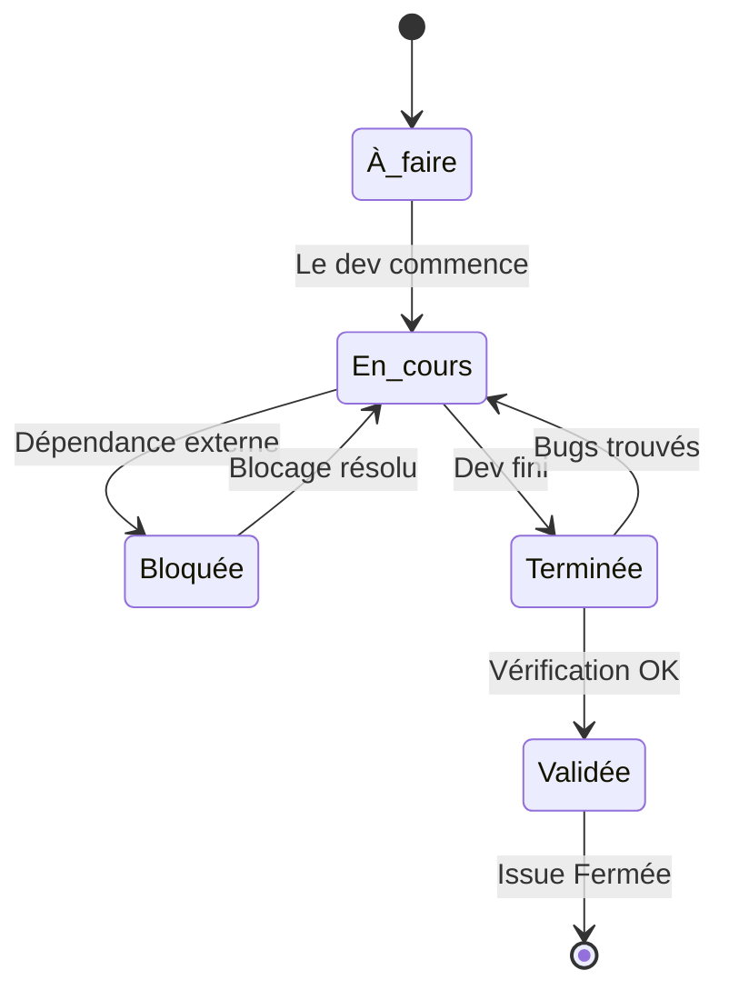

## 1. Objectif

Apprendre à suivre l'avancement réel d'une tâche (Issue GitHub) à travers ses différents statuts, communiquer sur les blocages et comprendre le cycle de vie du développement.

## 2. Prérequis

* Créer et organiser les Issues (T.251.121).

---

## Partie 1 — Théorie

### 1.1. Les états d'avancement d'une tâche

Créer une Issue ne suffit pas : il faut informer l'équipe de son état d'avancement. On utilise généralement 5 états clés :

1. **À faire (Todo)** : Le travail est prévu mais non commencé.
2. **En cours (In Progress)** : Quelqu'un travaille activement dessus.
3. **Bloquée (Blocked)** : Le travail est stoppé car il manque une information ou une autre tâche doit être finie avant.
4. **Terminée (Done)** : Le développeur a fini le code et l'a publié.
5. **Validée (Validated/QA)** : Le travail a été testé, vérifié et accepté (souvent par le Product Owner ou un testeur).

### 1.2. État du travail vs État GitHub

Il est important de ne pas confondre :
* **L'état du travail** (À faire, En cours, Bloqué...) : Souvent géré via un tableau kanban (GitHub Projects) ou des Labels.
* **L'état GitHub de l'Issue** : Une Issue n'a que deux états natifs (Ouverte ou Fermée). On ne ferme une Issue QUE lorsque le travail est **Validé**.

### 1.3. Gérer les dépendances et les blocages

Si l'Issue B ne peut pas avancer avant que l'Issue A ne soit terminée, on dit que **B est bloquée par A**.
Dans GitHub, la meilleure façon de gérer ça est :
* De l'écrire clairement dans les commentaires ou la description.
* D'utiliser la syntaxe GitHub : `Blocked by #101` pour créer des liens automatiques entre les Issues.

### 1.4. Communiquer via les commentaires

Une Issue est un fil de discussion. Le développeur doit l'utiliser pour informer le reste de l'équipe :
* *"Je commence cette tâche aujourd'hui."*
* *"Je suis bloqué car l'API ne répond pas."*
* *"La tâche est terminée, voici le lien vers la pull request."*

---

## Partie 2 — Pratique

### Mission : Gérer le cycle de vie d'une Issue

Vous allez simuler l'avancement de l'Issue créée dans le tutoriel précédent, en utilisant les commentaires et en gérant un blocage.

**Travail à faire (dans votre dépôt GitHub) :**

1. **Signaler le début du travail** :
   - Ouvrez l'Issue "Construire le formulaire de catégorie".
   - Ajoutez un commentaire : *"Je commence le travail sur ce formulaire."* (Cela simule le passage en **En cours**).
2. **Créer et signaler un blocage** :
   - Créez une deuxième Issue nommée "Définir la base de données". Laissez-la ouverte. Retenez son numéro (ex: `#2`).
   - Retournez sur votre Issue "Construire le formulaire".
   - Ajoutez un commentaire pour signaler que vous êtes bloqué en mentionnant la deuxième Issue : *"Je suis bloqué en attendant la création de la base de données. Blocked by #2"*.
   - Si vous utilisez des Labels de gestion de projet, ajoutez un Label `Blocked`.
3. **Simuler la fin du travail** :
   - Dans le commentaire, signalez : *"Blocage résolu, le formulaire est terminé et fonctionne !"*
   - Cochez toutes les cases de la checklist que vous aviez créée dans la description.
4. **Fermer l'Issue** :
   - Cliquez sur le bouton **Close issue**. L'Issue passe en violet/fermé, ce qui signifie qu'elle est définitivement **Validée**.

Comprendre les bonnes pratiques GitHub

**Pourquoi ne pas simplement tout fermer ?**
Fermer une Issue fait disparaître la tâche des vues par défaut. Si vous fermez la tâche alors qu'elle n'est pas testée par le client/professeur, elle risque de passer aux oubliettes s'il y a un bug. C'est pourquoi on garde l'Issue **Ouverte** tant qu'elle n'est pas **Validée**, même si le dev a fini de coder.

---

## Bilan

**Vous avez appris :**
* la différence entre les 5 états d'avancement d'une tâche et le statut Ouvert/Fermé de GitHub.
* à indiquer des dépendances avec la syntaxe `#numéro` pour lier les Issues entre elles.
* à utiliser les commentaires pour garder une trace historique de ce qui s'est passé (blocages, décisions).

## Glossaire

* **Dépendance (Dependency)** : Lien entre deux tâches où l'une doit être terminée avant de commencer l'autre.
* **Bloquée (Blocked)** : État d'une tâche qui ne peut temporairement plus avancer.
* **Close issue** : Action de fermer une Issue GitHub, signifiant la fin totale de son cycle de vie.
