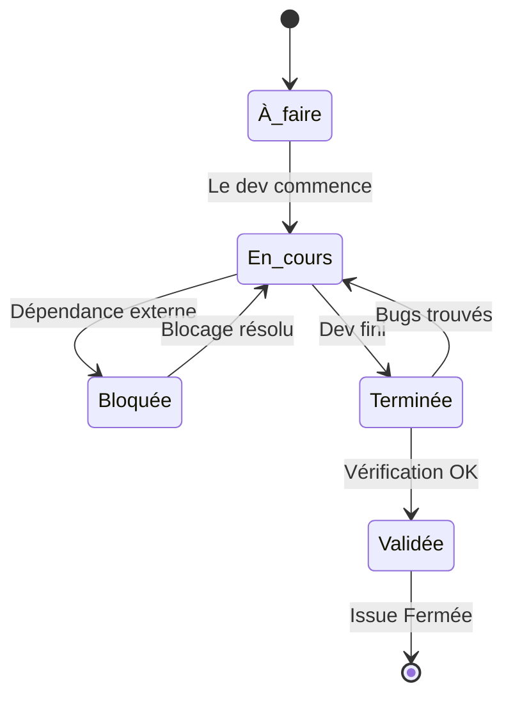

## 1. Objectif

Apprendre à suivre l'avancement réel d'une tâche (Issue GitHub) à travers ses différents statuts, communiquer sur les blocages et comprendre le cycle de vie du développement.

## 2. Prérequis

* Créer et organiser les Issues (T.251.121).

---

## Partie 1 — Théorie

### 1.1. Les états d'avancement d'une tâche

Créer une Issue ne suffit pas : il faut informer l'équipe de son état d'avancement. On utilise généralement 5 états clés :

1. **À faire (Todo)** : Le travail est prévu mais non commencé.
2. **En cours (In Progress)** : Quelqu'un travaille activement dessus.
3. **Bloquée (Blocked)** : Le travail est stoppé car il manque une information ou une autre tâche doit être finie avant.
4. **Terminée (Done)** : Le développeur a fini le code et l'a publié.
5. **Validée (Validated/QA)** : Le travail a été testé, vérifié et accepté (souvent par le Product Owner ou un testeur).

### 1.2. État du travail vs État GitHub

Il est important de ne pas confondre :
* **L'état du travail** (À faire, En cours, Bloqué...) : Souvent géré via un tableau kanban (GitHub Projects) ou des Labels.
* **L'état GitHub de l'Issue** : Une Issue n'a que deux états natifs (Ouverte ou Fermée). On ne ferme une Issue QUE lorsque le travail est **Validé**.

### 1.3. Comment matérialiser ces états dans GitHub ?

GitHub ne propose nativement que les états "Ouvert" ou "Fermé" pour une Issue. Pour suivre les étapes intermédiaires (En cours, Bloquée), vous avez deux solutions principales :

1. **La méthode simple (Labels)** : Vous créez des étiquettes personnalisées (ex: `status: in progress`, `status: blocked`) que vous ajoutez ou retirez sur l'Issue via le menu latéral droit.
2. **La méthode professionnelle (GitHub Projects)** : Vous liez votre dépôt à un tableau Kanban (via l'onglet *Projects*). Vous y glissez-déposez vos Issues sous forme de cartes d'une colonne à l'autre (*Todo* ➡️ *In Progress* ➡️ *Done*).

### 1.4. Gérer les dépendances et les blocages

Si l'Issue B ne peut pas avancer avant que l'Issue A ne soit terminée, on dit que **B est bloquée par A**.
Dans GitHub, la meilleure façon de gérer ça est :
* De l'écrire clairement dans les commentaires de l'Issue bloquée.
* D'utiliser la syntaxe GitHub : écrivez `Blocked by #numéro` (ex: `Blocked by #101`) dans le commentaire pour créer un lien cliquable automatique entre les deux Issues.

### 1.5. Communiquer via les commentaires

Quelle que soit la méthode choisie (Labels ou Projects), utiliser les commentaires comme un journal de bord est indispensable. Informez l'équipe avec des messages courts :
* *"Je commence cette tâche aujourd'hui."*
* *"Je suis bloqué car la base de données n'est pas prête."*
* *"La tâche est terminée, voici le code."*

---

## Partie 2 — Pratique

### Mission : Démarrer le Sprint 2 et lier les Issues

Maintenant que vos 3 Issues du Sprint 2 sont créées, vous allez mettre à jour leur statut et créer des dépendances entre elles.

**Travail à faire (dans votre dépôt GitHub) :**

1. **Signaler le début du travail (État: En cours)** :
   - Ouvrez l'Issue "Refactoriser la gestion des catégories en POO".
   - Ajoutez un commentaire explicite : *"Je commence le travail sur la refactorisation de l'architecture backend."*
2. **Créer un blocage (Dépendance)** :
   - Retenez le numéro de votre Issue de refactorisation (ex: `#1`).
   - Allez sur l'Issue "Ajouter des feedbacks asynchrones".
   - Ajoutez un commentaire pour signaler qu'elle ne peut pas commencer : *"Je suis bloqué. Il faut d'abord terminer la refactorisation du backend. Blocked by #1"*.
3. **Ne fermez aucune Issue pour le moment !** :
   - Vous allez réaliser le code pour ces Issues tout au long de la Session S2. Vous ne fermerez l'Issue de refactorisation qu'à la fin de la partie POO, et ainsi de suite.

Voir le résultat attendu sur GitHub

- L'Issue de refactorisation possède un commentaire signifiant le début du travail.
- L'Issue des feedbacks possède un commentaire indiquant le blocage avec un lien direct vers la première Issue (grâce à la mention `#numéro`).

**Livrable :** Le lien vers l'Issue "Ajouter des feedbacks asynchrones" montrant votre commentaire de blocage.

---

## Bilan

**Vous avez appris :**
* la différence entre les 5 états d'avancement d'une tâche et le statut Ouvert/Fermé de GitHub.
* à indiquer des dépendances avec la syntaxe `#numéro` pour lier les Issues entre elles.
* à utiliser les commentaires pour garder une trace historique de ce qui s'est passé (blocages, décisions).

## Glossaire

* **Dépendance (Dependency)** : Lien entre deux tâches où l'une doit être terminée avant de commencer l'autre.
* **Bloquée (Blocked)** : État d'une tâche qui ne peut temporairement plus avancer.
* **Close issue** : Action de fermer une Issue GitHub, signifiant la fin totale de son cycle de vie.
