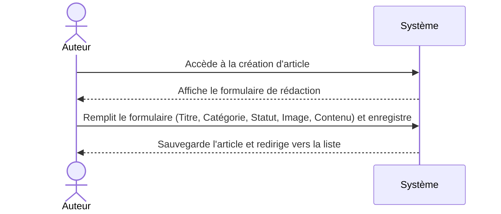

**Cas d'utilisation :** Ajouter un article  
**Acteur principal :** Auteur  
**Précondition :** L'Auteur est connecté au blog.  
**Déclencheur :** L'Auteur souhaite rédiger un nouvel article.  

**Scénario nominal :**  
1. L'Auteur accède à la page d'ajout d'article.  
2. Le système affiche le formulaire de rédaction.  
3. L'Auteur saisit le titre, sélectionne la catégorie et le statut, ajoute une image et rédige le contenu.  
4. L'Auteur clique sur le bouton "Enregistrer l'article".  
5. Le système sauvegarde l'article dans la base de données.  
6. Le système redirige l'Auteur vers la liste des articles.  

**Résultat attendu :** L'article est enregistré et l'Auteur est redirigé vers la gestion des articles.  

*Modélisation optionnelle :*

