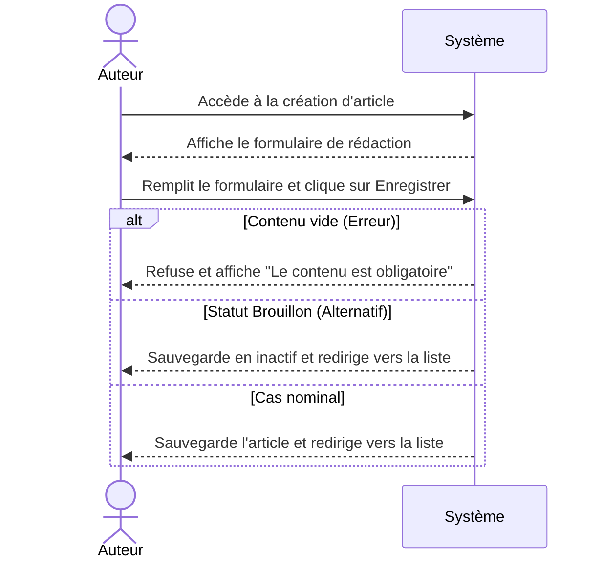

*(Suite du scénario nominal "Ajouter un article")*

**Condition (Erreur) :** À l'étape 3, l'Auteur ne saisit aucun contenu avant de valider.  
**Scénario d'erreur :**  
1. L'Auteur clique sur le bouton "Enregistrer l'article".  
2. Le système refuse l'enregistrement et affiche le message d'erreur "Le contenu de l'article est obligatoire".  
**Reprise :** L'Auteur remplit le champ contenu et le scénario reprend à l'étape 3.  

**Condition (Alternatif) :** À l'étape 3, l'Auteur sélectionne le statut "Brouillon" au lieu de "Publié".  
**Scénario alternatif :**  
1. L'Auteur clique sur le bouton "Enregistrer l'article".  
2. Le système sauvegarde l'article dans la base de données avec le statut inactif (brouillon).  
3. Le système redirige l'Auteur vers la liste des articles.  
**Fin du scénario.** *(Le résultat attendu diffère : l'article est enregistré, mais non visible par les visiteurs du site).*

*Modélisation optionnelle (Scénario complet avec exceptions) :*

