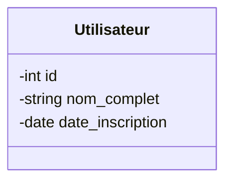

**Code Mermaid :**
```text
classDiagram
    class Utilisateur {
        -int id
        -string nom_complet
        -date date_inscription
    }
```

**Rendu visuel :**

```mermaid
classDiagram
    class Utilisateur {
        -int id
        -string nom_complet
        -date date_inscription
    }
```
