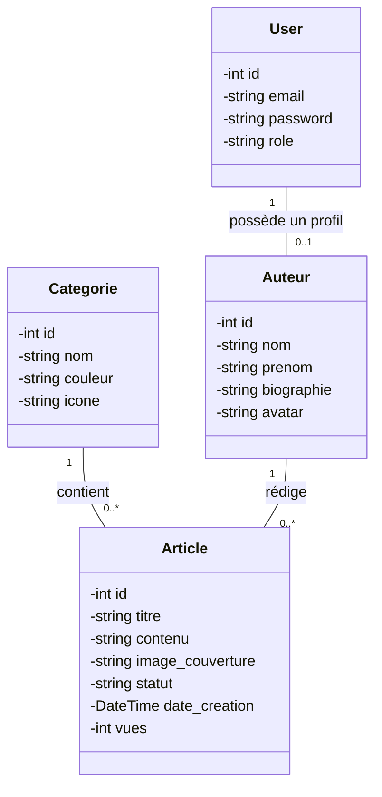

**Code Mermaid :**
```text
classDiagram
    class User {
        -int id
        -string email
        -string password
        -string role
    }

    class Auteur {
        -int id
        -string nom
        -string prenom
        -string biographie
        -string avatar
    }

    class Categorie {
        -int id
        -string nom
        -string couleur
        -string icone
    }

    class Article {
        -int id
        -string titre
        -string contenu
        -string image_couverture
        -string statut
        -DateTime date_creation
        -int vues
    }

    User "1" -- "0..1" Auteur : possède un profil
    Categorie "1" -- "0..*" Article : contient
    Auteur "1" -- "0..*" Article : rédige
```

**Rendu visuel :**

